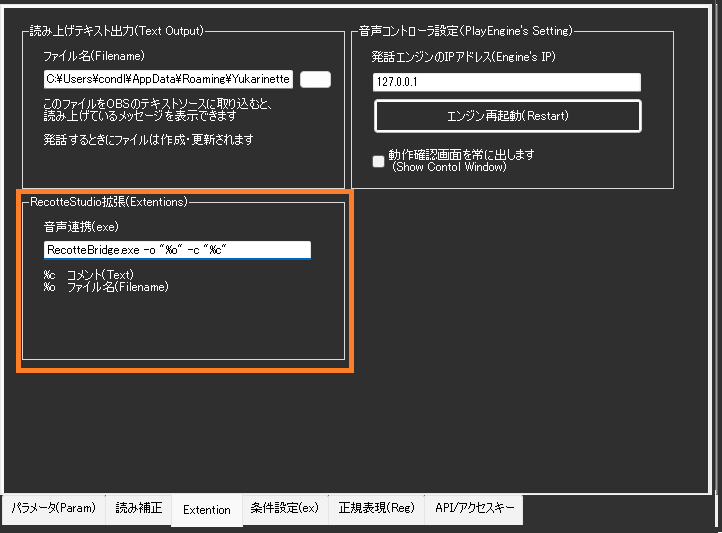
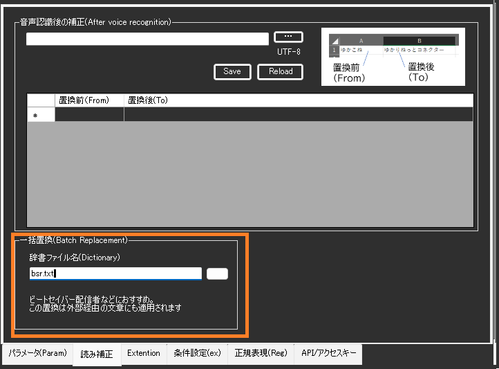
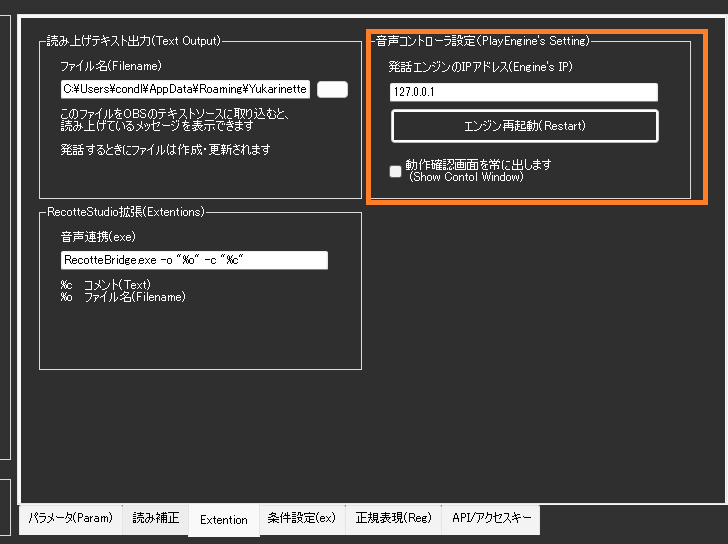

!!! Info "前提条件"
    * つかいたい音声ソフトウェアがインストールされていること
    * 音声ソフトウェアが正しく発声できる状態であること
    * つかう音声ソフトウェアが立ち上がっていること

!!! Warning "関連ツールについて"
    * RecotteStudio プラグイン、AssistantSeika、各音源と連携できるように設計しています
    * 連携部分については仕様を参考に実装しています
    * うまくいかない件は各製作者様に直接問い合わせせず、Discordサポートｃｈでご質問ください

## このプラグインで出来ること

* 各種音声合成ソフトを使って音声認識結果を読み上げできます
* VOICEROID、CeVIO、A.I.Voice、VOICEVOXなど多数の音声ソフトに対応
* 長い文章を高速で読み上げる機能
* インターネット上のAI音声サービスも利用可能
* 読み上げ用の辞書を自動管理
* 外部の読み上げ制御ソフト（AssistantSeikaなど）と連携

## 対応音声エンジン詳細

### 無料で使える音声エンジン

#### VOICEVOX
- **価格**: 完全無料
- **公式サイト**: https://voicevox.hiroshiba.jp/
- **動作要件**: Windows 10/11、GPU推奨（CPU版もあり）
- **対応パラメータ**: 音量(0-100)、速度(50-200)、音程(50-200)、抑揚(0-100)
- **注意点**: 初回起動時にエンジンダウンロード（約10分）

#### COEIROINK
- **価格**: 基本無料（追加声優は有料）
- **特徴**: カスタムモデル対応、高品質音声
- **対応パラメータ**: 音量、速度、音程
- **注意点**: **ゆかコネより先に起動する必要あり**

#### ブラウザ連携
- **価格**: 無料（Windows標準機能）
- **特徴**: インストール不要、複数言語対応
- **対応パラメータ**: 音量、速度
- **制限**: 音質は機械的、カスタマイズ性低

### 有料音声エンジン

#### A.I.Voice
- **特徴**: 高品質、感情表現、多言語対応
- **対応パラメータ**: 全パラメータ対応
- **対応言語**: 日本語、英語、中国語
- **注意点**: **標準フォルダーにインストール必須**

#### CeVIO AI
- **特徴**: 感情豊か、歌声合成も可能
- **対応パラメータ**: 感情(0-100)、音量(0-100)、速度(50-300)
- **必須環境**: 64bit環境、.NET Framework 4.8以上

#### VOICEROID2
- **特徴**: 安定した音質、豊富な調整項目
- **対応パラメータ**: 音量(0-100)、速度(50-300)、音程、抑揚
- **注意点**: 64bit版のみ対応

### クラウド音声サービス

#### AivisSpeech(Cloud）
- **価格**: 従量課金制
- **特徴**: 高品質AI音声、ネット接続必要
- **利用条件**: API契約必要

### 設定可能パラメータ一覧

| エンジン | 音量 | 速度 | 音程 | 抑揚 | 感情 | 特記事項 |
|:---------|:-----|:-----|:-----|:-----|:-----|:---------|
| VOICEVOX | 0-100 | 50-200 | 50-200 | 0-100 | - | GPU推奨 |
| A.I.Voice | 0-100 | 50-300 | 50-200 | 0-100 | 0-100 | 標準フォルダ必須 |
| CeVIO AI | 0-100 | 50-300 | 50-200 | 0-100 | 0-100 | 64bit環境必須 |
| VOICEROID2 | 0-100 | 50-300 | 50-200 | 0-100 | - | 64bit版のみ |
| COEIROINK | 0-100 | 50-200 | 50-200 | 0-100 | - | 先行起動必要 |
| ブラウザ | 0-100 | 50-200 | - | - | - | 設定制限あり |

### エンジン別トラブルシューティング

#### 「使えないものが表示される」場合
| エンジン名表示 | 原因 | 解決方法 |
|:-------------|:-----|:---------|
| VOICEVOX（灰色） | VOICEVOX未起動 | VOICEVOX起動後、ゆかコネ再起動 |
| A.I.Voice（エラー） | インストール場所が非標準 | 標準フォルダに再インストール |
| CeVIO AI（接続失敗） | CeVIO未起動 | CeVIO AI起動を確認 |
| VOICEROID2（×表示） | 32bit版を使用 | 64bit版に変更 |

#### 音声が出ない場合の確認順序
1. **エンジンソフトが起動しているか**
2. **出力デバイスが正しく設定されているか**
3. **音量設定が0になっていないか**
4. **他のアプリが音声デバイスを占有していないか**
5. **Windows音声設定で該当デバイスが有効か**

##　有効化


* プラグインを使うチェックをONにしてください。

## 設定


|設定|意味|
|:--|:---|
|使う読み上げエンジン|・発声エンジンを決定します。<br>・状況により、使えないものが表示されるケースがあります|
|読み上げる内容|何を読み上げさせるか指示します|
|出力先|どのスピーカー出力に音を出すか指定します。|
|かわいい語尾補正|認識した言葉の最後につける言葉を指定します|
|ひらがなベースで読み上げ|・IME辞書をつかって漢字をすべてひらがなに変換して渡します。<br>・UDトーク併用時は認識時のひらがなに直します|
|アルファベット読み上げ|・英語が読めない音源では、それっぽい発音に置き換えます。<br>正しく発音できないこともあります|
|音声コントローラ|使用する音声コントローラを選べます。<br>・外部のコントローラとして、[AssistantSeika](https://hgotoh.jp/wiki/doku.php/documents/voiceroid/assistantseika/assistantseika-001a)が利用できます。<br>・外部コントローラを使う場合は、URL、ID、PassWordの設定を合わせてください<br>・AssistantSeika連携：（ゆかコネNEO v2.0.115以降）|
|CoeFontの設定| CoeFontの仕様変更により、<br>```残念ながらCoeFont社の仕様変更によりCoeFont企業契約者以外はご利用いただけなくなりました```|
|パラメータを設定|発話に関する調整をします。音源によっては反映できない項目もあります|

## 使うとき

1. 音源を立ち上げます。
1. ゆかコネNEOを立ち上げます。
1. ゆかコネNEOで音声認識をしましょう。
1. 文章が確定すると同時に読み上げが行われます。

## 注意点

!!! Tips "負荷が上がる場合があります"
    * VOICEVOXなど、GPUを使うソフトウェアの場合、PCに負荷がかかる場合があります。
    * VOICEPEAKは生成処理が多く、若干待ち時間が長くかかります。

!!! Warning  "音声ソフトウェアがサポートする声が使えない場合があります"
    * 起動時にVOICEVOXなどへ問い合わせ通信をしているため、後からVOICEVOXを起動すると音源が表示されない場合があります。
    * COEIROINK のカスタムモデルを使う場合は、必ずCOEIROINKを先に立ち上げる必要があります。

!!! Success "使用中はバックグラウンドプロセスが立ち上がります"
    * 音源の制御をおこなう関係上、playengine.exe という発話管理プログラムが裏で起動します。
    * PlayEngineは32bit版、64bit版の２つがあり、最大それぞれ１つずつ（合計２つ）が起動します。

!!! Warning  "音源を標準のフォルダ以外に導入すると動かない場合があります"
    * A.I.Voiceなどは、インストールフォルダを変更すると連動できないことがあります。

!!! Info "音声パラメータについて"
    * 初期値として、デフォルトで使用される音源の設定値を採用します
    * 途中で音声を切り替える場合は、パラメータ不一致が起きる可能性があります。設定項目で値を設定してください。

## 条件変更

* 文章の特徴に応じて、発話パラメータを変更できます。


### 判断条件の設定
|項目           |意味                      |
|---------------------|------------------------------------|
|モード          |判断方法を設定します。  <br>・無効にするとその行は処理しません<br>・一部にすると話者・キーワードが一部一致すれば適用<br>・完全を選ぶとキーワード、話者が一致するときのみ<br>・キーワード・話者は空欄の場合は判断しません　　　 |
|キーワード      |文章に対しての判断条件します|
|話者名        |話者名に対しての判断条件します|
|言語名        |発話しようとしている言語に対する条件です。<br>・地域コードで指定します。(ja/en/zhなど)|

### 適用内容の設定
|項目           |意味                          |
|---------------------|-----------------------------------------|
|エンジン      |適用する音声エンジンのを設定します。|
|音声OFF      |発話をスキップします。             |
|プリセット      |既定のパラメータを適用します。|
|高さ　　　　　　      |声のピッチを数字で指定します<br>・指定範囲はエンジンによって異なります。<br>・|パラメータタブを参考に数値を決めてみましょう|
|抑揚         |声の抑揚を数字で指定します<br>・指定範囲はエンジンによって異なります。<br>・|パラメータタブを参考に数値を決めてみましょう|
|速さ　　　　　　      |声の速さを数字で指定します<br>・指定範囲はエンジンによって異なります。<br>・|パラメータタブを参考に数値を決めてみましょう<br>・遅くしすぎると音声が著しく劣化することがあります|
|音量　　　　　　     |声量を数字で指定します<br>・指定範囲はエンジンによって異なります。<br>・|パラメータタブを参考に数値を決めてみましょう|
|声質        |声の声質を数字で指定します<br>・指定範囲はエンジンによって異なります。<br>・|パラメータタブを参考に数値を決めてみましょう|
|基本設定に反映 |このチェックがONの場合、通常つかわれる設定に反映します。<br>（つまり、その後発話で採用される設定が書き換わることになります|
|キーワード除去 |このチェックがONの場合、条件に設定されたキーワードを文から除去します。|
|APIタグ | HTTPコールや、VRChat連携時に使います。|

* VRChatプラグインの左ジェスチャーと連携する場合には、APIタグと下記の文字が一対となります

|APIタグ        |意味                        |
|---------------|----------------------------|
|VRC:Neutral    |なにも指示していない状態    |
|VRC:Fist       |握りこぶし                   |
|VRC:HandOpen   |手を開いた状態               |
|VRC:FingerPoint|指さしポーズ                 |
|VRC:Victory    |Vサイン                      |
|VRC:RockNRoll  |電話ハンドサイン             |
|VRC:HandGun    |Lポーズ                      |
|VRC:ThumbsUp   |親指ポーズ                   |

## ブラウザ連携

* 従来通り、ブラウザがサポートする機械音声を使うことができます。
* ブラウザを起動して音声を選ぶと、ブラウザ経由で声が再生されます。
* 内蔵コントローラ使用中のみ利用可能です。


## 一括置換辞書の設定

読み上げ前に特定の文字や単語を自動で置き換える辞書ファイルを設定できます。

### 辞書ファイルの作り方

#### CSVファイル形式
- **ファイル名**: 任意（例：voice_replace.csv）
- **文字コード**: UTF-8
- **形式**: 「置換前,置換後」の1行1ペア

#### 具体例
```csv
ありがとう,ありがとうございます
おつかれ,お疲れ様でした
www,わらわらわら
ゆかりさん,結月ゆかりさん
```

#### 作成方法
1. **メモ帳で作る場合**:
   - メモ帳を開いて上記形式で入力
   - 保存時に「文字コード: UTF-8」を選択

2. **Excelで作る場合**:
   - A列に「置換前」、B列に「置換後」を入力
   - 「名前を付けて保存」→「CSV UTF-8(コンマ区切り)(*.csv)」を選択

### 使い方
1. 設定画面で辞書ファイルを指定
2. 「読み込み」ボタンでファイルを読み込み
3. 音声認識時に自動で置換が適用される

!!! Tips "置換のタイミング"
    * この置換は音声認識結果に対して適用されます
    * 外部からの入力（API経由など）にも適用されます
    * 他のプラグインの処理よりも後で実行されます

## 読み上げしている文章の取り込み

* 今読み上げ指示している文章をテキストに吐き出します。
* OBS Studio のテキストソースで参照することで、リアルタイム表示ができます。


## RecotteStudioプラグイン連携

* RecotteStudioプラグインを使って発話ができます。
* このモードは、ゆかコネ内蔵コントローラの時のみ使用可能です。
* たとえば、[りんなプラグイン](https://vtool.booth.pm/items/4591912)などを連携させて使うことが可能です。


## 一括置換

* TwiChaDashに搭載されていた機能です
* インストールフォルダに サンプルとして、``bsr.txt``があります。
* 正規表現ページにフォーマットを作成するためのツールが用意されています



## 高度な機能

### AI音声合成サービス統合

#### AivisSpeech (Cloud) 対応
* **クラウドAPI**: 高品質AI音声合成サービス連携
* **多様な声質**: 豊富な声質バリエーション
* **低遅延処理**: クラウド経由での高速音声生成

#### 新世代音声エンジン
* **VOICEPEAK**: より自然な音声合成
* **VOICEVOXNemo**: 新しいVOICEVOXバリアント
* **API統合**: 各エンジン固有機能の活用

### 音声スピードアップ機能

#### 長文最適化
* **SpeedUp_Border**: 文字数閾値の設定
* **SpeedUp_Ratio**: 高速化倍率の指定
* **自動適用**: 設定値を超えた長文の自動高速化

#### 実用例
```
設定例:
SpeedUp_Border = 50文字
SpeedUp_Ratio = 1.5倍

結果:
50文字以下: 通常速度
51文字以上: 1.5倍速で再生
```

### 非同期音声処理

#### 並列実行システム
* **voicePlayAsync**: 音声再生の非同期実行
* **ConcurrentQueue**: 効率的な音声キューイング
* **voiceCaptionAsync**: 字幕と音声の同期制御

#### パフォーマンス向上
* **UIブロッキング回避**: メインUIの応答性維持
* **高速処理**: 複数音声の並行生成・再生
* **メモリ効率**: 最適化されたリソース管理

### 動的辞書管理

#### ReplaceDictionary システム
* **ReplaceDictionaryFile**: 外部辞書ファイルの動的読み込み
* **実行時更新**: アプリケーション再起動不要の辞書更新
* **多言語対応**: 各言語別の置換辞書管理

### GPT連携機能

#### callGPTFunction
* **AI統合**: GPTプラグインとの直接連携
* **音声応答**: AI生成テキストの自動音声化
* **インテリジェント処理**: 文脈に応じた音声パラメータ調整

### 拡張API システム

#### ExtentionExe機能
* **外部プログラム実行**: カスタムスクリプト・アプリケーション連携
* **パラメータ渡し**: 音声内容・話者情報の外部プログラム渡し
* **拡張性**: プラグイン機能の無限拡張

### 高度なユーザーインターフェース

#### showControlWindow
* **コントローラウィンドウ**: 専用制御画面の表示
* **リアルタイム調整**: 音声パラメータの即座変更
* **視覚的操作**: トラックバー形式での直感的調整

#### VoiceStylePreset
* **プリセット管理**: 音声設定プロファイルシステム
* **シーン別設定**: 用途に応じた設定の切り替え
* **設定保存**: カスタム設定の永続化

### トラブルシューティング

#### PlayEngine 関連
* **プロセス確認**: タスクマネージャーでのPlayEngine.exe確認

#### AI音声サービス
* **API キー**: AivisSpeech Cloud等のAPIキー設定確認
* **ネットワーク**: インターネット接続・プロキシ設定確認
* **クォータ**: サービス利用制限の確認

#### 非同期処理
* **キュー詰まり**: 音声キューの処理状況確認
* **同期エラー**: 字幕と音声のタイミング調整
* **並行数制限**: 同時実行数の適切な設定

## コントローラ設定

* 内蔵コントローラの通信先や再起動指示を出せる枠になります


