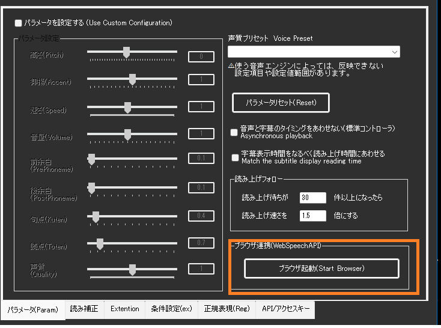

!!! Info "前提条件"
    * つかいたい音声ソフトウェアがインストールされていること
    * 音声ソフトウェアが正しく発声できる状態であること
    * つかう音声ソフトウェアが立ち上がっていること

!!! Warning "関連ツールについて"
    * RecotteStudio プラグイン、AssistantSeika、各音源と連携できるように設計しています
    * 連携部分については仕様を参考に実装しています
    * うまくいかない件は各製作者様に直接問い合わせせず、Discordサポートｃｈでご質問ください

## このプラグインで出来ること

* 各種音声合成ソフトを使って音声認識結果を読み上げできます
* VOICEROID、CeVIO、A.I.Voice、VOICEVOXなど多数の音声ソフトに対応
* 長い文章を高速で読み上げる機能
* インターネット上のAI音声サービスも利用可能
* 読み上げ用の辞書を自動管理
* 外部の読み上げ制御ソフト（AssistantSeikaなど）と連携

## 対応音声エンジン詳細

### 無料で使える音声エンジン

#### VOICEVOX
- **価格**: 完全無料
- **公式サイト**: https://voicevox.hiroshiba.jp/
- **動作要件**: Windows 10/11、GPU推奨（CPU版もあり）
- **対応パラメータ**: 音量(0-100)、速度(50-200)、音程(50-200)、抑揚(0-100)
- **注意点**: 初回起動時にエンジンダウンロード（約10分）

#### COEIROINK
- **価格**: 基本無料（追加声優は有料）
- **特徴**: カスタムモデル対応、高品質音声
- **対応パラメータ**: 音量、速度、音程
- **注意点**: **ゆかコネより先に起動する必要あり**

#### ブラウザ連携
- **価格**: 無料（Windows標準機能）
- **特徴**: インストール不要、複数言語対応
- **対応パラメータ**: 音量、速度
- **制限**: 音質は機械的、カスタマイズ性低

### 有料音声エンジン

#### A.I.Voice
- **特徴**: 高品質、感情表現、多言語対応
- **対応パラメータ**: 全パラメータ対応
- **対応言語**: 日本語、英語、中国語
- **注意点**: **標準フォルダーにインストール必須**

#### CeVIO AI
- **特徴**: 感情豊か、歌声合成も可能
- **対応パラメータ**: 感情(0-100)、音量(0-100)、速度(50-300)
- **必須環境**: 64bit環境、.NET Framework 4.8以上

#### VOICEROID2
- **特徴**: 安定した音質、豊富な調整項目
- **対応パラメータ**: 音量(0-100)、速度(50-300)、音程、抑揚
- **注意点**: 64bit版のみ対応

### クラウド音声サービス

#### AivisSpeech(Cloud）
- **価格**: 従量課金制
- **特徴**: 高品質AI音声、ネット接続必要
- **利用条件**: API契約必要

### 設定可能パラメータ一覧

| エンジン | 音量 | 速度 | 音程 | 抑揚 | 感情 | 特記事項 |
|:---------|:-----|:-----|:-----|:-----|:-----|:---------|
| VOICEVOX | 0-100 | 50-200 | 50-200 | 0-100 | - | GPU推奨 |
| A.I.Voice | 0-100 | 50-300 | 50-200 | 0-100 | 0-100 | 標準フォルダ必須 |
| CeVIO AI | 0-100 | 50-300 | 50-200 | 0-100 | 0-100 | 64bit環境必須 |
| VOICEROID2 | 0-100 | 50-300 | 50-200 | 0-100 | - | 64bit版のみ |
| COEIROINK | 0-100 | 50-200 | 50-200 | 0-100 | - | 先行起動必要 |
| ブラウザ | 0-100 | 50-200 | - | - | - | 設定制限あり |

### エンジン別トラブルシューティング

#### 「使えないものが表示される」場合
| エンジン名表示 | 原因 | 解決方法 |
|:-------------|:-----|:---------|
| VOICEVOX（灰色） | VOICEVOX未起動 | VOICEVOX起動後、ゆかコネ再起動 |
| A.I.Voice（エラー） | インストール場所が非標準 | 標準フォルダに再インストール |
| CeVIO AI（接続失敗） | CeVIO未起動 | CeVIO AI起動を確認 |
| VOICEROID2（×表示） | 32bit版を使用 | 64bit版に変更 |

#### 音声が出ない場合の確認順序
1. **エンジンソフトが起動しているか**
2. **出力デバイスが正しく設定されているか**
3. **音量設定が0になっていないか**
4. **他のアプリが音声デバイスを占有していないか**
5. **Windows音声設定で該当デバイスが有効か**

##　有効化


* プラグインを使うチェックをONにしてください。

## ボイスを選ぶ (ボイスパレット)

設定ボタンを押すと、まず **ボイスパレット** が開きます。
使えるボイスがタイルで並び、**押した瞬間に切り替わります**。配信中に開いたままにしておけます。

|できること|やり方|
|:--|:---|
|探す|上の検索欄にキャラ名かエンジン名を入れると、打つそばから絞り込まれます。<br>・ひらがな / カタカナ、全角 / 半角はどちらで打っても当たります<br>・空白で区切ると「両方を含むもの」だけが残ります (例: `ずんだ ノーマル`)|
|エンジンで絞る|左の一覧からエンジンを選びます。件数も出ます|
|お気に入り|タイル右上のピンを押すと、いちばん上の「★ お気に入り」に集まります|
|最近使った|選んだボイスは「最近使った」に残ります|
|並び替え|「既定の順 / 名前順 / エンジン順」。「エンジンで区切る」でエンジンごとの見出しが付きます|
|試聴|下の欄に文を入れて「試聴」。設定は変えずに声だけ確かめられます|
|元に戻す|直前のボイスに戻します。押し間違えたときに使ってください|

!!! Tips "ボイスが出てこないとき"
    * 音源のソフトを立ち上げてから、左下の「再取得」を押してください。
    * それでも出ないときは、詳細設定の「エンジン接続」から音源制御プログラムを起動し直せます。
    * お気に入りに入れたボイスが今は使えないときは、薄い表示で残ります。消えてしまうことはありません。

## 詳細設定

ボイスパレットの右上「詳細設定…」から開きます。左の見出しで 6 つに分かれています。

**この窓での変更は、OK か「適用」を押すまで読み上げには効きません。**
キャンセルで閉じれば、開く前の状態に戻ります。

### ホーム

|設定|意味|
|:--|:---|
|ボイス|いま使うボイス。ここでも選べます|
|読み上げる内容|何を読み上げさせるか指示します|
|出力先|どのスピーカーから音を出すか指定します|
|読み上げ|一時的に読み上げを止めたいときに外します|

### 声の調整

* 高さ・抑揚・速さ・音量・声質・前後の余白・句読点の間を決めます。
* **値の範囲はボイスのエンジンによって変わります**。スライダーの端が自動で変わるので、数字の意味はエンジンごとに違うと思ってください。
* 「調整した値を使う」を外すと、下の調整はすべて無視されてエンジンの既定で鳴ります。
* 「感情スタイル (CeVIO)」は CeVIO 系のボイスにだけ効きます。
* 「既定に戻す」で調整だけを初期値に戻せます。

### エンジン接続

|設定|意味|
|:--|:---|
|音声コントローラ|・ゆかコネ内蔵 (PlayEngine) か、外部の [AssistantSeika](https://hgotoh.jp/wiki/doku.php/documents/voiceroid/assistantseika/assistantseika-001a) かを選びます<br>・切り替えるとボイスの一覧が入れ替わります。お気に入りもそれぞれ別に覚えます<br>・AssistantSeika連携：（ゆかコネNEO v2.0.115以降）|
|発話エンジンのアドレス|ふつうは `127.0.0.1` のまま。別の PC で合成するときだけ変えます|
|起動し直す|音源制御プログラムを立ち上げ直します。ボイスが出てこないときに|
|エンジンごとの資格情報|CoeFont / AivisSpeech Cloud / VoiSona などの API キーやパスワードを入れます|

!!! Warning "資格情報は設定プリセットに入りません"
    * API キーやパスワードは、後述の設定プリセットには**保存されません**。人に渡した時点で漏れてしまうためです。
    * CoeFont は仕様変更により、```CoeFont企業契約者以外はご利用いただけなくなりました```

### タイミングと連携

|設定|意味|
|:--|:---|
|音声と字幕のタイミングを合わせない|合成を待たずに次へ進みます。遅れは減りますが、字幕と声がずれます|
|字幕の表示時間を読み上げの長さに合わせる|読み終わるまで字幕を残します|
|読み上げが溜まったとき|待ちが決めた件数以上になったら、読み上げの速さを上げます (長文の早口化)|
|読み上げ中の文を書き出すファイル|OBS のテキストソースに取り込むと、いま読んでいる文を配信に出せます|
|音声連携する実行ファイル|RecotteStudio プラグインなど。`%c` が本文、`%o` が音声ファイルの場所に置き換わります|

### 読み方と補正

|設定|意味|
|:--|:---|
|ひらがなにして読む|・IME辞書をつかって漢字をすべてひらがなに変換して渡します<br>・UDトーク併用時は認識時のひらがなに直します|
|アルファベットの読み上げをフォローする|英語が読めない音源では、それっぽい発音に置き換えます。正しく発音できないこともあります|
|末尾に足す言葉|読み上げる文の最後に必ず付けます (かわいい語尾)|
|一括置換の辞書|「置換前＝置換後」を 1 行ずつ書いたファイル。外から来た文にも効きます|
|認識のあとに直す|「直す前 / 直したあと」の表。行を足したり消したりできます|

### 条件ルール

話者や言葉に応じてボイスを差し替える決まりごとです。後述の「条件ルール」を見てください。

!!! Info "前の画面に戻したいとき"
    * **Shift を押しながら設定ボタン**を押すと、以前の設定画面が開きます。
    * 設定フォルダの `Plugin_PlayVoice_library.json` で `ui` の `legacyConfigWindow` を `true` にすると、いつも以前の画面が開くようになります。
    * 以前の画面は次の版で無くなる予定です。困ったことがあれば Discord サポートｃｈへお知らせください。

## 設定プリセット

よく使う設定に名前を付けて覚えさせ、ひと押しで切り替えられます。
ボイスパレットの左上「設定プリセット」から作ります。

|項目|意味|
|:--|:---|
|覚える範囲|・**ボイス**と**声の調整**は必ず一緒に覚えます (調整値の意味はエンジンごとに違うため)<br>・出力先 / 読み上げる内容 / 読み方 は、入れるかどうかを選べます|
|番号 (スロット)|1〜99。外部から呼ぶときに使います|

!!! Warning "切り替えられないことがあります"
    * 覚えたときとエンジンの系列が違うと、調整値の意味が変わってしまうので切り替えを断ります。
    * 覚えたボイスがいま一覧に無いときは確認が出ます。プリセット自体は消えません。
    * 詳細設定の窓を開いている間は、外部からの切り替えを断ります (OK でも閉じたときに上書きされてしまうため)。

## 配信中に切り替える (外部から)

StreamDeck などから、HTTP コールでボイスパレットとプリセットを操作できます。

|やりたいこと|コマンド|
|:--|:--|
|ボイスパレットを出す / 隠す|`command=palette&action=show` / `hide` / `toggle`|
|プリセットを切り替える|`command=preset&action=apply&slot=1`|
|プリセットの一覧|`command=preset&action=list`|
|いま当たっているプリセット|`command=preset&action=current`|
|次 / 前のプリセット|`command=preset&action=next` / `prev`|

* 名前でも呼べます (`name=雑談ずんだもん`) が、URL に日本語を書くのは面倒なので**番号 (`slot`) をおすすめします**。
* うまくいったかどうかは、返ってくる `ok` で分かります (通信自体はいつも成功扱いになるため)。

## 使うとき

1. 音源を立ち上げます。
1. ゆかコネNEOを立ち上げます。
1. ゆかコネNEOで音声認識をしましょう。
1. 文章が確定すると同時に読み上げが行われます。

## 注意点

!!! Tips "負荷が上がる場合があります"
    * VOICEVOXなど、GPUを使うソフトウェアの場合、PCに負荷がかかる場合があります。
    * VOICEPEAKは生成処理が多く、若干待ち時間が長くかかります。

!!! Warning  "音声ソフトウェアがサポートする声が使えない場合があります"
    * 起動時にVOICEVOXなどへ問い合わせ通信をしているため、後からVOICEVOXを起動すると音源が表示されない場合があります。
    * COEIROINK のカスタムモデルを使う場合は、必ずCOEIROINKを先に立ち上げる必要があります。

!!! Success "使用中はバックグラウンドプロセスが立ち上がります"
    * 音源の制御をおこなう関係上、playengine.exe という発話管理プログラムが裏で起動します。
    * PlayEngineは32bit版、64bit版の２つがあり、最大それぞれ１つずつ（合計２つ）が起動します。

!!! Warning  "音源を標準のフォルダ以外に導入すると動かない場合があります"
    * A.I.Voiceなどは、インストールフォルダを変更すると連動できないことがあります。

!!! Info "音声パラメータについて"
    * 初期値として、デフォルトで使用される音源の設定値を採用します
    * 途中で音声を切り替える場合は、パラメータ不一致が起きる可能性があります。設定項目で値を設定してください。

## 条件ルール

* 話者や言葉に応じて、ボイスや調整を差し替えられます。
* 詳細設定の「条件ルール」で、左の一覧から 1 件選び、右で中身を決めます。
* **上から順に見て、最初に当たった 1 件だけが使われます。** 並び順が効くので、「↑」「↓」で動かしてください。

### このルールの当て方

|項目|意味|
|:--|:--|
|使わない|その行は処理しません|
|完全一致|文がまるごと同じときだけ当たります|
|部分一致|その言葉が含まれていれば当たります|
|外部から|ふだんは当たりません。HTTPコールや VRChat 連携から名指しされたときだけ使います|

### こういうとき (当てる条件)

|項目|意味|
|:--|:--|
|文に含まれる言葉|文章に対しての条件です。空にすると文の中身は問いません|
|話者の名前|話者名に対しての条件です。空にすると問いません|
|どこから来た文か|Twitch / YouTube など、文の出どころに対する条件です|
|言語|発話しようとしている言語に対する条件です。地域コードで指定します (ja / en / zh など)|
|呼び出しの合い言葉|「外部から」のときに、どのルールを使うかを指す名前です (旧「APIタグ」)|

### こうする (当たったときにすること)

|項目|意味|
|:--|:--|
|使うボイス|ボイスパレットに出る名前をそのまま書きます。空なら基本設定のボイスのままです|
|出力先|このルールのときだけ別のスピーカーから出せます|
|高さ / 抑揚 / 速さ / 音量 / 声質|数字で指定します。**空の欄は基本設定の値のまま**にします (`0` と空欄は違う意味です)<br>・指定範囲はエンジンによって異なります。「声の調整」のスライダーの端を参考にしてください<br>・速さを遅くしすぎると音声が著しく劣化することがあります|
|この文は読み上げない|発話をスキップします|
|当てた言葉を読み上げから消す|条件に設定した言葉を文から除去します|
|当たった内容を基本設定にも反映して、以降ずっと使う|通常つかわれる設定そのものが書き換わります。配信中に声を切り替えたままにしたいときに使います|

!!! Tips "カンマは使えません"
    * ルールは 1 行ずつカンマで区切った形で保存されます。欄にカンマを入れると区切りとして扱われてしまいます。
    * カンマの入った欄があるときは、画面の上に注意が出ます。

* VRChatプラグインの左ジェスチャーと連携する場合には、呼び出しの合い言葉 (旧「APIタグ」) と下記の文字が一対となります

|呼び出しの合い言葉|意味                     |
|---------------|----------------------------|
|VRC:Neutral    |なにも指示していない状態    |
|VRC:Fist       |握りこぶし                   |
|VRC:HandOpen   |手を開いた状態               |
|VRC:FingerPoint|指さしポーズ                 |
|VRC:Victory    |Vサイン                      |
|VRC:RockNRoll  |電話ハンドサイン             |
|VRC:HandGun    |Lポーズ                      |
|VRC:ThumbsUp   |親指ポーズ                   |

## ブラウザ連携

* 従来通り、ブラウザがサポートする機械音声を使うことができます。
* ブラウザを起動して音声を選ぶと、ブラウザ経由で声が再生されます。
* 内蔵コントローラ使用中のみ利用可能です。


## 一括置換辞書の設定

読み上げ前に特定の文字や単語を自動で置き換える辞書ファイルを設定できます。

### 辞書ファイルの作り方

#### CSVファイル形式
- **ファイル名**: 任意（例：voice_replace.csv）
- **文字コード**: UTF-8
- **形式**: 「置換前,置換後」の1行1ペア

#### 具体例
```csv
ありがとう,ありがとうございます
おつかれ,お疲れ様でした
www,わらわらわら
ゆかりさん,結月ゆかりさん
```

#### 作成方法
1. **メモ帳で作る場合**:
   - メモ帳を開いて上記形式で入力
   - 保存時に「文字コード: UTF-8」を選択

2. **Excelで作る場合**:
   - A列に「置換前」、B列に「置換後」を入力
   - 「名前を付けて保存」→「CSV UTF-8(コンマ区切り)(*.csv)」を選択

### 使い方
1. 設定画面で辞書ファイルを指定
2. 「読み込み」ボタンでファイルを読み込み
3. 音声認識時に自動で置換が適用される

!!! Tips "置換のタイミング"
    * この置換は音声認識結果に対して適用されます
    * 外部からの入力（API経由など）にも適用されます
    * 他のプラグインの処理よりも後で実行されます

## 読み上げしている文章の取り込み

* 今読み上げ指示している文章をテキストに吐き出します。
* OBS Studio のテキストソースで参照することで、リアルタイム表示ができます。
* 詳細設定の「タイミングと連携」→「読み上げ中の文を書き出すファイル」で指定します。

## RecotteStudioプラグイン連携

* RecotteStudioプラグインを使って発話ができます。
* このモードは、ゆかコネ内蔵コントローラの時のみ使用可能です。
* たとえば、[りんなプラグイン](https://vtool.booth.pm/items/4591912)などを連携させて使うことが可能です。
* 詳細設定の「タイミングと連携」→「音声連携する実行ファイル」で指定します。

## 一括置換

* TwiChaDashに搭載されていた機能です
* インストールフォルダに サンプルとして、``bsr.txt``があります。
* 詳細設定の「読み方と補正」→「一括置換の辞書」でファイルを指定します。

!!! Info "フォーマットを作るツールについて"
    * 正規表現のフォーマットを組み立てるツールは、**以前の設定画面**にあります。
    * Shift を押しながら設定ボタンを押すと開けます。

## 高度な機能

### AI音声合成サービス統合

#### AivisSpeech (Cloud) 対応
* **クラウドAPI**: 高品質AI音声合成サービス連携
* **多様な声質**: 豊富な声質バリエーション
* **低遅延処理**: クラウド経由での高速音声生成

#### 新世代音声エンジン
* **VOICEPEAK**: より自然な音声合成
* **VOICEVOXNemo**: 新しいVOICEVOXバリアント
* **API統合**: 各エンジン固有機能の活用

### 音声スピードアップ機能

#### 長文最適化
* **SpeedUp_Border**: 文字数閾値の設定
* **SpeedUp_Ratio**: 高速化倍率の指定
* **自動適用**: 設定値を超えた長文の自動高速化

#### 実用例
```
設定例:
SpeedUp_Border = 50文字
SpeedUp_Ratio = 1.5倍

結果:
50文字以下: 通常速度
51文字以上: 1.5倍速で再生
```

### 非同期音声処理

#### 並列実行システム
* **voicePlayAsync**: 音声再生の非同期実行
* **ConcurrentQueue**: 効率的な音声キューイング
* **voiceCaptionAsync**: 字幕と音声の同期制御

#### パフォーマンス向上
* **UIブロッキング回避**: メインUIの応答性維持
* **高速処理**: 複数音声の並行生成・再生
* **メモリ効率**: 最適化されたリソース管理

### 動的辞書管理

#### ReplaceDictionary システム
* **ReplaceDictionaryFile**: 外部辞書ファイルの動的読み込み
* **実行時更新**: アプリケーション再起動不要の辞書更新
* **多言語対応**: 各言語別の置換辞書管理

### GPT連携機能

#### callGPTFunction
* **AI統合**: GPTプラグインとの直接連携
* **音声応答**: AI生成テキストの自動音声化
* **インテリジェント処理**: 文脈に応じた音声パラメータ調整

### 拡張API システム

#### ExtentionExe機能
* **外部プログラム実行**: カスタムスクリプト・アプリケーション連携
* **パラメータ渡し**: 音声内容・話者情報の外部プログラム渡し
* **拡張性**: プラグイン機能の無限拡張

### 高度なユーザーインターフェース

#### 動作確認の画面
* **コントローラウィンドウ**: 音源制御プログラムの状態を見る専用画面
* 詳細設定の「エンジン接続」から出せます

#### 呼び名について
よく似た名前のものが 3 つあるので、区別できるように呼び分けています。

|呼び名|中身|
|:--|:--|
|設定プリセット|この版で入った、設定に名前を付けて覚える仕組み|
|感情スタイル (CeVIO)|CeVIO 系の音源が持つ、配布物に入っている声の組み合わせ|
|CoeFont 音声|CoeFont のサービス側で用意されている声|

### トラブルシューティング

#### PlayEngine 関連
* **プロセス確認**: タスクマネージャーでのPlayEngine.exe確認

#### AI音声サービス
* **API キー**: AivisSpeech Cloud等のAPIキー設定確認
* **ネットワーク**: インターネット接続・プロキシ設定確認
* **クォータ**: サービス利用制限の確認

#### 非同期処理
* **キュー詰まり**: 音声キューの処理状況確認
* **同期エラー**: 字幕と音声のタイミング調整
* **並行数制限**: 同時実行数の適切な設定

## コントローラ設定

* 内蔵コントローラの通信先や再起動指示を出せる枠になります。
* 詳細設定の「エンジン接続」にまとまっています。
