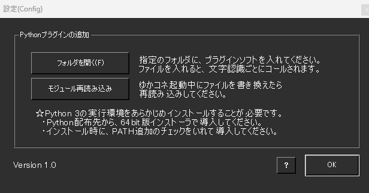
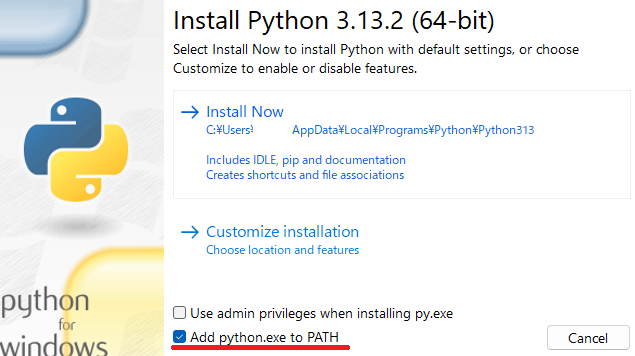
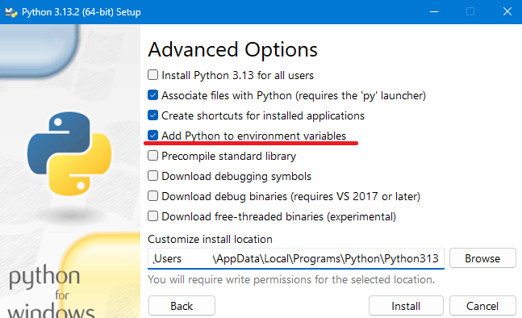

!!! Info "前提条件"
    * v2.1.59～

## このプラグインで出来ること

* Pythonをつかってプラグインをつくれます

## 有効化


* プラグインを使うチェックをONにしてください。

## 設定画面



|設定|意味|
|:--|:---|
|フォルダを開く|プログラムを入れる場所をひらきます|
|モジュール再読み込み|プログラムを再読み込みします|

## 初期設定

!!! Info "Pythonのインストールが必要です"
    * Python3のインストールが必要です
    * Microsoftストアではなく、[Python公式サイト](https://www.python.org/downloads/windows/)から、ダウンロードしてください。
    * 脆弱性などの関係から、古いバージョンはお勧めしません

* 注意点としては、インストール時に表示されるパスを通すチェックをONにする必要があります。



## 使うとき

1. Python をインストールしておきます。
2. 設定画面のフォルダを開き、Pythonプログラム（～.py）を入れます
3. 自動的に読み込まれ、音声認識するたびに内部で動きます。
4. ファイルを書き換えたら、ゆかコネを再起動するかモジュール再読み込みボタンをおしてください。

!!! Info "Pythonプログラムのファイルを消した時"
    * ゆかコネの再起動が必要です

## プログラム例

!!! Info "例題"
    * 音声認識で「です」と表示されるところをすべて「にゃん」にします
    * 翻訳１の「今日」をすべて「昨日」と解釈して翻訳します
    * 翻訳１文の「weather」をすべて「❤」にします

``` Python
#=====================================================
# ゆかコネNEO Pythonプラグイン拡張 サンプル
#=====================================================
# ・Pythonでつくれるプラグインモジュールです
# ・Pythonスクリプトで動かすより、コンパイルしたほう
#   速いですが、Pythonで書くほうがおそらく簡単です
#=====================================================

#=====================================================
# 音声認識されたとき
#=====================================================
# これは、音声認識されるたびに呼び出されます。
# ここを書き換えると、母国語の表示を置換できます。
# Message["TextFixed"] が True ならば、音声認識で文が確定した状態です
# Message["isDeleted"] が True ならば、文が取り消されたことを意味します
def PostRecognition(Message):
    text = Message["Text"]
    text = text.replace('です', 'にゃん')
    return text

#=====================================================
# 翻訳を実行する前
#=====================================================
# これは、翻訳を掛ける前の状態を変更できます。
# Text1～Text4　は、それぞれ翻訳１～翻訳４に対応する母国語です。
# ここを書き換えたあとのものが翻訳されます。
# Message["Language1"] １～４が、翻訳先言語コードです
# Message["Native"] が母国語言語コードです
# Message["ID"] をみると、文章のユニークなIDが得られます
def PreTranslation(Message):
    text = Message["Text1"]
    text = text.replace('今日', '昨日')
    Message["Text1"] = text
    return Message
    
#=====================================================
# 翻訳を実行した後
#=====================================================
# これは、翻訳を掛けたあとの状態を変更できます。
# Text1～Text4　は、それぞれ翻訳１～翻訳４に対応する翻訳後文です。
# ここを書き換えたあとのものが表示されます。
def PostTranslation(Message):
    text = Message["Text1"]
    text = text.replace('weather', '❤')
    Message["Text1"] = text
    return Message
```

## 特性等

* ログなど取りたい場合は、Pythonプログラム側で出力するコードをかいて対処してみてください
