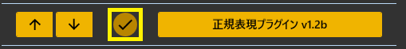
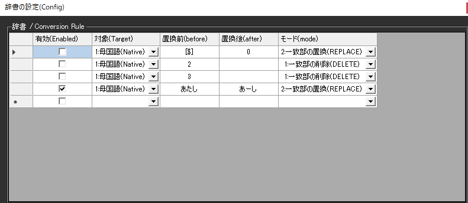
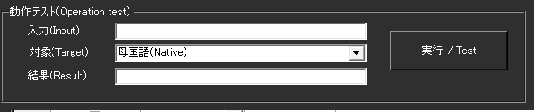

!!! Info "前提条件"
    * なし

## このプラグインで出来ること

* 認識された文字を自動的に置き換えることができます
* 言い間違いや不適切な言葉を修正できます
* 専門用語を分かりやすい言葉に変換できます

!!! note "この置換機能について"
    * ゆかりねっととの互換があるようにつくっています

##　有効化

* プラグインを使うチェックをONにしてください。

## 設定

|設定|意味|
|:--|:---|
|有効|その条件を使うかを指定します|
|対象|どの表示言語に適用するかを決めます。|
|置換前|置き換えたい文字や言葉を入力します|
|置換後|置き換え後の文字や言葉を入力します|
|モード|置き換え方を決めます。完全置換、一部置換、該当部の削除、クリアから選べます|

##　テスト

* テストしたい文章をいれて、テストボタンを押します
* どのように置き換わるかが表示されます。

## オプション

* ゆかりねっとが入っている場合は、インポートボタンを押すことで自動取り込みします。

## よく使うパターン例

### 言い間違いの修正
- 「です」→「だ」（関西弁風に変更）
- 「えー」→「」（削除）
- 「あの」→「」（削除）

### 専門用語の分かりやすい言葉への変更
- 「API」→「アプリの接続機能」
- 「レスポンシブ」→「画面サイズに合わせて表示を変える」
- 「UI」→「画面デザイン」

### 不適切な言葉のフィルタ
- 特定の言葉を「****」に置き換える

## 基本的な使い方

1. 「置換前」に変更したい言葉を入力
2. 「置換後」に変更後の言葉を入力
3. 「有効」にチェックを入れる
4. 「テスト」で動作を確認

!!! tip "初心者の方へ"
    複雑な正規表現は使わずに、そのまま文字を入力するだけでも十分に機能します。例：「です」→「だ」

## よくある質問

**Q: 正規表現って何ですか？**  
A: 文字列の検索パターンを指定する書き方ですが、普通の文字をそのまま入力するだけでも使えます。

**Q: うまく置換されません**  
A: 「テスト」機能で確認してみてください。大文字・小文字や全角・半角の違いも確認してください。

**Q: 設定がたくさんあって分かりません**  
A: まずは簡単な例（「です」→「だ」など）から始めてみてください。