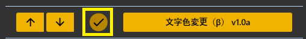
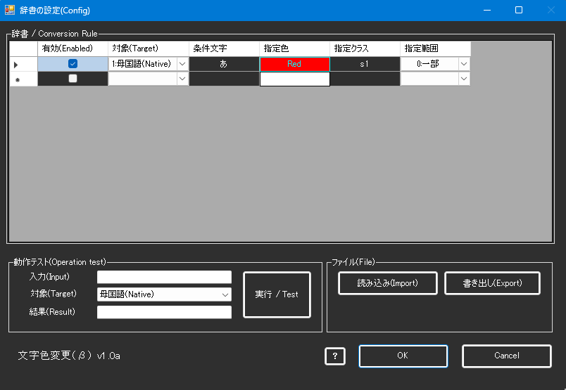
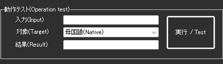
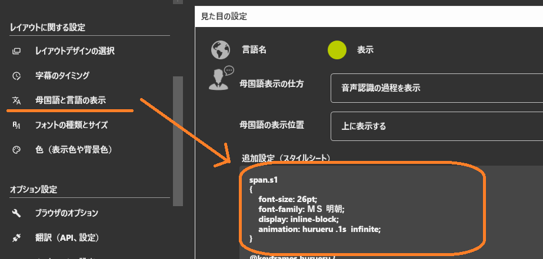

!!! Info "前提条件"
    * なし

## このプラグインで出来ること

* 認識された文字の色を自動的に変更できます
* 正規表現で文字列にマッチさせて、特定の文字やフレーズに色を付けられます
* 重要な単語やキーワードを目立たせることができます
* 母国語と翻訳後の文字にそれぞれ異なる色付けルールを適用できます

!!! note "この文字色変更機能について"
    * 正規表現パターンマッチングを使用した高度な色付け機能です
    * HTMLのstyle属性とclass属性による装飾に対応しています

## 有効化



* プラグインを使うチェックをONにしてください。
* 音声認識後と翻訳サーバーの両方で自動的に有効化されます。

## 設定



### 辞書テーブルの項目

|設定項目|説明|
|:--|:---|
|有効(Enabled)|その条件を使うかどうかを指定します|
|対象(Target)|どの表示言語に適用するかを決めます。母国語、翻訳1～4から選択|
|条件文字|マッチさせたい文字パターンを正規表現で入力します|
|指定色|文字に適用する色をカラーコードで指定します（例：#FF0000）|
|指定クラス|HTMLのクラス属性を指定できます（オプション）|
|指定範囲|色を付ける範囲を選択します（0:一部=マッチ部分のみ、1:全部=テキスト全体）|

### 対象言語の選択肢

- **1:母国語(Native)** - 音声認識された元の言語
- **2:翻訳１(Translate1)** - 第1翻訳言語
- **3:翻訳２(Translate2)** - 第2翻訳言語
- **4:翻訳３(Translate3)** - 第3翻訳言語
- **5:翻訳４(Translate4)** - 第4翻訳言語

### 指定範囲のモード

- **0:一部** - 正規表現にマッチした部分だけに色を適用
- **1:全部** - テキスト全体に色を適用

## テスト機能



1. 「対象(Target)」で色付けをテストしたい言語を選択します
2. 「入力(Input)」にテストしたい文章を入力します
3. 「実行 / Test」ボタンを押します
4. 「結果(Result)」に色付け後の結果が表示されます

!!! tip "テスト機能の活用"
    設定を変更したら、必ずテスト機能で動作を確認しましょう。正規表現のパターンが正しく動作するか事前に確認できます。

## ファイル操作

### インポート/エクスポート

- **読み込み(Import)** - CSV形式の辞書ファイルを読み込みます
- **書き出し(Export)** - 現在の辞書設定をCSV形式で保存します

### データ形式

CSVファイルは以下の形式で保存されます：
```
"有効(True/False)","対象","条件文字","指定色","指定クラス","指定範囲"
```

例：
```csv
"True","1:母国語(Native)","テスト","#FF0000","","0:一部"
```

## 辞書の編集操作

データグリッド上で右クリックすると、以下の操作が可能です：

- **この行の上に挿入(&U)** - Alt + ↑
- **この行の下に挿入(&I)** - Alt + ↓
- **上の行と入れ替える(&S)** - Ctrl + ↑
- **下の行と入れ替える(&W)** - Ctrl + ↓
- **この行を消す(&D)** - 選択行を削除

## よく使うパターン例

### 重要な単語を強調表示
```
条件文字: 重要|注意|警告
指定色: #FF0000 (赤色)
指定範囲: 0:一部
```

### 特定のキーワードに色付け
```
条件文字: API|データベース|サーバー
指定色: #00FF00 (緑色)
指定範囲: 0:一部
```

### 数値を目立たせる
```
条件文字: \d+
指定色: #FFFF00 (黄色)
指定範囲: 0:一部
```

### 質問文を強調
```
条件文字: .*\?$
指定色: #00FFFF (シアン)
指定範囲: 1:全部
```

### カスタムクラスの適用
```
条件文字: コードブロック
指定色: #AAAAAA (グレー)
指定クラス: code-block
指定範囲: 0:一部
```

## 基本的な使い方

1. プラグインの設定画面を開きます
2. 「辞書 / Conversion Rule」テーブルに新しい行を追加します
3. 「有効」にチェックを入れます
4. 「対象」で適用する言語を選択します
5. 「条件文字」に正規表現パターンを入力します
6. 「指定色」のボタンをクリックしてカラーピッカーで色を選択します
7. 「指定範囲」でマッチ部分のみか全体かを選択します
8. テスト機能で動作を確認します
9. OKボタンで設定を保存します

!!! tip "初心者の方へ"
    正規表現が分からなくても、そのまま文字を入力するだけで動作します。例えば「テスト」と入力すれば、「テスト」という文字だけに色が付きます。

## 正規表現の基本

| パターン | 説明 | 例 |
|:--------|:----|:---|
| `abc` | 文字列「abc」に完全一致 | `テスト` → 「テスト」にマッチ |
| `a\|b` | 「a」または「b」にマッチ | `犬\|猫` → 「犬」または「猫」にマッチ |
| `\d` | 任意の数字1文字 | `\d+` → 「123」「45」などにマッチ |
| `\w` | 英数字とアンダースコア | `\w+` → 「test_123」などにマッチ |
| `.*` | 任意の文字列（0文字以上） | `こんにちは.*` → 「こんにちは」で始まる文字列 |
| `^` | 行の先頭 | `^Hello` → 行頭の「Hello」 |
| `$` | 行の末尾 | `です$` → 行末の「です」 |
| `[abc]` | a、b、cのいずれか1文字 | `[あいう]` → 「あ」「い」「う」のいずれか |
| `[^abc]` | a、b、c以外の1文字 | `[^0-9]` → 数字以外 |
| `+` | 直前のパターンの1回以上の繰り返し | `あ+` → 「あ」「ああ」「あああ」 |
| `*` | 直前のパターンの0回以上の繰り返し | `あ*` → 「」「あ」「ああ」 |
| `?` | 直前のパターンの0回または1回 | `です?` → 「で」「です」 |

## よくある質問

**Q: 正規表現って何ですか？**  
A: 文字列の検索パターンを指定する強力な書き方です。普通の文字をそのまま入力するだけでも使えますが、正規表現を使うとより柔軟なパターンマッチングができます。

**Q: 色が適用されません**  
A: 
- 「有効」にチェックが入っているか確認してください
- 「対象」が正しい言語になっているか確認してください
- テスト機能で正規表現パターンが正しくマッチするか確認してください
- 正規表現のエスケープが必要な文字（`.` `*` `?` など）は `\` でエスケープしてください

**Q: 色の指定方法が分かりません**  
A: 「指定色」の列をクリックすると、カラーピッカーが開きます。視覚的に色を選択できるので、カラーコードを知らなくても大丈夫です。

**Q: 複数の単語に同じ色を付けたい**  
A: 正規表現の「|」（パイプ）を使って、「単語1|単語2|単語3」のように指定できます。

**Q: テキスト全体の色を変えたい**  
A: 「指定範囲」を「1:全部」に設定してください。条件にマッチした場合、テキスト全体に色が適用されます。

**Q: 設定をバックアップしたい**  
A: 「書き出し(Export)」ボタンでCSVファイルとして保存できます。別のPCで使う場合は「読み込み(Import)」で復元できます。

**Q: 正規表現が難しくて使えません**  
A: まずは単純な文字列から始めてください。例えば「こんにちは」と入力すれば、その文字列だけに色が付きます。慣れてきたら正規表現の機能を少しずつ試してみましょう。

**Q: フォントなどをかえたいです**  
A: 「母国語と言語の表示」ページにある追加設定（スタイルシート）に追記してみましょう。このとき、span.(クラス名)を設定し、条件式の画面にはクラス名をいれます。

例：
```
span.s1
{
    font-size: 26pt;
    font-family: ＭＳ 明朝;
}
```


## トラブルシューティング

### 色が反映されない

1. プラグインが有効になっているか確認
2. 設定を保存してから再起動
3. テスト機能でパターンマッチを確認
4. 正規表現のエラーがないか確認

### パフォーマンスが低下する

- 複雑すぎる正規表現を使用していないか確認
- 不要なルールは無効化する
- 「.*」などの広範囲にマッチするパターンは慎重に使用

### 意図しない場所に色が付く

- 正規表現が広すぎる可能性があります
- テスト機能で期待通りの動作か確認
- より具体的なパターンに変更
