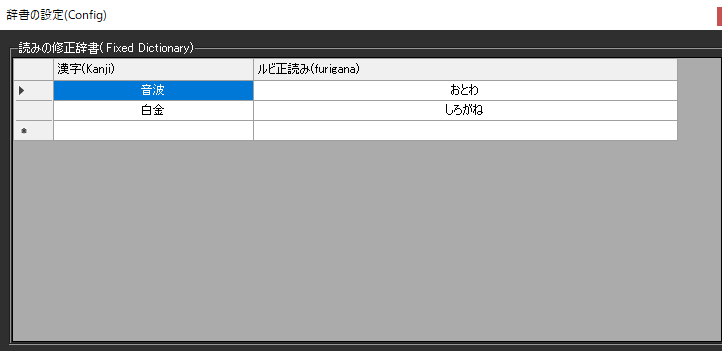

!!! Info "前提条件"
    * 日本語もしくは中国語の場合

## このプラグインで出来ること

* 認識後の文章にルビ（かな、もしくはピンイン)を振ることができます

!!! warning "ルビはNEOの表示レイアウト内のみ有効で、OBS転送などには反映されません"

##　有効化

* プラグインを使うチェックをONにしてください。

## 設定

!!! Info "辞書編集は必須ではありません。正しくルビが振れない場合は辞書を再構築できます"

|設定|意味|
|:--|:---|
|漢字|ルビを振りたい言葉|
|ルビ正読み|正しいルビを指定します。|

!!! Success "編集後OKを押すと辞書の再構築が始まります。少し時間がかかります"

## 使うとき

1. 音声認識と同時にルビが付与されます。
