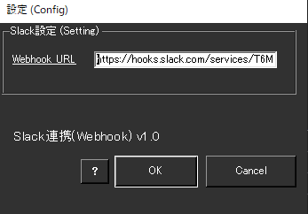
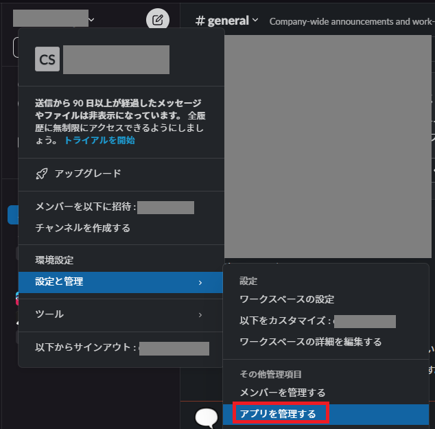
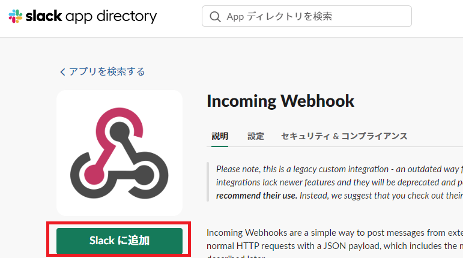
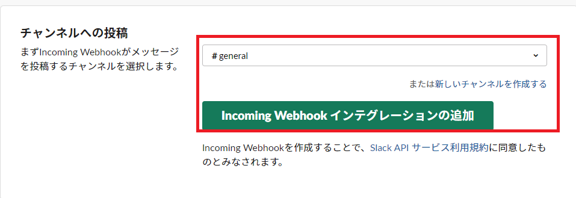
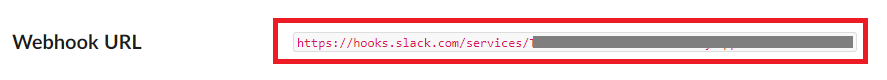

!!! Info "前提条件"
    * Webhook URL登録するためには Slack アカウントが必要です
    * プラグインは v2.0.115から同梱されています

## このプラグインで出来ること

* 音声認識結果をSlackチャットチャネル転送することができます

##　有効化

* プラグインを使うチェックをONにしてください。

## 設定

|設定|意味|
|:--|:---|
|Webhook URL|WebHookのアドレスを入れます。|

## 具体的な使い方

* まず、Slackクライアントから管理画面をだします

* Slackアプリとして、Incomming Webhookを追加します

* 書き込み先ｃｈを設定します

* URLが発行されます。このアドレスをゆかコネNEOに設定します。

* 認識が終わるごとに、転送されます。

