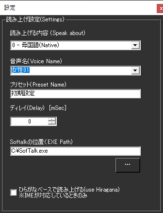

!!! Info "前提条件"
    * Softalkが起動していること

## このプラグインで出来ること

* Softalkをつかって音声認識結果を読み上げできます。

##　有効化

* プラグインを使うチェックをONにしてください。

## 設定

|設定|意味|
|:--|:---|
|読み上げる内容|何を読み上げさせるか指示します|
|音声名|使う声の種類を指定します|
|プリセット|声の調整をしたプリセットがあれば指定します|
|ディレイ|どれぐらい遅らせて話始めるかを指定します|
|Softalkの位置|使うSoftalkがどこにあるか指定します|
|ひらがなベースで読み上げ|・IME辞書をつかって漢字をすべてひらがなに変換して渡します。 ・UDトーク併用時は認識時のひらがなに直します|

## 使うとき

1. Softalkを立ち上げます。
1. ゆかコネNEOで音声認識をしましょう。
1. 文章が確定すると同時にSoftalkで読み上げが行われます。
