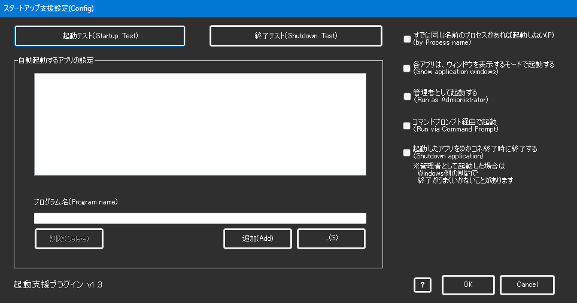

!!! Info "前提条件"
    * 特になし

## このプラグインで出来ること

* 起動時に関連するツールも起動できます

!!! Info "こういう時に使おう"
    * いくつも使うツールがある場合に活用しましょう

##　有効化

* プラグインを使うチェックをONにしてください。

## 設定

|設定|意味|
|:--|:---|
|立ち上げ時に起動|この起動設定を有効にします|
|すでに同じ名前のプロセスがあれば起動しない|すでに立ち上がっていれば多重起動しません|
|各アプリはウィンドウを表示するモードで起動|ウィンドウを隠さずに起動します|
