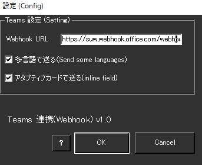
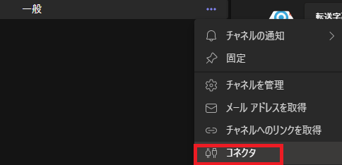
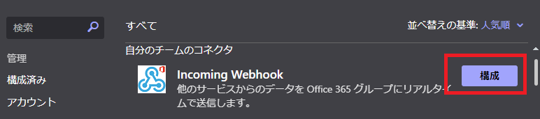
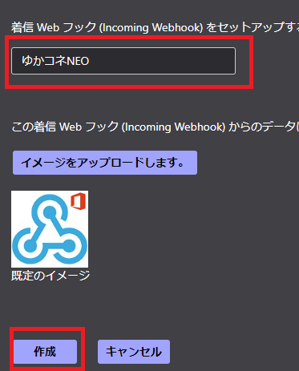
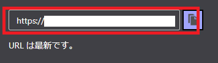
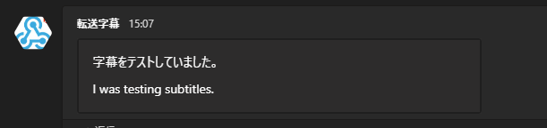

!!! Info "前提条件"
    * Webhook URL登録するためには Microsoft アカウントが必要です。
    * プラグインは v2.0.115から同梱されています

## このプラグインで出来ること

* 音声認識結果を Microsoft Teams チャットチャネル転送することができます

##　有効化

* プラグインを使うチェックをONにしてください。

## 設定

|設定|意味|
|:--|:---|
|Webhook URL|WebHookのアドレスを入れます。|
|多言語で送る|翻訳も一緒に送ります|
|アダプティブカードで送る|見やすい形に整形しておくります|

## 具体的な使い方

* まず、Teamsクライアントの書き込みたいｃｈのメニューからコネクタ画面をだします

* Incomming Webhookを探して、構成をおします

* 表示名を決めて設定します

* URLが発行されます。このアドレスをゆかコネNEOに設定します。

* 認識が終わるごとに、転送されます。

