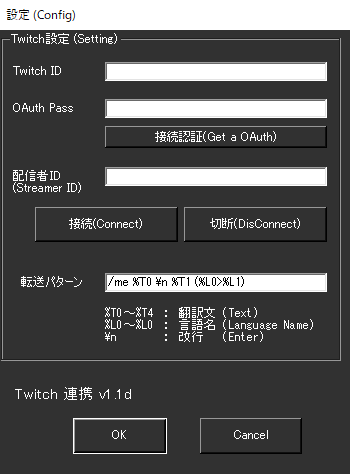

!!! Info "前提条件"
    * Twitch アカウントが必要です。

## このプラグインで出来ること

* 音声認識結果をTwitchチャットチャネルに転送することができます

##　有効化

* プラグインを使うチェックをONにしてください。

## 設定

|設定|意味|
|:--|:---|
|Twitch ID|Twitchのアカウント名を入れます|
|OAuth Pass|「接続認証」を押した後に得られる文字列をいれます|
|配信者ID|転送したいチャットのIDを入れます|
|言語|どの言語を転送するか決めます|

!!! Info "OAuthについて"
    * この文字列は、認証したアカウントに入るための認証済み手形みたいなものです。
    * この文字が漏洩するとアカウントの安全性が脅かされるため慎重に取扱いをしてください
    * この文字列は無効化されるまで　有効です。

## 具体的な使い方
1. IDを入れ、Twitchアカウント認証を行います
2. 認証後に得られる OAuth　Passコードを入れます
3. 接続先を決めます
4. 接続を押します