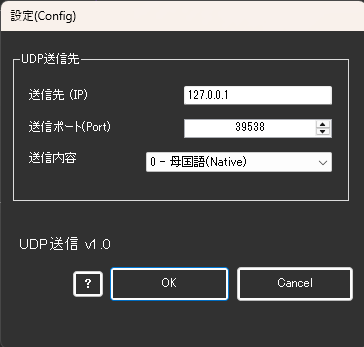

!!! Info "前提条件"
    * UDP通信を受け取る相手が必要です

## このプラグインで出来ること

* 音声認識結果をUDP通信で送付することができます。

## 有効化

* プラグインを使うチェックをONにしてください。

## 設定

|設定|意味|
|:--|:---|
|送付先|その通信先に送るかをIPアドレス(v4)で指定します|
|送信ポート|送付先通信ポート番号を指定します|
|送信内容|どの内容を送るかを指定します|

!!! Tips "データについて"
    * データはUTF8で、音声認識確定時に送られます。

