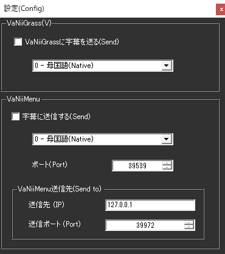

!!! Info "前提条件"
    * [VaNiiMenu](https://sabowl.sakura.ne.jp/gpsnmeajp/unity/vaniimenu/)もしくは、 [VaNiiGrass](https://sabowl.sakura.ne.jp/gpsnmeajp/unity/vaniiglass/)が必要です

## このプラグインで出来ること

* バーチャルワールド内に字幕を出すことができます。
!!! Info "謝辞"
    * 連携先ソフトウェアの開発者は[gpsnmeajp様](https://sabowl.sakura.ne.jp/gpsnmeajp/)です。

!!! Warning "うまく動かないときのレポートについて"
    * 当方が連携機能をつかって勝手に連携しているだけです。 gpsnmeajp様に直接問い合わせをしないでください。

##　有効化

* プラグインを使うチェックをONにしてください。

## 設定

* 使う機能のチェックをONにし、言語を選んでください。

## 使い方
1. VaNiiMenuやVaNiiGrassを起動します。
2. 音声認識されると、ボードに表示されます。

