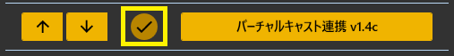
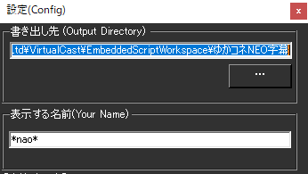

!!! Info "前提条件"
    * バーチャルキャスとTHE SEED ONLINE を連携させることが必要です。
    * バーチャルキャストを動かすPCとゆかりねっとコネクターNEOを動かすPCは同一である必要があります

## このプラグインで出来ること

* バーチャルキャストのワールド内に字幕を出すことができます。

##　有効化

* プラグインを使うチェックをONにしてください。

## 設定

1. [THE SEED ONLINE](https://seed.online/products/66338c22802dab2dc2960fcfef0da39b7c916fcd9c7bdd24d5afd4e1d6fa7dde)でゆかコネNOE字幕VCIを手に入れます。

2. 一度バーチャルキャストの中でVCIを開いてください。
    * VCIを開くと、必要なフォルダが自動生成されます

|設定|意味|
|:--|:---|
|書き出し先|VCIと連携するためのフォルダを設定します|
|表示する名前|ボードに表示する名前を決めます|

!!! Info "書き出し先"
    * 基本的には自動的に位置を探して入力されます。
    * デフォルトは``C:\Users\（ユーザ名）\AppData\Roaming\..\LocalLow\infiniteloop Co,Ltd\VirtualCast\EmbeddedScriptWorkspace\ゆかコネNEO字幕`` になります。

## 使い方
1. バーチャルキャスト内でVCIを表示します
2. 音声認識されると、ボードに表示されます。

!!! info "バーチャルキャスト内での操作について"
    * ボード自体は伸縮可能です。
    * パーツをUseすると背景色が変わります。

