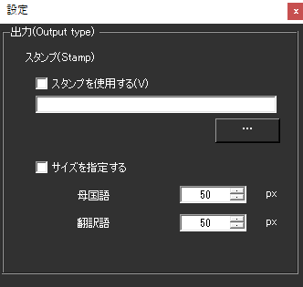

!!! Info "前提条件"
    * レイアウト表示のみに適用されます

## このプラグインで出来ること

* 指定した単語を含んでいたら、指定した写真に差し替え表示します

##　有効化

* プラグインを使うチェックをONにしてください。

## 動作の仕組み

* ファイル名と同じ言葉を検出したら写真と差し替えて表示します

!!! Note "扱える写真の形式"
    * PNG
    * JPEG
    * BMP
    * GIF
    * そのほかにもブラウザが対応しているもの

## 設定

|設定|意味|
|:--|:---|
|スタンプを使用する|この機能を有効化します|
|入力枠|写真が入っている場所を指定します|
|サイズを指定する|差し替え後の写真のサイズを指定します|

## 使い方
1. 字幕を表示します
2. 音声認識させると自動的に処理され、写真表示画面に読み込まれます。

