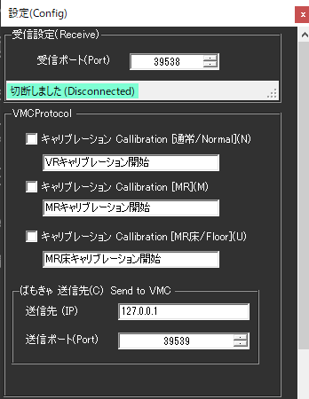
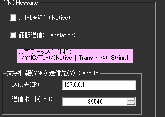

!!! Info "前提条件"
    * [ばもきゃ](https://vmc.info/)に対応した仕組みと併用することが必要です

## このプラグインで出来ること

* ばもきゃに対応した信号を出すことができます。

!!! Info "謝辞"
    * 連携先ソフトウェアの開発者は[あきら様](https://twitter.com/sh_akira)です。

!!! Warning "うまく動かないときのレポートについて"
    * 当方が連携機能をつかって勝手に連携しているだけです。 あきら様に直接問い合わせをしないでください。

##　有効化

* プラグインを使うチェックをONにしてください。

## 設定

|設定|意味|
|:--|:---|
|受信ポート|ばもきゃデータの受信ポートを指定します。デフォルトは　``39538`` です。|
|キャリブレーション開始|音声認識文に特定の文字列を含む場合は、キャリブレーション信号を送ります|
|送信先IP/ポート|ばもきゃデータの送信先を指定します。デフォルトは　``127.0.0.1:39539`` です。|

|設定|意味|
|:--|:---|
|Native Language|母国語を送ります|
|Translation Language|翻訳文を送ります|
|送信先IP/ポート|ばもきゃデータの送信先を指定します。デフォルトは　``127.0.0.1:39540`` です。|

## 使い方
1. ばもきゃ通信をするツールを起動します
2. OpenをおしてVMC参加をおします。
3. 条件がそろえば、随時通信を送ります。

