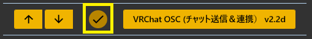
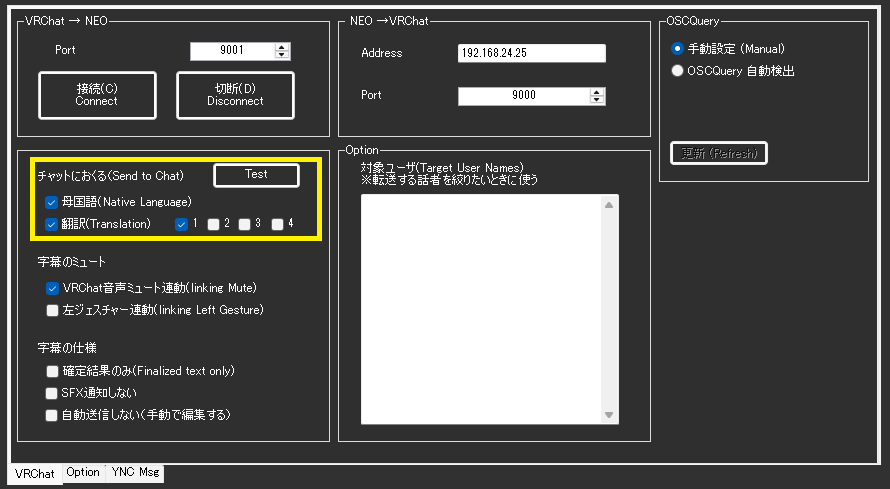
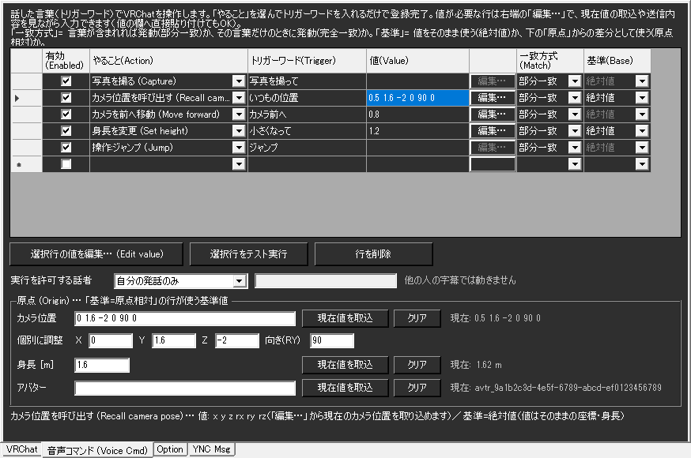
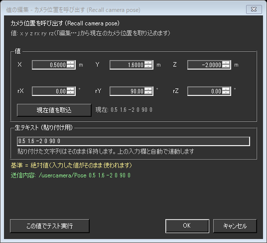
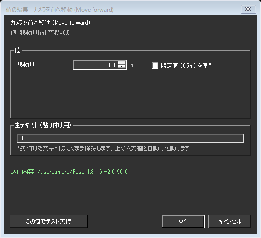
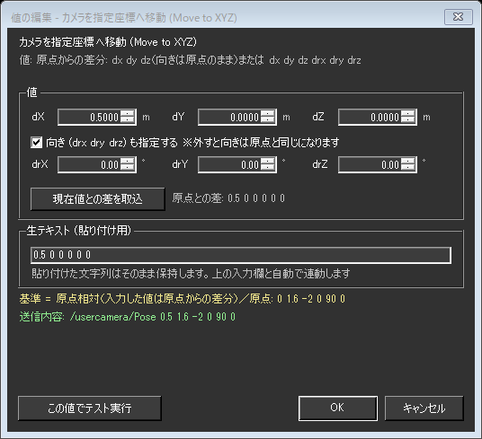

# VRChat向けOSCプラグイン

!!! Info "前提条件"
    * [VRChat](https://vrchat.com/home/)が動作することが必要です
    * VRChatのリングメニューでOSCを``Enable``にする必要があります
    * アバターのパラメータを動かす場合は、ワールドかアバターにギミックが必要です（字幕表示や音声コマンドはギミック不要です）

## このプラグインで出来ること

* 音声認識した字幕を、VRChatのチャットボックスに表示できます
* 特定の言葉を話したときに、アバターやワールドのギミックへOSC信号を送れます（**ルール**）
* **話した言葉でVRChatそのものを操作できます**（写真を撮る・カメラを動かす・身長を変える・アバターを変える・歩く など／**音声コマンド**）

## 有効化

* プラグインを使うチェックをONにしてください。

!!! Info "起動順序について"
    * ツールとしての順序は特にないものの、ユーザレポートによると、ゆかコネを先に立ち上げておいたほうがトラブルが少ないようです。

## 設定画面の構成

設定画面は4つのタブに分かれています。

|タブ|内容|
|:--|:---|
|VRChat|接続の設定と、チャットボックスへの字幕表示の設定|
|音声コマンド (Voice Cmd)|話した言葉でVRChatを操作する設定|
|Option|ルール（言葉をきっかけに任意のOSCアドレスへ値を送る）|
|YNC Msg|ゆかコネ独自形式(``/YNC/Text/...``)で字幕を送る設定|

---

## VRChat タブ（接続と字幕）

### 接続

|設定|意味|
|:--|:---|
|VRChat → NEO / Port|VRChatからゆかコネが**受け取る**ポート番号です。既定は ``9001`` です|
|接続(Connect) / 切断(Disconnect)|通信を開始・終了します|
|NEO → VRChat / Address|ゆかコネからVRChatへ**送る**宛先アドレスです。既定は ``127.0.0.1`` です|
|NEO → VRChat / Port|同じく送り先のポート番号です。既定は ``9000`` です|

### OSCQuery

|設定|意味|
|:--|:---|
|手動設定 (Manual)|上で指定したアドレスとポートをそのまま使います（既定）|
|OSCQuery 自動検出|同じPC上のVRChatを自動で探し、ポートを合わせます|
|更新 (Refresh)|自動検出をやり直します。表示が ``VRChat 未検出 (Not found)`` から ``VRChat: 127.0.0.1:9000`` のようなアドレス表示に変われば成功です|

!!! Info "どちらを選べばよいか"
    * まずは ``手動設定`` のままで構いません。
    * ポートが他のOSCツールと競合してVRChatが別ポートで待ち受けている場合に ``OSCQuery 自動検出`` が役に立ちます。
    * **カメラ位置や身長を「取込」したいときは ``OSCQuery 自動検出`` を選んでください。** VRChatは、受け取り口を登録したツールにしかこれらの情報を送りません（登録はプラグインが自動で行います）。

### チャットにおくる (Send to Chat)

|設定|意味|
|:--|:---|
|母国語(Native Language)|認識した言葉をそのままチャットボックスに出します|
|翻訳(Translation) / 1〜4|翻訳結果を出します。数字はどの翻訳枠を使うかの指定です|
|Test|テスト用の文字列を送って、表示されるか確認します|

### 字幕のミュート

|設定|意味|
|:--|:---|
|VRChat音声ミュート連動(linking Mute)|VRChat側でマイクをミュートしたら、字幕の送信も止めます|
|左ジェスチャー連動(linking Left Gesture)|左手のジェスチャーに合わせて合成音声の声色を変えます|

!!! Info "左ジェスチャー連動"
    * 読み上げ連携プラグインがONになっていないと機能しません。

### 字幕の仕様

|設定|意味|
|:--|:---|
|確定結果のみ(Finalized text only)|認識途中の文字を出さず、確定した文だけを表示します|
|SFX通知しない|チャットボックス表示時のVRChat側の通知音を鳴らしません|
|自動送信しない（手動で編集する）|チャット入力欄に文字を入れるだけで、送信はVRChat側で手動で行います|

### 対象ユーザ (Target User Names)

* 字幕を転送する話者を絞りたいときに、話者名を入力します。空欄なら全員が対象です。

!!! Info "チャットボックスの表示間隔について"
    * VRChatのチャットボックスは **5秒間に5メッセージまで** という制限があります。
    * プラグインは送信を自動で調整するので、長い文章を話しても取りこぼしません。
    * 1メッセージは**144文字**までです。超える分は自動で分割して順番に表示します。
    * 認識途中の文字は「最新の1件」だけを送るので、確定文が制限で埋まることはありません。

---

## 音声コマンド (Voice Cmd) タブ

**話した言葉をきっかけに、VRChatを操作する機能です。** OSCのアドレスや数値の型を覚える必要はありません。
やりたいことを一覧から選び、きっかけになる言葉を書くだけで登録できます。

### 1行つくる手順

1. 表の一番下の空行で、**やること(Action)** を一覧から選びます
2. **トリガーワード(Trigger)** に、発動させたい言葉を入れます（例：``写真を撮って``）
3. 値が必要なやることなら、**値(Value)** の右にある ``編集…`` を押して入力します
4. ``選択行をテスト実行`` で、VRChatが思ったとおり動くか確かめます
5. ``OK`` で保存します

### 表の項目

|設定|意味|
|:--|:---|
|有効(Enabled)|この行を有効にします。外すと反応しなくなります|
|やること(Action)|VRChatに何をさせるかを一覧から選びます|
|トリガーワード(Trigger)|発動のきっかけになる言葉です|
|値(Value)|やることによって必要な数値やIDです。直接入力・貼り付けもできます|
|編集…|値を**入力支援つき**で編集します。値が不要な時は灰色になります|
|一致方式(Match)|``部分一致``＝その言葉が含まれていれば発動／``完全一致``＝その言葉だけを言ったときに発動|
|基準(Base)|``絶対値``＝入力した値をそのまま使う／``原点相対``＝下の「原点」からの差として使う|

!!! Info "音声コマンドが発動する条件"
    * **母国語の、確定した認識結果**だけが判定に使われます（翻訳文では発動しません）。
    * ``完全一致`` は、末尾の「。」「？」などの句読点を無視して比較します。「天気」と登録すれば「天気。」でも発動します。
    * 迷ったら ``部分一致`` のままで構いません。ただし、ふだんの会話に出てくる短い言葉をトリガーにすると誤爆します。``カメラ写真`` のような、言わない組み合わせにするのがコツです。

### やること (Action) の一覧

|分類|やること|値|
|:--|:---|:---|
|カメラ操作|写真を撮る／タイマー撮影／カメラを閉じる|不要|
|カメラ操作|カメラ:写真モード／配信モード／ドローン|不要|
|カメラ操作|グリーンスクリーンON・OFF／カメラが自分を見るON・OFF|不要|
|カメラ操作|カメラドリー再生・停止|不要（VRChat Plus / VRC+ の機能です）|
|カメラ移動|カメラを前／後ろ／左／右／上／下へ移動|移動量[m]（空欄なら0.5）|
|カメラ移動|カメラを左／右へ旋回|角度[°]（空欄なら15）|
|カメラ移動|カメラを相対移動|``dx dy dz``（例：``0 1 0`` で1m上へ）|
|カメラ移動|カメラを指定座標へ移動|``x y z`` または ``x y z rx ry rz``|
|カメラ移動|カメラ位置を呼び出す|``x y z rx ry rz``|
|アバター|アバター変身|``avtr_`` で始まるアバターID|
|アバター|身長を変更|身長[m]（例：``1.6``）|
|アバター|身長を2割アップ／ダウン|不要|
|原点|今のカメラ位置／身長／アバターを原点に記録|不要|
|原点|原点カメラ／身長／アバターへ戻る|不要|
|操作|前／後ろ／左／右へ歩く、前へ走る|歩く秒数（空欄なら1）|
|操作|左／右を向く|旋回秒数（空欄なら0.5）|
|操作|ジャンプ／座る・立つ／AFK／マイクミュート／クイックメニュー／セーフモード|不要|
|操作|右手・左手で 使う／掴む／離す|不要|

!!! Warning "アバター変身について"
    * VRChatの仕様上、**お気に入り・最近使った・自分がアップロードしたアバター**にしか変身できません。
    * アバターIDは、VRChat側でそのアバターに着替えてから ``編集…`` の ``現在値を取込`` で取り込むのが確実です。

!!! Info "新しい機能を使うにはVRChatの更新が必要です"
    |やること|必要なVRChatのバージョン|
    |:--|:---|
    |アバター変身、カメラドリー、原点アバターへ戻る|2025.1.2 以降|
    |カメラ操作・カメラ移動すべて（原点カメラへ戻る を含む）|2025.3.3 以降|
    |身長の操作すべて（変更／2割アップ・ダウン／原点身長へ戻る）|2026.2.1 以降|

### 値の入力（``編集…``）

値の欄には直接入力や貼り付けができますが、``編集…`` を押すと入力を助ける画面が開きます。

|項目|意味|
|:--|:---|
|X／Y／Z、rX／rY／rZ|位置と向きを1つずつ入力します。矢印で少しずつ動かせます|
|向き (rx ry rz) も指定する|外すと、位置だけを変えて今の向きをそのまま保ちます|
|現在値を取込|VRChatから受け取っている今の値を入れます。右に「現在: 」として常に表示されています（基準が ``原点相対`` の行では ``現在値との差を取込`` に変わります。下記参照）|
|生テキスト (貼り付け用)|実際に保存される文字列です。**ここに貼り付けてもかまいません**|
|送信内容|この値で実際にVRChatへ送られる内容です。入力に合わせてその場で変わります|
|この値でテスト実行|OKで確定する前に、VRChatで動きを確かめられます|

* 移動量や秒数のように数値ひとつを入れるやることでは、入力欄と単位、``既定値を使う`` のチェックが出ます。
* ``既定値を使う`` にすると値は空欄で保存され、実行時に既定値（上の一覧の「空欄なら〜」）が使われます。

!!! Info "貼り付けた文字は書き換わりません"
    * ``0.5,1.6,-2`` のようにカンマ区切りで貼り付けても正しく読み取ります。
    * 読み取れなかった文字列は**消さずにそのまま残します**（欄が赤くなり、理由が下に表示されます）。直すか空にして**別の場所をクリックすると**、上の入力欄がまた使えるようになります。
    * ``キャンセル`` を押した場合は、表の値は一切変わりません。

#### 基準が「原点相対」のとき

基準を ``原点相対`` にすると、値の意味が「座標そのもの」から「**原点からの差**」に変わります。
それに合わせて、この画面も次のように切り替わります。

|絶対値のとき|原点相対のとき|
|:--|:---|
|``X`` ``Y`` ``Z`` ``rX`` ``rY`` ``rZ``|``dX`` ``dY`` ``dZ`` ``drX`` ``drY`` ``drZ``（d＝差）|
|``現在値を取込``（今の座標をそのまま入れる）|``現在値との差を取込``（**今いる場所と原点の差**を入れる）|
|``現在: 0.5 1.6 -2 0 90 0``|``原点との差: 0.5 0 0 0 0 0``|
|「向きも指定する」を外すと**今の向きを保つ**|「向きも指定する」を外すと**向きは原点と同じ**になる|

!!! Warning "「向きも指定する」の意味は基準によって違います"
    * ``絶対値`` … 外すと、そのときカメラが向いている方向をそのまま保ちます。
    * ``原点相対`` … 外すと「向きの差がゼロ」という意味になるので、**原点を記録したときの向き**になります。今の向きは保たれません。
    * 今の向きを保ったまま原点相対で動かしたいときは、``現在値との差を取込`` を押してください（向きの差も含めた6つの値が入ります）。

!!! Info "「現在値との差を取込」の使いどころ"
    ワールドごとに座標が違っても、**同じ構図を撮り直せる**ようになります。
    1. VRChatで基準にしたい場所にカメラを置き、下の ``原点`` で ``現在値を取込`` を押します
    2. 撮りたい構図までカメラを動かします
    3. 行の ``基準`` を ``原点相対`` にして ``編集…`` を開き、``現在値との差を取込`` を押します
    4. 以後は「原点をその都度決め直す」だけで、同じ位置関係を再現できます

    原点が未設定のままこのボタンを押すと、先に原点を決めるよう画面下に表示されます。

### 実行を許可する話者

|設定|意味|
|:--|:---|
|自分の発話のみ|自分が話したときだけコマンドが動きます（既定）|
|自分＋指定した話者|自分に加えて、右の欄に書いた話者名（カンマ区切り・部分一致）を許可します|
|全員（誰の字幕でも実行）|誰の字幕でもコマンドが動きます|

!!! Warning "「全員」を選ぶときの注意"
    * ゆかコネ経由の相手の発言やコメントでも、カメラ・身長・アバターが動きます。
    * 配信中は意図しない操作をされる可能性があるため、通常は ``自分の発話のみ`` のままにしてください。

### 原点 (Origin)

**原点とは、「基準」を ``原点相対`` にした行が“基準”として使う値です。**
ここで決めた場所・身長からの**差分**でコマンドの値を書けるようになります。
たとえば原点カメラを決めておけば、``カメラを指定座標へ移動`` の値を「原点から右に1m」のように書けます。

|項目|意味|
|:--|:---|
|カメラ位置|``x y z rx ry rz`` の6つの数値です。``個別に調整`` の X／Y／Z／向き(RY) と連動します|
|身長 [m]|基準にする身長です|
|アバター|基準にするアバターIDです|
|現在値を取込|VRChatから受け取っている今の値を原点にします|
|クリア|原点を未設定に戻します|

* 原点は、VRChat内から声でも記録できます（やること：``今のカメラ位置を原点に記録`` など）。
* 記録した原点へは ``原点カメラへ戻る`` などで戻れます。

!!! Info "「基準」が使えるやること"
    * ``カメラ位置を呼び出す`` ``カメラを指定座標へ移動`` ``身長を変更`` の3つだけです。
    * それ以外の行では「基準」の欄は灰色になり、選んでも効きません。

!!! Warning "原点が未設定のまま「原点相対」にすると実行されません"
    * 差分だけを絶対値として実行すると、身長 ``+0.1`` が身長10cmになるなど危険なため、あえてエラーにしています。
    * ``選択行をテスト実行`` を押すと、画面下に理由が表示されます。

---

## Option タブ（ルール）

* ルールは、条件に一致したときに**任意のOSCアドレスへ値を送る**「仕掛け」です。アバターやワールドのギミックを動かすときに使います。

|設定|意味|
|:--|:---|
|有効(Enabled)|この条件を有効化します|
|モード(Mode)|条件の判断モードを指定します|
|判定対象(Target)|対象にする言語を決めます（母国語、翻訳１～４）|
|起動フレーズ(Phrase)|判断に使う起動キーワードです|
|OSC Address|OSCに送るための送付先です 例）``/OSC1/OSC2``|
|パラメータ(Param)|渡すパラメータを指定します。スペース区切りで複数指定できます|
|対象者(TargetName)|話者名に指定文字が含まれているときに反応します。空欄の場合は全員が対象です|
|API用タグ(ExternalCallTag)|APIから呼び出すときにつかうタグ名です|

!!! Info "パラメータの記述"
    * Boolean型でデータを送る場合は、``false`` ``true`` で記述します
    * 配列で数字を送る場合は　``0x00 0x01`` のようにスペース区切りで記述します
    * 浮動小数点で送付する場合は ``1.0`` のように小数で記述します

!!! Info "ルールと音声コマンドの使い分け"
    * **ルール**は、自分で用意したギミック向けです。OSCアドレスと値を自分で決めます。
    * **音声コマンド**は、VRChat本体の機能（カメラ・身長・アバター・移動）向けです。アドレスを書く必要はありません。

---

## YNC Msg タブ

* ゆかコネ独自形式で字幕データを送ります。VRChat以外の自作ツールと連携したいときに使います。

|設定|意味|
|:--|:---|
|Native Language|母国語を送ります|
|Translation Language|翻訳文を送ります|
|Send Type : Int|文字列を数字(アスキーコード)として送ります|

!!! Info "字幕の送付"
    * データは ``/YNC/Text/ja/Int`` や ``/YNC/Text/ja/String`` のようなアドレスに送られます。
    * VRChatはString型のパラメータを受け取れないため、Intを使います
    * Int の場合は、UTF-8のバイトコードが１文字ずつ送付され、0x00 で終端します。

---

## 使い方

1. VRChatを起動します
2. VRChatのリングメニューでOSCを ``Enable`` にします
3. ゆかコネ側で ``接続(Connect)`` をおして通信を開始します
4. VRChat 側で、ChatBoxの表示設定をします
5. VRChat のリングメニューでChatBoxをONにします
6. 音声認識すると字幕が表示されます

### 音声コマンドを使うとき

1. 上の手順で接続まで終わらせます
2. ``OSCQuery 自動検出`` を選び、``VRChat 未検出 (Not found)`` の表示が ``VRChat: 127.0.0.1:9000`` のようなアドレス表示に変わることを確認します（カメラ位置などの取込に必要です）
3. VRChat側で一度カメラを出して動かします。``音声コマンド`` タブの「現在: 」にカメラ位置が表示されれば準備完了です
4. 行を作り、``選択行をテスト実行`` で動作を確認してから ``OK`` で保存します
5. 実際に声に出して発動するか確かめます

!!! Info "うまくいかないとき"
    * 通信ポートがすでに使われている場合があります。競合ソフトを終了してください
    * 通信ポートの競合が改善できない場合は、[VRChat側の通信ポートを変更する方法](https://docs.vrchat.com/docs/osc-overview)もあります
    * 通信先が ``localhost`` と指定されている場合に通信失敗することがあります。その場合は``127.0.0.1``に変更します。

!!! Info "音声コマンドがうまくいかないとき"
    * **反応しない**：``有効`` のチェック、``実行を許可する話者``（既定は自分だけ）、トリガーワードが認識結果に含まれているかを確認してください。ゆかコネの認識結果ウィンドウで、実際に何と認識されたかを見るのが近道です。
    * **「現在: 未受信」から変わらない**：まず ``OSCQuery 自動検出`` になっているかを確認してください。そのうえで、VRChatから値が届くのはそれを動かしたときだけです。カメラ位置＝カメラを出して動かす／身長＝アバターを読み込み直すか身長を変える／アバターID＝着替える、で届きます。
    * **テスト実行で赤い文字が出る**：その文がそのまま原因です。値が足りない／原点が未設定、のどちらかであることがほとんどです。
    * **意図しないときに発動する**：``一致方式`` を ``完全一致`` にするか、トリガーワードを長くしてください。
