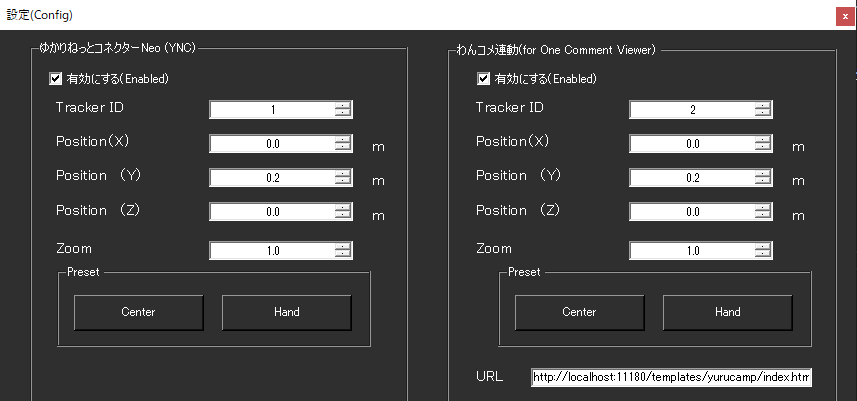

!!! Info "前提条件"
    * OSC通信を使うアプリケーションと併用していること

## このプラグインで出来ること

* VRゲーム内で字幕とコメントをみることができます。
!!! Warning "オーバーレイについて"
    * リアルタイム合成するため、多少VRに負荷がかかります（FPSが低下します）。
    * 環境などによっては、オーバーレイが表示できないことがあります。(OpenVRを使っていない場合など)

##　有効化

* プラグインを使うチェックをONにしてください。

## 設定

|設定|意味|
|:--|:---|
|有効にする|手に画面を出す機能をONします|
|Tracker ID|どの位置デバイスを基準に動かすかを決めます。 単純構成なら ``1``が左手 ``2``が右手です|
|Position|デバイスからどれぐらいの位置に表示するかを指定します。|
|ZOOM|サイズをどれぐらい拡大するかを指定します|
|URL|どのページを表示するかを決めます|

!!! Info "URLについて"
    * わんコメテンプレートからのドラッグ＆ドロップを受け付けます。
    * わんコメ以外でもURLアクセスできるものであれば表示できます

## 使い方
1. VRゲームを起動します
2. プラグインのLaunchボタンを押します
3. 黒いウィンドウが表示され、字幕が投影されます

!!! Info "黒いウィンドウについて"
    * StreamVRにオーバーレイデータを生成・送付しているプログラムです
    * 使用中は起動しておいてください（最小化で構いません）

