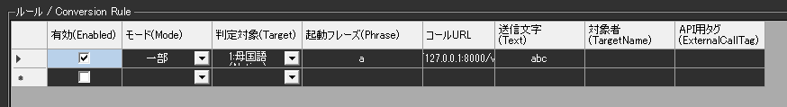

!!! Info "前提条件"
    * WebSocketで呼び出されてつかえる機能（相手）が必要です

## このプラグインで出来ること

* 特定の条件でHTTPの通信を呼び出すことができます。

## 有効化


* プラグインを使うチェックをONにしてください。

## 設定



|設定|意味|
|:--|:---|
|ルール|音声認識文に特定の文字列を含む場合は、指定したアドレスにデータを送ります|

## ルール

* ルールは、条件に一致したときにそのデータを送付することができる「仕掛け」です

|設定|意味|
|:--|:---|
|有効(Enabled)|この条件を有効化します|
|モード(Mode)|条件の判断モードを指定します|
|対象|対象にする言語を決めます（母国語、翻訳１～４）|
|起動フレーズ|判断に使う起動キーワードです。一致すると起動します|
|コールURL|WebSocketコールするときの送付先です (ws://で始まるアドレスになります) |
|送信文字|接続後に送信する文字列です。（送信後、通信を終了します）|
|対象者|話者名に指定文字が含まれているときに反応します。空欄の場合は全員が対象です|
|APIタグ|APIから呼び出すときにつかうタグ名です|

!!! Info "パラメータの記述"
    * 発話がきっかけで呼び出される場合は、URLの中に下記パラメータが使えます

    |パラメータ|意味|
    |:--------|:---|
    |{text0}|母国語（文）|
    |{text1}|翻訳１（文）|
    |{text2}|翻訳２（文）|
    |{text3}|翻訳３（文）|
    |{text4}|翻訳４（文）|
    |{lang0}|母国語（言語名）|
    |{lang1}|翻訳１（言語名）|
    |{lang2}|翻訳２（言語名）|
    |{lang3}|翻訳３（言語名）|
    |{lang4}|翻訳４（言語名）|
    |{talker}|発話者名|

!!! Tips "コールURLの設定例"
    * VNyanでつかうには、コールURLに下記の用に設定します
    ```ws://127.0.0.1:8000/vnyan```


