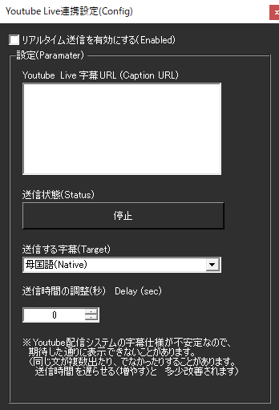
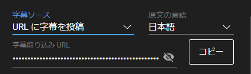

!!! Info "前提条件"
    * Google アカウントが必要です。

## このプラグインで出来ること

* YouTube Live配信に字幕を送付できます

!!! Warning "字幕送付について"
    * 超低遅延設定の配信に字幕をつけている場合にうまく表示されないことがあります
    * PCの時刻が 50秒ずれていると送付できないことがあります
    * 別の手段として [OBS連携](plugin_OBS5.md)にある 608/607送信を使うてもあります

## 有効化

* プラグインを使うチェックをONにしてください。

## 設定

|設定|意味|
|:--|:---|
|Youtube Live字幕URL|Youtube Liveで提供されるURLをいれます|
|送信する字幕|送信する言語を決めます|
|送信時間の調整|送付時間の調整をします|

!!! Info "送信時間の調整"
    * 現在時刻と送付字幕の時刻差が大きい場合、YouTube側が字幕を受諾しません。
    * そういう場合は字幕の時間を調整し、受諾する範囲を探してください。

!!! Info "YouTubeでのURL取得"
    * ライブ配信設定画面の字幕設定を調整することで得られます
    
    * YouTubeの字幕配信URLは配信毎に変わります。そのため設定は保存されません。
