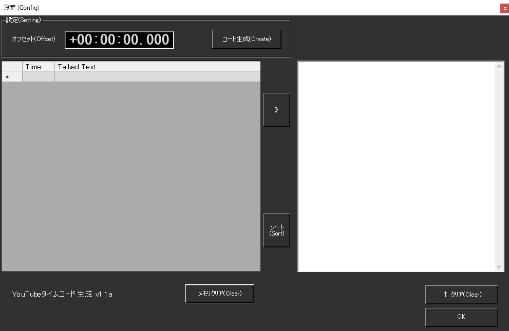

!!! Info "前提条件"
    * 特になし

## このプラグインで出来ること

* YouTube Liveの目次につけるデータを作成できます

##　有効化

* プラグインを使うチェックをONにしてください。

## 使い方
1. プラグインを有効にします
2. 音声認識をします
3. すべて終わったら編集をします

## 編集画面

|設定|意味|
|:--|:---|
|オフセット|目次に生成する時間のずれを調整します|
|左画面|時刻と発話のリストです|
|右画面|編集画面です|
|メモリクリア|中で記憶している時刻と発話のデータを消します|
|↑クリア|編集亜面を消します|
|》|その時刻のデータを転記します|
|ソート|時間順に並べなおします|

!!! Info "オフセット調整"
    * 頭出しするのに使います
    * 時間を調整したらコード生成を押してください
    * 入力桁がたりない場合は正しい補正がなされません

## 編集手順
1. オフセットを入れてコード生成を押します。
2. 時刻が調整できるまで手順１を繰り返します
3. 発話をみながら、目次にしたい行を探します
4. 「》」をおして、転記します
5. 時刻の後ろに 目次にしたい内容を書きます
6. 手順３～５を繰り返します
7. 最後に、作った目次をYouTubeに貼ります。
