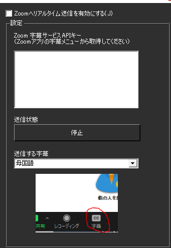

!!! Info "前提条件"
    * ZOOM アカウントが必要です。
    * 字幕を送付するには、主催者からURLを受け取る必要があります

## このプラグインで出来ること

* ZOOM配信に字幕を送付できます

!!! Warning "字幕送付について"
    * ZOOMの仕様により、文の訂正ができないため、UDトークなどで編集した結果は反映されません。

##　有効化

* プラグインを使うチェックをONにしてください。

## 設定

|設定|意味|
|:--|:---|
|リアルタイム送信を有効にする|Zoomにデータを送るようにします|
|Zoom字幕サービスAPIキー|Zoom会議で発行される字幕転送用のURLをいれます|
|送信する字幕|送信する言語を決めます|

!!! Info "送信者について"
    * 字幕の送信は１会議につき１名（１クライアント）にしてください。
