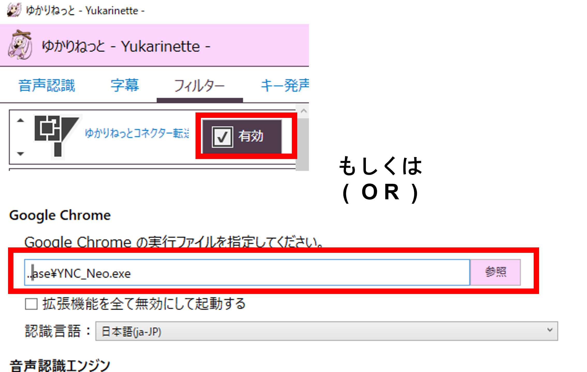

## 1. 導入

!!! Question "1-1　利用料"
    ### 使用は無料ですか
    * 本ソフトウェア自体はフリーソフトであり、無料でお使いいただけます。
    * 翻訳に有料翻訳を使う場合は、使った分だけ料金がかかります。
    * 翻訳に使うライセンスキーは、FANBOX支援版を使う場合を除き、個人で用意してください。
    * FANBOX支援をすると、個人契約不要でゆかコネをつかった翻訳出力ができます。
    * FANBOXの特典は個人が使うことを想定しています。（企業の方は個々に各企業と直接API契約をお願いします）

!!! Question "1-2　動作環境"
    ### どの環境でうごきますか
    * 現在サポート状態にあるWindows上で動くように設計しています。
    * Windows 8.1、10、11 を想定しています。
    
!!! Question "1-3　動作"
    ### うまく起動できません
    * まずは [再インストール](./reinstall.md)してみましょう。
    * それでもだめなら[レポート](report.md)しましょう。

## 2. 音声認識

!!! Question "2-1 音声認識"
    ### どんな音声認識システムがつかえますか
    下記のシステムに対応しています。

    * ブラウザが対応している音声認識(Google社,Microsoft社)
    * [UDトーク](https://udtalk.jp/)([Shamrock Records,Inc社](https://shamrock-records.jp/))
    * オフライン音声認識システム
    * [ゆかりねっと](http://www.okayulu.moe/)

!!! Question "2-2 ゆかりねっと連携"
    ### ゆかりねっとと連動させるためには？
    ゆかりねっとにプラグインをいれるか、ブラウザの代わりに指定します。具体的な手順は[チートシート](../cs/cs_yukari.md)を参考に設定してみてください。
        

## 3. 翻訳

!!! Question "3-1 使用範囲①"
    ### Google無料ライブラリは何に使っても問題ないですか
    * この翻訳エンジンは提供されなくなったため、現在では使用出来ません。

!!! Question "3-2 ライセンス"
    ### 企業が提供する翻訳は何に使っても問題ないですか
    * ご利用の状況やご利用者によって解釈・条件が異なります。
    * 提供企業が明示しているライセンス条項に基づいてご活用ください。
    * 解説は [こちら](../licensing.md)でおこなっています。

!!! Question "3-3 使用範囲②"
    ### 共用翻訳は何に使っても問題ないですか
    * 提供元のライセンスでは、商用利用は可能となっています。
    * 翻訳品質は一般的に商用翻訳より劣りますので内容を確認し利用するか判断して下さい。

    
## 4. 支援と連携

!!! Question "4-1 支援方法"
    ### どのように支援すればいいですか
    まずは、そのような気持ちを持ってくださったことに感謝をいたします。いくつかの支援方法があります。
    
    * [PIXIV FANBOX](https://nao.fanbox.cc/plans) で支援する
    * 配信でつかう（配信コメントにバナーを貼っていただけると嬉しいです）
    * Twitter ([#ゆかコネもいいぞ](https://twitter.com/search?q=%23%E3%82%86%E3%81%8B%E3%82%B3%E3%83%8D%E3%82%82%E3%81%84%E3%81%84%E3%81%9E&src=typeahead_click&f=live)) などで拡散する
    * [note](https://note.com) などで使い方を紹介する
    * [コミュニティ](https://t.co/WZAJU71QUQ)内でQ&Aに答える
    * [ゆかコネ技術部](https://discord.com/channels/539815056939024386/982340918948552764)でデバッグテストに協力する

    いろんな相談をしながら拡張しているので、ぜひご相談ください。

!!! Question "4-2 OSS"
    ### オープンソースにしないのですか

    * 企業とのNDAを結んでいる部分があるので、全体公開する予定はありません。
    * [プラグイン](https://github.com/nmori/YNCNeo_Plugin)などは公開しています。

!!! Question "4-3 開発"
    ### 私のツールやプラットフォームとつないでみたい
    * 相談は随時承っています。
    * お引き受けするかどうかは状況や条件次第で、確約はありません。
    * その後の発展性や、相互メリットなどが感じられる場合、協業するケースがあります。
    * 現時点で、[UDトーク](https://udtalk.jp/)、[わんコメ](https://onecomme.com/)、[音声認識システム（ガムベック氏）](https://twitter.com/Bek_Gum/status/1556510389168312323)との連携実績があります。

!!! Question "4-4 開発"
    ### 機能を改良、追加してほしい
    * [コミュニティ](https://t.co/WZAJU71QUQ)にリクエストをだすことで提案ができます。
    * リアクションが一定以上あったり作者が必要だと思う場合実装が検討あれます。
    * サポートレベルによって実装される範囲が変わります。詳しくは、[こちらの表](support_lv.md)を確認してください。

!!! Question "4-5 プロモーションコードの入手"
    ### プロモーションコードを入手したい
    * [PIXIV FANBOX](https://nao.fanbox.cc/plans) で支援をすると入手ができます

!!! Question "4-6 プロモーションコードの期限"
    ### プロモーションコードがつかえなくなった
    * プロモーションコードは１～２か月ごとに更新されます。これは支援を継続しているかを確認するためのものです。
    * [PIXIV FANBOX](https://nao.fanbox.cc/plans) で新しいコードが入手ができます
    * 課金システムではないので、企業提供品のようなID管理や自動更新システムなどは実装していません。

!!! Question "4-7 プロモーションコードの配布"
    ### プロモーションコードを他人に教えていいですか
    * プロモーションコードはPIXIV FANBOXで支援した方本人に提供しているものです。
    * 製作者から特別な条件で受け取ったものを除き、本人以外に開示することは許可していません。
    * 不当な方法で入手したコードの利用および許可していないコードの開示・配布は損害賠償を請求することがあります。

!!! Question "4-8 プロモーションコードが機能しない"
    ### プロモーションコードを入れてもうまく動きません
    * FANBOXのダイレクトメールか、Discordで連絡をとり、直接サポートを受けてください。

!!! Question "4-9 FANBOXの決済について①"
    ### クレジットカードを持っていません。
    * FANBOXによるとコンビニ決済などが利用可能なようです。

!!! Question "4-10 FANBOXの決済について②"
    ### 親や親戚のクレジットカードをつかってよいですか。
    * 当方ではその件について回答や判断は致しかねます。
    * クレジットカード会社やFANBOXの規約を読んでご対応ください。
    * 一般的には、当人以外の決済は規約で禁止されているケースがほとんどです。

!!! Question "4-11 企業提供について"
    ### 企業としてソフトウェアを利用したいのですが
    * フリーソフトとして利用される分には、規約に沿っていれば利用は可能です。
    * 「FANBOX支援に入って企業内で使いまわす」ような使い方はお断りしております。
    * 「有償APIを自前で用意し自分の所でうまく回したい」などあれば相談は可能です。
    判定ガイドラインなどの詳細は[こちら](../support/support_summary.md#1-企業ライバー事務所が業務システムとして採用する場合)からどうぞ
