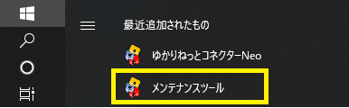
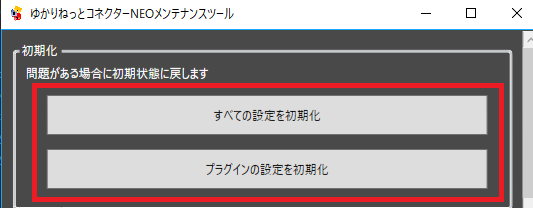
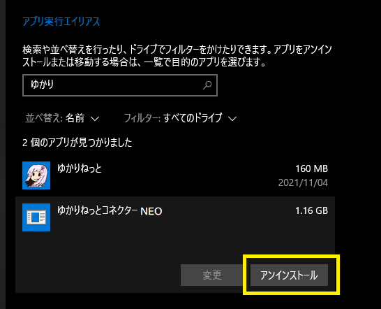

!!! Warning "初期化すると"
    * あなたが実施した設定が消え、インストール初期状態に戻ります。
    * 設定を消したくない場合は、手順２からお試しください。

## 1. 設定を初期化します

!!! Info "この作業で使う「メンテナンスツール」の起動方法"
    スタートメニューの中にあります。（古いバージョンにはついてないので、ない場合はアップデートしましょう）

    

* メンテナンスツールで消すことができます。

## 2. アンインストール

* Windows のアプリケーション設定から削除を行います。

## 3. フォルダが残っていれば消す

* インストール先フォルダが残っていれば、削除します。

!!! Info "ファイルがある場所"
    |項目|デフォルトの場所|
    |:--|:-------------|
    |プログラム|C:\Program Files\YNC_Neo|
    |設定ファイル(v1)|マイドキュメント\YukarinetteConnector|
    |設定ファイル(v2)|%APPDATA%\YukarinetteConnector|

## 4. 再インストールする

* [ダウンロード画面](../download.md)からダウンロードして導入しなおします。
