# わんコメ連動がうまくいかないとき

ゆかコネは、わんコメと連動させて翻訳や読み上げができますが、うまく連動できないとお問い合わせ頂くことがあります。下記の項目を確認してみてください。

!!! Notice "始める前に"

    * 一息おいてみましょう。
    * わんコメのバージョンを上げてみましょう
    * ゆかコネのバージョンを上げてみましょう
    * 再起動しても直りませんか？

## 1.ゆかコネのプラグインを確認

まずは、ゆかコネのプラグインを確認します。
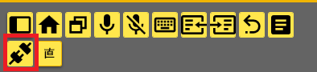

これらの画面で、下記のプラグインがONになっていることを確認します。

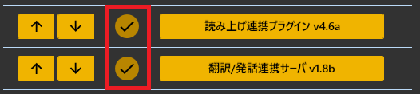

* 読み上げを使う場合は、読み上げをONにします
* 翻訳、読み上げいずれかを使う場合には、連携サーバをONにします

## 2.ゆかコネの翻訳設定を確認

翻訳を使う場合は、翻訳設定ができていることを確認してください。

### ～v2.1まで

翻訳設定を参照します。ここで今使える翻訳エンジンが選ばれていることを確認してください。

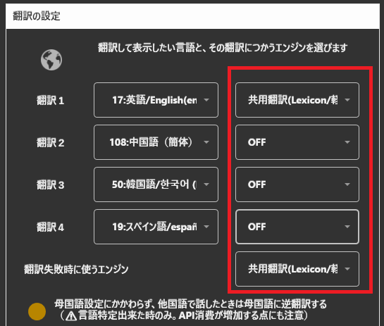

### v2.2～

ツール連携用の翻訳設定を参照します。ここで今使える翻訳エンジンが選ばれていることを確認してください。

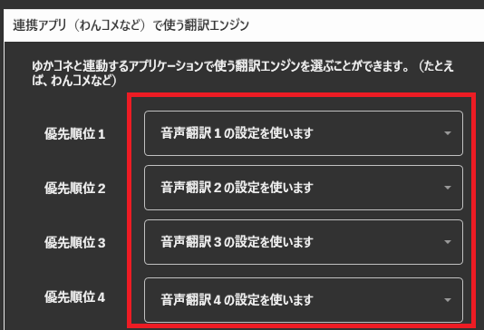

## 3.ゆかコネの読み上げ設定を確認

* 連携した読み上げが必要な方は、こちらを確認します。
* 読み上げをつかわないなら、この確認は不要です

読み上げプラグインをひらき、
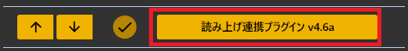

再生先や、つかうコントローラを選びます。
うまくいっていれば、読み上げテストで声がだせます。

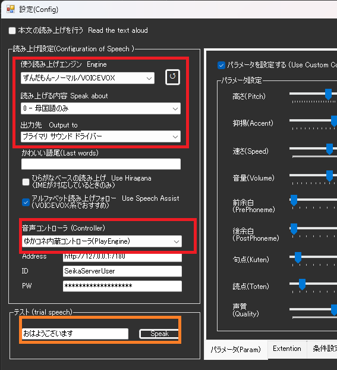

## 4.わんコメの連携をONに

わんコメの画面で、通信の選択を確認してください。

* 通信方法は「WS」
* ホスト名は、「127.0.0.1」か「localhost」
* ポート番号は、横の虫眼鏡ボタンを押せば自動で入ります
* 翻訳をする場合には翻訳タブのチェックをいれます
* 読み上げをする場合には、読み上げのチェックをいれてボイスをえらんでおきます

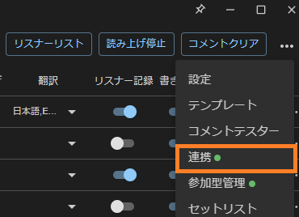
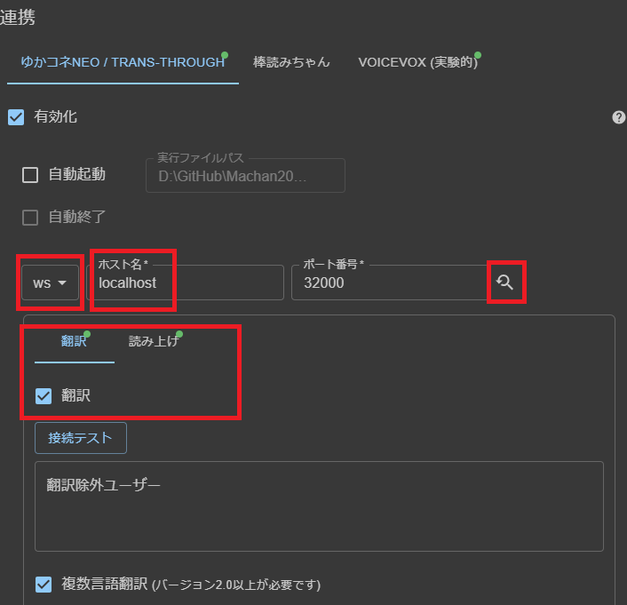

なお、

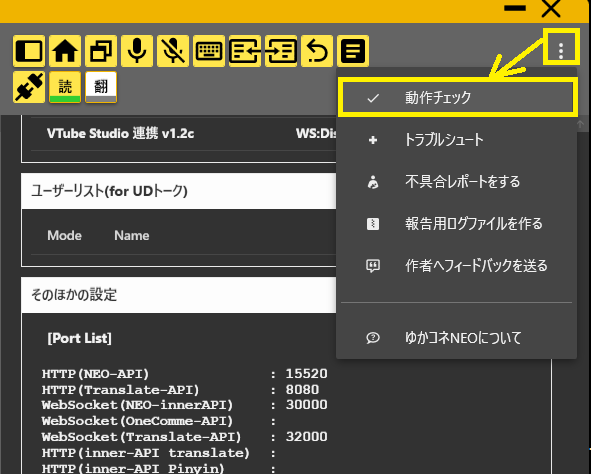
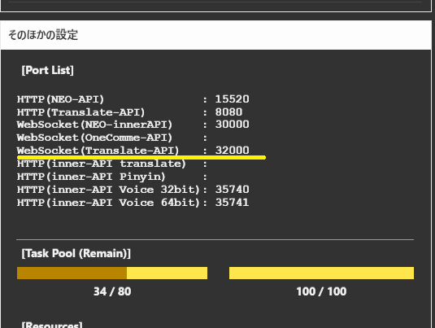

## 5.翻訳をONになっているか確認します

* うまく通信できていれば、これで翻訳がされます。

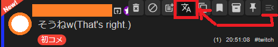
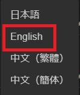

枠の設定で、翻訳の設定ができているかをかくにんしてください。

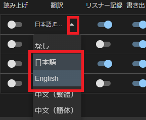

## 6.それでも駄目なら…

* サポート依頼をしましょう
* ゆかコネやわんコメのログを開発者に共有してください
