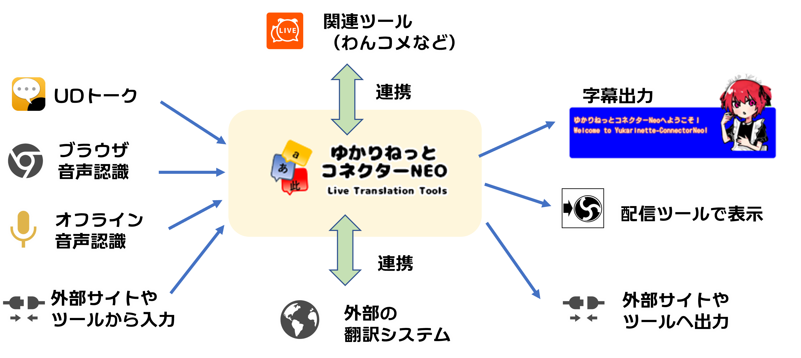

# 何ができるか？
ゆかりねっとコネクターは次のことをサポートします。

* 音声認識（との繋ぎ）
* 翻訳
* 字幕表示
* 周辺ツールへの出力

# 具体的仕様

|項目|可否|補足|
|:--|:---|:---|
|多言語翻訳|〇|母国語＋４か国語まで|
|翻訳エンジン|状況による|●Microsoft翻訳エンジン ●Google翻訳エンジン ●Amazon翻訳エンジン ●IBM 翻訳エンジン ●NAVER Papago翻訳エンジン ●Google翻訳ライブラリ ●共用翻訳サーバ(lexcon）|
|音声認識|〇| ●UDトーク ●ブラウザ音声認識 ●ブラウザ音声認識(ガムベックさん開発) ●オフライン音声認識ライブラリ|
|ゆかりねっと連携|〇|●ゆかりねっとプラグイン併用モード ●ブラウザエミュレート|
|OBS連携|〇| OBS Studio用 WebSocket v4/v5対応|
|読み上げ|〇|プラグインを使えば可能 ●A.I.Voice ●CeVIO/CeVIO AI ●AITalk3 ●VOICEVOX ●COEIROINK on VOICEVOX ●LMRoid ●SAPI5 ●VOICEROID2  |
|表示形式|〇|●多言語 ●VRオーバーレイ ●リスト ●ゲーム風 ●コラボレイアウト ●わんコメテンプレ|
|辞書・ルビ|〇|プラグインで実現|
|FANBOX支援|〇|支援しなくても利用はできます。 支援するとみんなで支える翻訳サーバがつかえるようになります|
