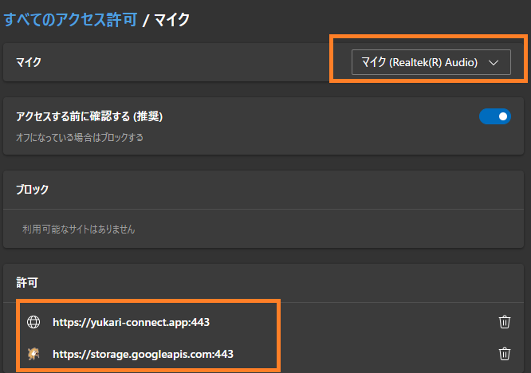

# 音声認識できないとき

ブラウザ音声認識とは、ブラウザに搭載されている音声認識機能を活用して、音声を文字に変換するものです。下記のモードのいずれかで活用できます。

音声認識ができない場合は下記のことを確認してください。

①ブラウザが使用するマイクの設定を確認してください

* 設定画面は　Edgeであれば、「edge://settings/content/microphone」、Chromeであれば「chrome://settings/content/microphone」にあります。

このような画面が出ると思います。マイクの設定でおつかいのマイクをえらびます。また、許可のところにこのような表示が出ることを確認します。（ブロックされていると音声認識がつかえません）

②音量が正しいことを確認します。

* 音が小さいと音声認識がされなかったり、不明瞭な結果になったり、認識の確定が遅れます

* 音が大きすぎると、音が割れて不明瞭な結果や音声認識結果が出てこないことがあります

③ブラウザを変えてみます

* 時折、メーカから提供されている機能が不安定になることがあります。その場合はブラウザを変えて動かしてみてください。

