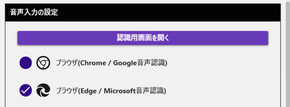

# 音声認識がうまくいかないときの解決法

  <h4>このページについて</h4>
  
音声認識機能がうまく動かないときに、原因を特定して解決するためのガイドです。よくあるトラブルを順番に確認していきましょう！

  <a href="#_2" class="purpose-card">
    
🎤

    <h3>マイクが認識されない</h3>
    
ブラウザのマイク設定を確認する方法

  </a>
  <a href="#_3" class="purpose-card">
    
🔊

    <h3>音声が正しく拾われない</h3>
    
音量レベルの調整方法

  </a>
  <a href="#_4" class="purpose-card">
    
🌐

    <h3>ブラウザを変更したい</h3>
    
別のブラウザで試す方法

  </a>

## ブラウザ音声認識について

ブラウザ音声認識は、Edgeやスマートフォンに搭載されている音声認識機能を使って、あなたの声を文字に変換するシンプルな方法です。

## よくある問題と解決法

### マイク設定の確認

  

    <h3>ブラウザのマイク設定画面を開く</h3>
    
ブラウザのアドレスバーに以下のいずれかを入力します：

    <ul>
      <li>Microsoft Edge: <code>edge://settings/content/microphone</code></li>
      <li>Google Chrome: <code>chrome://settings/content/microphone</code></li>
    </ul>
  

  
  

    <h3>正しいマイクを選択する</h3>
    
使いたいマイクが選択されているか確認します

    

      
      

        使用するマイクを選択
      

      

        「許可」になっていることを確認
      

    

  

  
  

    <h3>ブラウザが許可状態か確認する</h3>
    
「ブロック」になっていると音声認識ができません。必ず「許可」にしましょう。

  

### 音量調整

音量が適切でないと、認識精度に大きく影響します。

  <h4>音量調整のポイント</h4>
  <ul>
    <li><strong>音量が小さすぎる場合</strong>：認識されない、結果が不明瞭、認識の確定が遅れる</li>
    <li><strong>音量が大きすぎる場合</strong>：音が割れて認識精度が下がる、認識結果が表示されないことも</li>
  </ul>

#### Windows 10/11での音量確認方法

1. タスクバーの音量アイコンを右クリック
2. 「サウンド設定を開く」を選択
3. 「入力」メニューで使用するマイクを選び、音量レベルを確認
4. レベルメーターが話しているときに中間くらいまで動くのが理想的です

### ブラウザの変更

ブラウザによって音声認識の精度や安定性が異なることがあります。

  

    <h3>別のブラウザで試す</h3>
    
現在のブラウザで問題がある場合は、別のブラウザに切り替えてみましょう

    <ul>
      <li>Microsoft Edge → Google Chrome</li>
      <li>Google Chrome → Microsoft Edge</li>
    </ul>
  

  
  

    <h3>ブラウザの設定変更</h3>
    
ゆかコネのオプション設定で使用するブラウザを変更できます

    <ol>
      <li>ゆかコネの設定画面を開く</li>
      <li>オプションタブを選択</li>
      <li>「ブラウザ」の項目で別のブラウザを選択</li>
    </ol>
  

## その他のよくある問題

### 認識はされるが非常に遅い場合

  <h4>考えられる原因と対策</h4>
  <ul>
    <li>静かすぎる環境：少し大きめの声で話してみる</li>
    <li>PC負荷が高い：他のアプリを閉じてみる</li>
    <li>インターネット接続が不安定：接続状態を確認する</li>
  </ul>

### 特定の単語や専門用語が認識されない場合

「辞書」プラグインを使うと、特定の単語や専門用語の認識精度を高めることができます。

<a href="../../plugin/plugin_dictionary/" class="md-button">辞書プラグインの設定方法</a>

### それでも解決しない場合

  

    <h3>Windows の設定を確認する</h3>
    
Windows自体のマイク設定に問題がある可能性があります

    <ol>
      <li>Windowsの「設定」→「システム」→「サウンド」を開く</li>
      <li>「入力」セクションでマイクがデフォルトデバイスになっているか確認</li>
      <li>「デバイスのプロパティ」でマイクのアクセス許可を確認</li>
    </ol>
  

  
  

    <h3>デバイスドライバーを確認する</h3>
    
特に外付けマイクを使っている場合は、ドライバーが最新かチェックしましょう

  

  <h4>困ったときは</h4>
  
上記の方法を試しても解決しない場合は、<a href="../../qa/before_help/">ヘルプが欲しいとき</a>のページで詳しい問題解決方法を確認できます。

