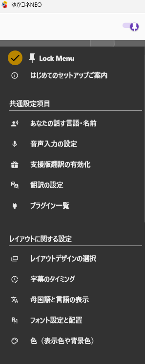
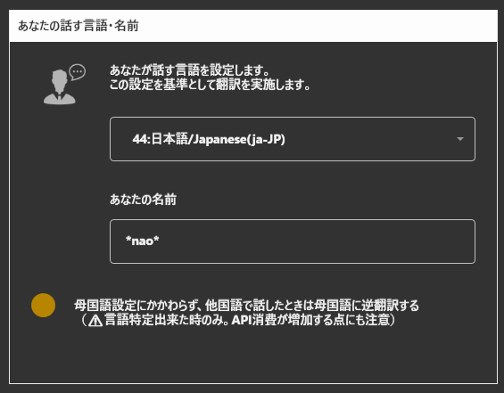
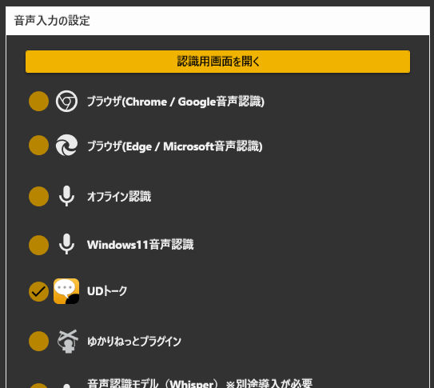
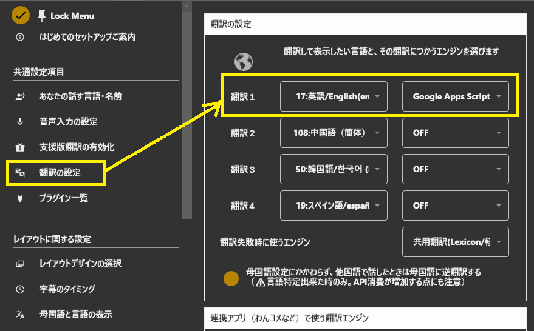
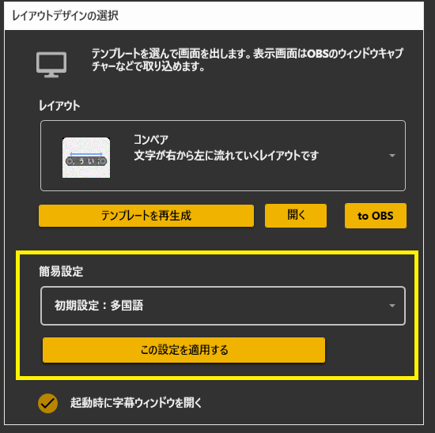
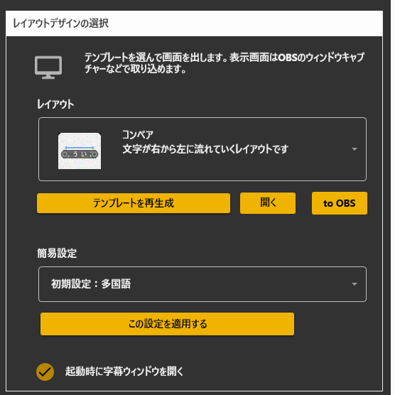
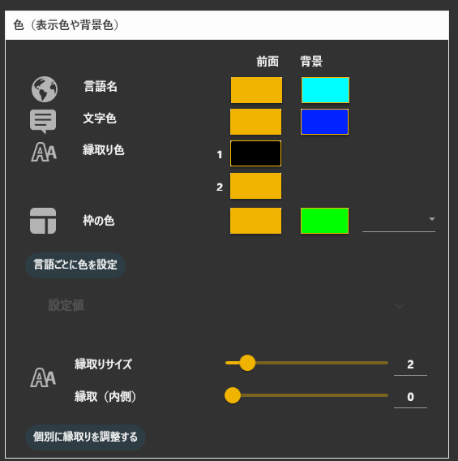
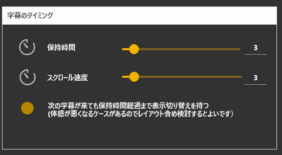

# 標準設定項目

ゆかコネNEOを使うには、画面のメニューを上から順番に設定していくことで簡単に使うことができます。

!!!note "メニューの使い方"
    メニューは開いたり閉じたりすることができます。設定するときに１つずつ開いて作業すると今の手順がわかりやすくて便利です。

## 標準手順

### 1.まず話者設定をしましょう

* あなたは話す言語を設定します。ゆかコネNEOは、この言語を基準に翻訳をするようになります。
* あなたの表示上の名前を設定します。これはコラボレーションなどを行うときの名前や、配信画面に表示される名前として使われます。

### 2.音声認識の種類を決めましょう

次に、音声認識に何を使うかをえらびます。一番簡単に使えるのはブラウザ音声認識になります。

|種類|特徴|
|:---|:---|
|ブラウザ|●ブラウザとマイクがあれば認識ができます。 ●インターネット接続が必要です。|
|オフライン|●インターネットがなくても認識できます。 ●認識精度が少し落ちます。|
|UDトーク|●商用向けの音声認識を採用しており認識精度が高く優秀です。 ●スマホかエミュレータでUDトークアプリを動かす事が必要です。|
|ゆかりねっとプラグイン|●ゆかりねっとの音声認識を利用します。 ●ボイスロイド等と連動する場合に効果的です。|
|音声認識モデル(Whisper)|音声認識AIをパソコンにダウンロードして動かすパターンを使うときに選びます|

その他の設定はこのようになります
|種類|説明|
|:---|:---|
|UDトークとの接続パネル|UDトークのトークルームに接続するときの設定画面です|
|音声区切り|長く話したとき、どれぐらいの息継ぎの間を見て文を区切るか？を指定します。|

### 3.翻訳先の言語を決めましょう

* 言語は４つまで選べます。
* 言語に合わせて翻訳エンジンも選んでください。

!!! warning "言語設定について"
    翻訳エンジンによっては、言語に対応していないことがあり、翻訳できないことがあります。その場合は別の翻訳エンジンを選んでください。

!!! Info "商用翻訳エンジンについて"
    翻訳エンジンは、「共用翻訳サーバ」以外は、個人で契約する必要があります。ただし、「みんなで支える翻訳支援」の仕組みがあり、そちらで支援いただくと多くの翻訳エンジンを利用することが可能になります。(その場合は支援版機能の有効化をしてください)

### 4.設定を決めます

* おすすめ設定を取り込みます。
* 一般的には「多言語」が使われています

### 5.字幕の出し方を決めましょう

* レイアウトを選んで、右横のボタンをおします。
* この画面は後程、配信ソフトで取り込んで使います。

!!! tip "配信ソフトへ取り込む簡単な方法"
    * ブラウザ機能がついた配信ソフトをお使いの場合は、「to OBS」の所をマウスでつかみ、配信ソフトにドラック＆ドロップすることで取り込み作業が１発完了します。
    * うまくいかない場合は、アドレスが表示されているところをダブルクリックしてください。そうするとアドレスがコピーされます。あとはOBSなどのブラウザソースで表示してください。

ここまでできれば、OBSで表示ができているはずです。

!!! Info "文字がすごく小さく見える場合"
    * OBSに取り込んだときにサイズがOBSによって自動設定されているため小さくなっています。
    * OBSのブラウザソース→プロパティにある幅と高さを小さくしてみてください（たとえば 幅800,高さ300）

## 調整する場合

### 1.フォントを決めましょう

文字を出すために使うフォントを決めます。フォントサイズ、フォント種類、配置（寄せ方）が設定できます。

!!! info "設定について"
    * ブラウザによって指定のフォントが採用されないケースがあります。
    * 言語に応じたフォントを選ばないと文字化けするケースがあります。

### 2.色を決めましょう

* フォントや背景などの色を決めます。
* 枠を消したい場合などは、背景色と同じにするといいです。

|項目|意味|
|:--|:--|
|縁取りサイズ|文字の縁取りをします。 ●あまり大きくするとエッジがでたり縁がぼけるので注意。|

!!! info "テンプレートの設定について"
    * 使用するテンプレートによっては、該当する部分がなかったり反映されないことがあります。

### 3.見え方を調整しましょう①

* どのように見せたいか？を調整します。

|項目|意味|
|:--|:--|
|行間|文字の行間を設定します。|
|段落間|認識のかたまり毎の隙間です。リスト表示レイアウトなどで有効な設定です|
|文字間隔|文字ごとのすき間を設定します|
|ウィンドウ枠の高さ|表示内の枠の高さを設定します|
|整形モード|強制的に指定行数に絞り込みます。レイアウトによっては指定行数にならないことがあります|

!!! Info "音声区切りについて"
    * 音声区切りは音声認識の間を見て強制的に文章を確定する手法です。
    * 音声認識エンジンに手を入れるわけではないので、
    設定によってうまく出ないことがあります。
    * 話しながら一番自然に区切れる位置をチューニングしてみてください。
    * 特定の音声認識の時のみ使えるオプション機能です。

!!! Tips "反映される設定項目について"
    |   |多言語|リスト|ゲーム風|トークセッション|
    |:-|:-----|:-----|:------|:--------------|
    |縁取りサイズ|〇|〇|〇|〇|
    |保持時間|〇|〇|〇|〇|
    |行間|〇|〇|〇|〇|
    |段落間|－|〇|－|－|
    |文字間隔|〇|〇|〇|〇|
    |ウィンドウ枠の高さ|－|－|－|〇|
    |整形モード|〇|－|－|－|

### 4.見え方を調整しましょう②

* どのように見せたいか？を調整します。

|項目|意味|
|:--|:--|
|保持時間|何ミリ秒間字幕をキープするか？を設定します。|
|スクロール時間|字幕スクロールに対応しているレイアウトの場合は、時間を指定できます|
|母国語の表示位置|翻訳文の上に出すか、下に出すかを選べます|
|認識した母国語の表示|認識過程を出すか、文章確定後に出すかを選べます 過程を出すとリアルタイム感を得られますがちらつきも増えます。|

## そのほか機能

### 1.クイックボタン

* 左から順に説明します

|項目|意味|
|:--|:--|
|隠す←|左のメニューを隠します|
|ホーム|メニューホームに戻ります|
|レイアウト表示|字幕画面を表示します|
|音声認識ボタン|ブラウザ音声認識を起動します|
|音声認識ミュート|ONにすると字幕を消し、音声認識結果を出さなくなります|
|支援状態|支援機能を有効化したり、現状を確認できます|
|プラグイン|拡張機能を有効化したり設定します|
|＜＞|メニューページをめくります|
|戻る|１つ前のメニューに戻ります|
|？|トラブルが起きたとき向けのお助け画面をだします|

* ほかにも、右上の…を押すとオプションメニューが出ます。

|項目|意味|
|:--|:--|
|ユーザリスト|現在字幕として参加している人のリストが表示されます(UDトーク使用時向け)|
|ステータス|各プラグイン機能の動作状況を確認できます|
|動作状況|通信ポートなどの状況を確認できます|
|ヘルプ|ヘルプ画面をだします|
|不具合レポート|うまく動かないときはこのレポートを提出してください|
|報告用ログファイルをつくる|レポートを出すときにこのファイルを提出すると改善しやすいです|
|サポートｃｈをひらく|サポート用Discordを開きます|
|マニュアルを開く|このマニュアルページを開きます|
|トラブル解決サポート|初期化などができるメニューを表示します|
