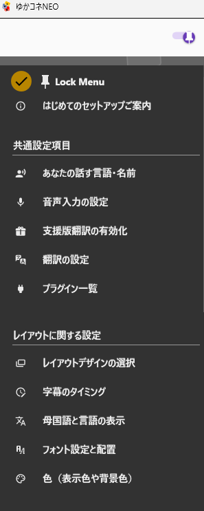
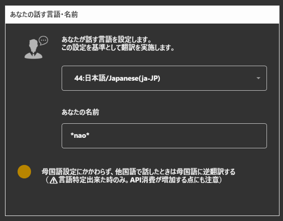
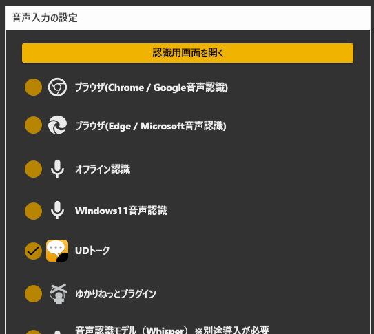
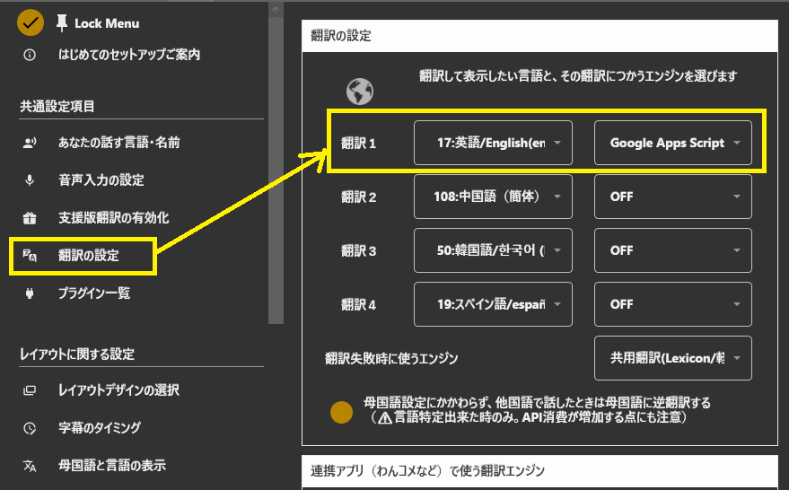
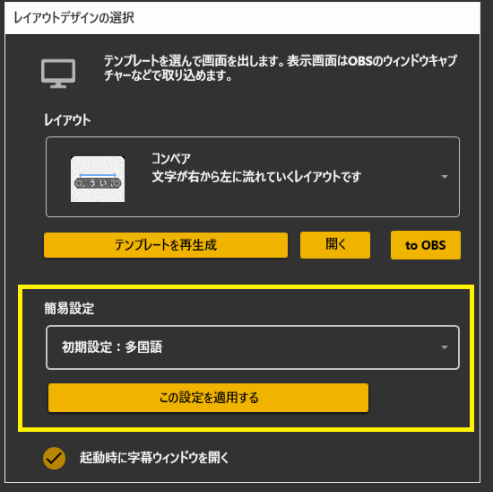
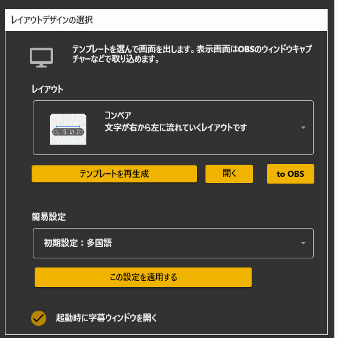
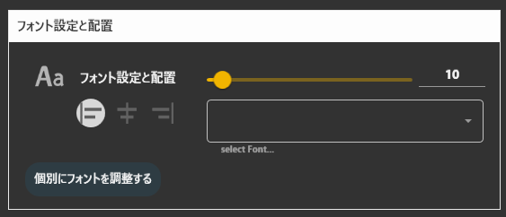
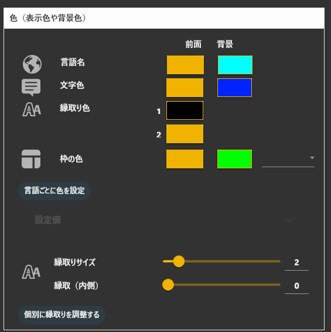
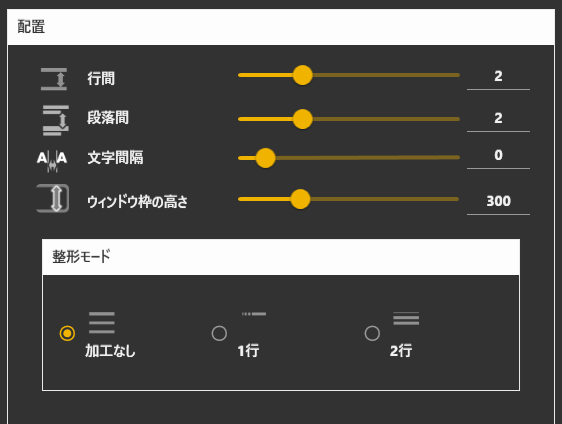
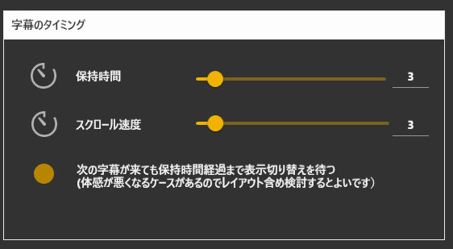

# 標準設定項目

ゆかコネNEOを使うには、画面のメニューを上から順番に設定していくことで簡単に使うことができます。

<!-- TODO: スクリーンショットは v2.3.59 時点のものです。左メニューの構成が変わっているため撮り直しが必要 -->

!!!note "メニューの使い方"
    メニューは開いたり閉じたりすることができます。設定するときに１つずつ開いて作業すると今の手順がわかりやすくて便利です。

## 設定画面の地図

設定は、画面左のメニューから選ぶと右側に出てきます。「設定ウィンドウ」が別に開くわけではありません。

|グループ|メニュー項目|内容|
|:--|:--|:--|
|（先頭）|はじめてのセットアップご案内|初回向けのガイドを開きます|
|**共通設定項目**|あなたの話す言語・名前|母国語と表示名|
||音声入力の設定|音声認識の種類と細かい調整|
||支援版翻訳の有効化|プロモーションコードの入力、翻訳残量の確認|
||翻訳の設定|翻訳先の言語と翻訳エンジン|
||プラグイン一覧|拡張機能の有効化と設定|
|**レイアウトに関する設定**|レイアウトデザインの選択|字幕の見せ方の選択と配信ソフトへの取り込み|
||字幕のタイミング|保持時間・スクロール速度|
||母国語と言語の表示|母国語をどう出すか、言語名を出すか|
||フォント設定と配置|フォント・サイズ・寄せ方・行間など|
||色（表示色や背景色）|文字色・背景色・縁取り|
|**オプション設定**|ブラウザのオプション|字幕表示に使うブラウザの設定|
||翻訳（API、設定）|翻訳の節約設定・自分のAPIキー・翻訳キャッシュ|
||ネットワークの設定|通信の許可範囲・使うネットワーク|
||フォルダの指定|話し手の絵や外部ツールの場所|
||起動時設定|見た目のテーマ・スタートアップ登録・調査用ログ|
|**設定**|設定保存・復元|設定の保存／読み込み／プロファイル管理|
||全ての設定画面を表示|すべての設定を1画面にまとめて表示|
|**その他**|手動入力枠|キーボードから字幕を入れる|
||サポートｃｈを開く|サポート用Discordを開きます|
||マニュアルを開く|このマニュアルページを開きます|
||ゆかコネNEOについて|バージョン情報|
|**トラブルシュート**|動作チェック|各機能が動いているかをランプで確認|
||トラブルシュート|初期化やフォルダを開くなどの復旧メニュー|
||不具合レポートをする|うまく動かないときの報告|
||報告用ログファイルを作る|報告に添付するファイルを作ります|

!!! Tip "オプション設定の項目が見つからないとき"
    「全ての設定画面を表示」を選ぶと、すべての設定項目が1画面に並びます。どのページにあるかわからない項目を探すときに便利です。

## 標準手順

### 1.まず話者設定をしましょう

* あなたは話す言語を設定します。ゆかコネNEOは、この言語を基準に翻訳をするようになります。
* あなたの表示上の名前を設定します。これはコラボレーションなどを行うときの名前や、配信画面に表示される名前として使われます。

|項目|意味|既定|
|:--|:--|:--|
|母国語設定にかかわらず、他国語で話したときは母国語に逆翻訳する|母国語以外の言葉で話したとき、母国語へ翻訳して表示します|OFF|

### 2.音声認識の種類を決めましょう

<!-- TODO: スクリーンショットは v2.3.59 時点のもの。Parapper と Windows11音声認識のカードが写っていないため撮り直しが必要 -->

次に、音声認識に何を使うかをえらびます。一番簡単に使えるのはブラウザ音声認識になります。

|種類|特徴|
|:---|:---|
|ブラウザ（Chrome / Google音声認識）|●Chromeとマイクがあれば認識ができます。 ●インターネット接続が必要です。 ●既定で選ばれています。|
|ブラウザ（Edge / Microsoft音声認識）|●Edgeとマイクがあれば認識ができます。 ●インターネット接続が必要です。 ●Chromeで思うように認識しないときに試してみてください。|
|オフライン|●インターネットがなくても認識できます。 ●認識精度が少し落ちます。|
|UDトーク|●商用向けの音声認識を採用しており認識精度が高く優秀です。 ●スマホかエミュレータでUDトークアプリを動かす事が必要です。|
|ゆかりねっとプラグイン|●ゆかりねっとの音声認識を利用します。 ●ボイスロイド等と連動する場合に効果的です。|
|音声認識モデル(Whisper)|●音声認識AIをパソコンにダウンロードして動かすパターンを使うときに選びます。 ●別途、実行ファイルの場所を「フォルダの指定」で設定します。|
|ゆーかねすぴれこ|●HARU_Keiさんが公開しているオフライン認識ツールと連携します。 ●別途ツールの導入と、「フォルダの指定」での設定が必要です。|
|Parapper|●Parakeet株式会社の軽量な音声認識ツールと連携します。 ●パソコンの中だけで認識できます。 ●別途ツールの導入と、「フォルダの指定」での設定が必要です。|
|Windows11音声認識|●Windows11に入っている音声認識を使います。 ●Windows側で音声認識を有効にしておく必要があります。|

!!! Info "カードに付いているバッジについて"
    それぞれの選択肢には、目印としてバッジが付いています。

    |バッジ|意味|
    |:--|:--|
    |簡単|マイクとブラウザだけで始められます|
    |スマホ利用|スマートフォンなど別の機器が必要です|
    |応用|少し設定に慣れてから使うのがおすすめです|
    |追加導入|別のソフトをインストールする必要があります|
    |限定機能|動作条件がかぎられています|

その他の設定はこのようになります

|種類|説明|
|:---|:---|
|UDトークとの接続パネル|UDトークのトークルームに接続するときの設定画面です|
|音声区切り|長く話したとき、どれぐらいの息継ぎの間を見て文を区切るか？を指定します。（100～10000ミリ秒。既定は3000）|
|起動時に音声認識ウィンドウを開く|ゆかコネNEOを立ち上げたときに、認識画面を自動で開きます|

#### UDトークとの接続パネル

|項目|意味|
|:--|:--|
|使うネットワークの指定|複数のネットワークがある場合にどれを使うか選びます|
|招待確認 / 接続 / 切断|トークルームへの参加・退出を行います|
|ユーザID|自分のIDが表示されます（変更はできません）|
|認識結果が細分化されるのを抑制します|短く区切られすぎた認識結果をつなげて、読みやすくします|

### 3.翻訳先の言語を決めましょう

<!-- TODO: スクリーンショットは v2.3.59 時点のもの。Parapper翻訳が一覧に入っていないため撮り直しが必要 -->

* 言語は４つまで選べます。
* 言語に合わせて翻訳エンジンも選んでください。

!!! warning "言語設定について"
    翻訳エンジンによっては、言語に対応していないことがあり、翻訳できないことがあります。その場合は別の翻訳エンジンを選んでください。

!!! Info "商用翻訳エンジンについて"
    翻訳エンジンは、「共用翻訳サーバ」以外は、個人で契約する必要があります。ただし、「みんなで支える翻訳支援」の仕組みがあり、そちらで支援いただくと多くの翻訳エンジンを利用することが可能になります。(その場合は「支援版翻訳の有効化」から手続きをしてください)

!!! Info "支援が必要なエンジンを選んだ場合"
    * 一覧の項目が選べなくなる（グレーアウトする）ことはありません。どのエンジンも選択そのものはできます。
    * 支援の条件を満たしていない状態で使うと、**翻訳を実行したときにエラーになる**か、無料の翻訳エンジンに切り替わって翻訳されます。
    * 支援の状態は「支援版翻訳の有効化」画面で確認できます。

#### 翻訳失敗時に使うエンジン

* 5つ目のエンジン選択欄です。指定したエンジンで翻訳できなかったときの、予備のエンジンを決めます。
* 既定は「共用翻訳(m2m100/無料)」です。

#### 連携アプリで使う翻訳エンジン

* わんコメなど、ほかのアプリからの翻訳依頼に使うエンジンを、優先順位1～4の順に決められます。
* 先頭の「音声翻訳Nの設定を使います」を選ぶと、字幕用の設定と同じエンジンを使います。
* 字幕は高品質なエンジン、連携アプリは無料のエンジン、というような使い分けができます。

### 4.設定を決めます

* おすすめ設定（簡易設定）を取り込みます。
* 一般的には「多言語」が使われています
* 選んだあと、右の「この設定を適用する」を押すと反映されます。

### 5.字幕の出し方を決めましょう

<!-- TODO: スクリーンショットは v2.3.59 時点のもの。レイアウトの選択肢が増えているため撮り直しが必要 -->

* レイアウトを選んで、右横のボタンをおします。
* この画面は後程、配信ソフトで取り込んで使います。
* 選べるレイアウトの一覧は [レイアウトについて](startup_layout.md) をご覧ください。

|項目|意味|
|:--|:--|
|起動時に字幕ウィンドウを開く|ゆかコネNEOを立ち上げたときに、字幕画面を自動で開きます|
|テンプレートを再生成|字幕テンプレートを初期状態に戻します。表示がおかしくなったときに使います|

!!! tip "配信ソフトへ取り込む簡単な方法"
    * ブラウザ機能がついた配信ソフトをお使いの場合は、「to OBS」の所をマウスでつかみ、配信ソフトにドラック＆ドロップすることで取り込み作業が１発完了します。
    * うまくいかない場合は、アドレスが表示されているところをダブルクリックしてください。そうするとアドレスがコピーされます。あとはOBSなどのブラウザソースで表示してください。

ここまでできれば、OBSで表示ができているはずです。

!!! Info "文字がすごく小さく見える場合"
    * OBSに取り込んだときにサイズがOBSによって自動設定されているため小さくなっています。
    * OBSのブラウザソース→プロパティにある幅と高さを小さくしてみてください（たとえば 幅800,高さ300）

!!! Tip "言語ごとに別々に取り込みたい場合"
    「テンプレートの取り込み、パス」の中にある「応用パターン（１言語ごとの取り込み）」を開くと、母国語・翻訳1～翻訳4を**それぞれ別のブラウザソースとして**取り込めます。言語ごとに位置やサイズを変えたいときに使います。

## 調整する場合

### 1.フォントを決めましょう

文字を出すために使うフォントを決めます。フォントサイズ、フォント種類、配置（寄せ方）が設定できます。

|項目|意味|範囲・既定|
|:--|:--|:--|
|フォントサイズ|文字の大きさ|2～200（既定32）|
|フォント種類|使うフォント|—|
|文字配置|左寄せ／中央／右寄せ|既定は左寄せ|

!!! info "設定について"
    * ブラウザによって指定のフォントが採用されないケースがあります。
    * 言語に応じたフォントを選ばないと文字化けするケースがあります。

!!! Tip "翻訳ごとに別のフォントにしたい場合"
    「個別にフォントを調整する」をONにすると、翻訳1～翻訳4のフォントサイズ・フォント種類・配置を別々に決められます。（既定はOFF）

### 2.色を決めましょう

* フォントや背景などの色を決めます。
* 枠を消したい場合などは、背景色と同じにするといいです。

|項目|意味|
|:--|:--|
|文字色|文字の色です|
|背景色|背景の色です（既定は緑／Lime）|
|縁取り色|文字のふちの色です（既定は黒）|
|言語名の色|言語名を出す設定のときの、文字色と背景色です|
|区切り線の色|リスト表示などで文と文の間に出る線の色です|
|縁取りサイズ|文字の縁取りをします。 ●あまり大きくするとエッジがでたり縁がぼけるので注意。|
|縁取り（内側）|縁取りをもう一段追加します。既定は0（使わない）|

!!! info "テンプレートの設定について"
    * 使用するテンプレートによっては、該当する部分がなかったり反映されないことがあります。

!!! Tip "言語ごとに色を変えたい場合"
    * 「言語ごとに色を設定」をONにすると、言語ごとに文字色と縁取り色を決められます。
    * 「個別に縁取りを調整する」をONにすると、縁取りの太さも言語ごとに決められます。
    * どちらも既定はOFFです。

### 3.見え方を調整しましょう①

* どのように見せたいか？を調整します。
* この画面は「フォント設定と配置」の中にあります。

|項目|意味|範囲・既定|
|:--|:--|:--|
|行間|文字の行間を設定します。|最大10（既定2）|
|段落間|認識のかたまり毎の隙間です。リスト表示レイアウトなどで有効な設定です|最大10（既定2）|
|文字間隔|文字ごとのすき間を設定します|最大2|
|ウィンドウ枠の高さ|表示内の枠の高さを設定します|50～1000（既定300）|
|整形モード|強制的に指定行数に絞り込みます。レイアウトによっては指定行数にならないことがあります|加工なし／1行／2行（既定は加工なし）|

!!! Info "音声区切りについて"
    * 音声区切りは音声認識の間を見て強制的に文章を確定する手法です。
    * 音声認識エンジンに手を入れるわけではないので、
    設定によってうまく出ないことがあります。
    * 話しながら一番自然に区切れる位置をチューニングしてみてください。
    * 特定の音声認識の時のみ使えるオプション機能です。
    * 設定は「音声入力の設定」画面にあります。

!!! Tips "反映される設定項目について"
    |   |多言語|リスト|ゲーム風|トークセッション|
    |:-|:-----|:-----|:------|:--------------|
    |縁取りサイズ|〇|〇|〇|〇|
    |保持時間|〇|〇|〇|〇|
    |行間|〇|〇|〇|〇|
    |段落間|－|〇|－|－|
    |文字間隔|〇|〇|〇|〇|
    |ウィンドウ枠の高さ|－|－|－|〇|
    |整形モード|〇|－|－|－|

### 4.字幕のタイミングを調整しましょう

* 「字幕のタイミング」画面で設定します。

|項目|意味|
|:--|:--|
|保持時間|確定した字幕を何秒間キープするか？を設定します。（1～30秒。最大にすると消去しなくなります）|
|スクロール速度|字幕スクロールに対応しているレイアウトの場合は、速さを指定できます。**数字を大きくすると速くなります**|
|次の字幕が来ても保持時間経過まで表示切り替えを待つ|次の発話が来ても、いまの字幕を保持時間いっぱいまで残します（既定OFF）|

!!! Info "保持時間の数え方"
    * 保持時間は、**確定した字幕が画面に出た時点**から数えます。(v2.3.128～)
    * v2.3.127以前は翻訳が終わった時点から数えていたため、翻訳にかかった時間のぶんだけ、実際の表示が設定より長くなっていました。

### 5.母国語と言語の表示を調整しましょう

* 「母国語と言語の表示」画面で設定します。

|項目|意味|選択肢|
|:--|:--|:--|
|母国語の表示位置|翻訳文の上に出すか、下に出すかを選べます|上に表示する／下に表示する／表示しない|
|母国語表示の仕方|認識過程を出すか、文章確定後に出すかを選べます 過程を出すとリアルタイム感を得られますがちらつきも増えます。|音声認識の過程を表示／音声認識の結果のみ表示|
|言語名の表示|字幕に言語名を添えるかどうか|ON／OFF（既定OFF）|

!!! Info "追加設定（スタイルシート）について"
    * 同じ画面に、字幕の見た目をCSSで直接調整できる欄があります。
    * 標準の設定項目では届かない細かい調整をしたい方向けの、上級者向け機能です。
    * 書き方を間違えると字幕が表示されなくなることがあります。困ったときは中身を空にして、既定の状態に戻してください。

## そのほか機能

### 1.クイックボタン

<!-- TODO: スクリーンショットは v2.3.59 時点のもの。ボタンの並びが変わっているため撮り直しが必要 -->

* 左から順に説明します

|項目|意味|
|:--|:--|
|☰（設定メニュー）|左のメニューを開いたり隠したりします|
|ホーム画面へ|メニューホームに戻ります|
|字幕ウィンドウを表示|字幕画面を表示します|
|音声認識画面|音声認識を起動します|
|ミュート|ONにすると字幕を消し、音声認識結果を出さなくなります|
|手動入力枠|キーボードから字幕を入力する画面を出します|
|＜|前のメニューページに移動します|
|＞|次のメニューページに移動します|
|戻る|１つ前のメニューに戻ります|
|マニュアルを開く|このマニュアルページを開きます|
|プラグイン一覧|拡張機能を有効化したり設定します|

* ほかにも、右上の…を押すとオプションメニューが出ます。

|項目|意味|
|:--|:--|
|動作チェック|各機能が正しく動いているかをランプで確認できます|
|トラブルシュート|初期化などができるメニューを表示します|
|不具合レポートをする|うまく動かないときはこのレポートを提出してください|
|報告用ログファイルを作る|レポートを出すときにこのファイルを提出すると改善しやすいです|
|作者へフィードバックを送る|感想や要望を送れます|
|ゆかコネNEOについて|バージョンなどの情報を表示します|

!!! Info "以前の「…」メニューにあった項目について"
    * 「ユーザリスト」「ステータス」「動作状況」は、左メニューの「全ての設定画面を表示」から出る画面に移りました。
    * 「サポートｃｈをひらく」「マニュアルを開く」は左メニューの「その他」に移りました。

### 2.動作チェック

* 「動作チェック」を選び「チェックする」を押すと、各機能の状態をランプで確認できます。
* 翻訳1～4、翻訳サーバ、わんコメ翻訳、FANBOX支援、音声認識、入力モード、出力モード、ゆかりねっと連動、翻訳の呼び出しと最終処理が並びます。
* うまく動かないときは、まずここでどこが赤くなっているかを確認してください。

### 3.手動入力枠と入力リスト

* キーボードから字幕を入れられます。音声認識が使えない場面や、決まった文言を出したいときに使います。
* 「入力リスト」には定型文を5つ登録でき、ボタン1つで送れます。
