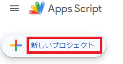
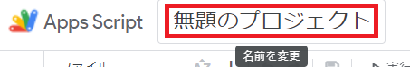
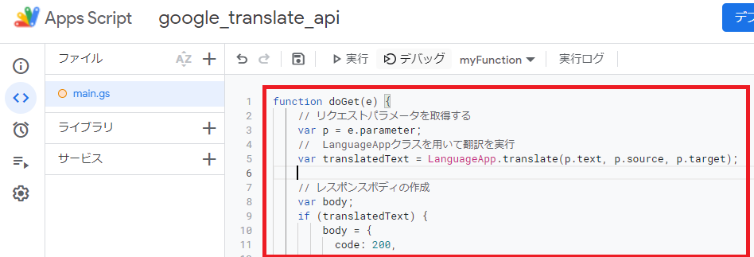
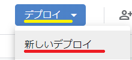
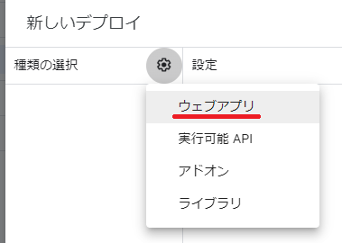
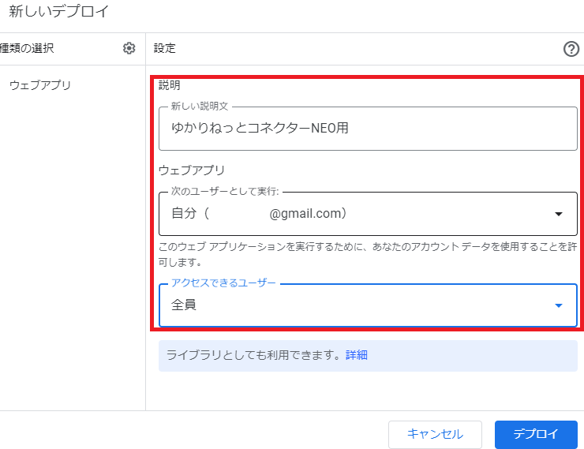
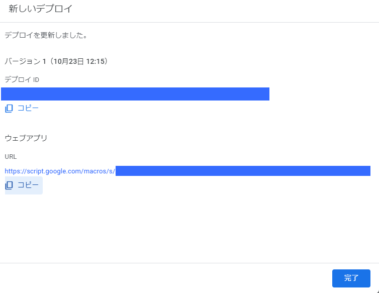
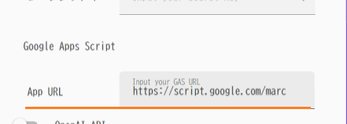
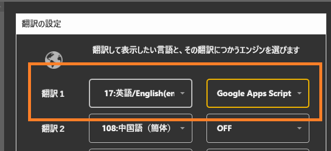

!!! Info "前提条件"
    * GASを使った翻訳は Version 1.9592 から対応しています
    * Googleアカウントが必要です

!!! info "謝辞"
    * [@satto_sann(株式会社ZOZO) 様](https://qiita.com/satto_sann)の技術記事を参照しています。ありがとうございます。


## GASとは

* Googleの機能で、自作プログラムを動かすことができる機能です。
* 翻訳結果を加工するなど、個人で機能を拡張することができます。

## GASをつかった翻訳とは

* 個人のGoogleアカウントに紐づく機能を使うことで自前APIでの翻訳を実現します。
* 使い始めるまでに個人で若干の作業が必要になります。
* GASから提供される範囲内で無料で翻訳サービスを受けられます（2022年8月23日現在）

## 設定の仕方

### 1. GASの設定をする

!!! Info "詳細解説について"
    * [こちらの資料](https://qiita.com/satto_sann/items/be4177360a0bc3691fdf)を参考にGASの設定をしてください。

なお、色々資料を行ったり来たりするのがわかりにくいということなので、こちらにも解説を追記しておきます。

#### 1-1. 作成画面をひらく

* まずは[管理画面](https://script.google.com/home?pli=1)を開いてください。

* 開いたら、あたらしいプロジェクトをクリックします



#### 1-2. プロジェクト名の変更

* 画面が出たら、まずプロジェクトの名前を```google_translate_api```に変更します。



#### 1-3. ファイル名の変更

* 画面が出たら、まず名前を```main```に変更します。


#### 1-4. プログラムの転記

* プログラム作成画面にプログラムをコピペします。
* コピペする内容は[下記に](https://qiita.com/satto_sann/items/be4177360a0bc3691fdf#%E7%BF%BB%E8%A8%B3%E7%B5%90%E6%9E%9C%E3%82%92%E8%BF%94%E3%81%99api%E3%82%92%E3%81%A4%E3%81%8F%E3%82%8B)掲載されています。



#### 1-5. プログラムの公開

* デプロイボタンで公開準備をしましょう









うまく設定ができると、ウェブアプリというURLが作成されますので、コピーボタンをおします。

### 2. アドレスの設定をする

* ゆかコネNEOのオプションをひらきます。
　　　

* ゆかコネNEOのオプション枠にあるURL欄にURLをいれます。
  
  * 末尾の```/exec```は消してください。
  * 設定が終わったら、OKでオプション画面を閉じます。

### 3. 翻訳を使う設定



* 選択でGASを選んでください。これで翻訳されるようになります。

!!! info "仕様について"
    * 入力される言語は母国語を想定しています。
    * 言語推定をGoogle側に一任しているので、翻訳が失敗することもあります。
    * 翻訳は一定数使うとGAS側で制約がかかります。
    * GASの仕様は変わることがあります。かかる制限やコストなどは個人で調査しご利用ください。