# レイアウトについて
標準で用意しているレイアウトはいくつかあります。
お好みのレイアウトを配信ソフトに取り込むことで簡単に字幕が出せます。

## ゆかコネNEO標準

### 多言語
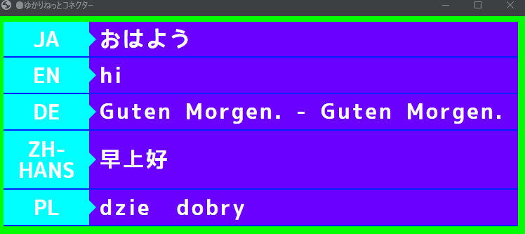

* 縦に言語が並ぶ配列です。言語は最大５つ並べられます。
* 設定により、色や言語表示、枠を消すことができます。

### リスト
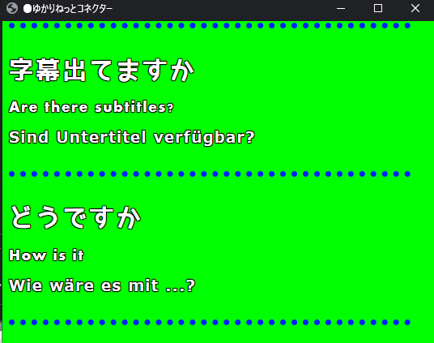

* 文章がスクロールして出ていく方式です。
* たくさん話しちゃう方は、こちらのほうが視認性を確保できます。
* 文字サイズ、区切り線の有無や色は設定で変更できます。
* 保持時間の設定をすると、過去の文章を消すことができます。

### ゲームメッセージ風
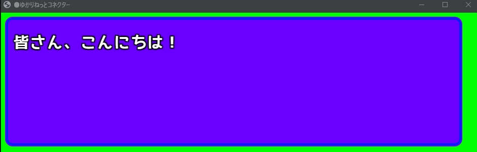

* ゲームのようなウィンドウに文字が表示されます。

### 多言語（縁取りくっきり)
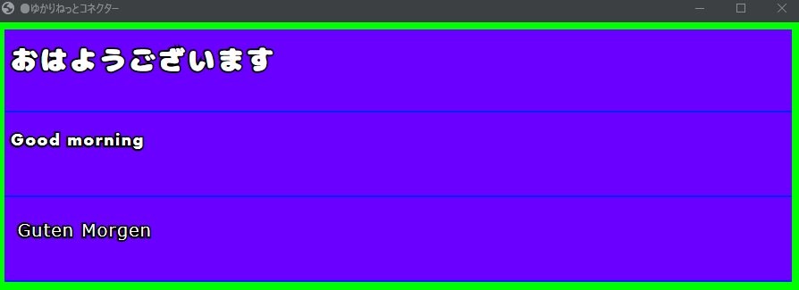

* 縦に言語が並ぶ配列です。言語は最大５つ並べられます。
* 縁取りをくっきりさせるため、投影手法を変えています
* OBSなどに取り込みやすい画面です。
* この手法ではフォントサイズを大きくしすぎると、ふちにヒゲがでてしまいます。

### ゲーム風（横ならべ)
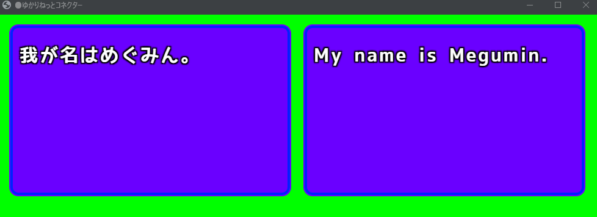

* ゲーム風レイアウトをつかって言語を横にならべられます。

### トークセッション

* コラボレーションなどの時に使います。
* 顔、名前、文章がでます。話者が２名以上になると枠が増えます。
* 保持時間の設定で枠や文字の動作が変わります。
* 保持時間を最大化すると、消去動作をしなくなります。

## わんコメ連携

* わんコメと連携させることで、わんコメが提供しているレイアウトをつかったエンタテインメント字幕を演出することが可能です。

* 以下、わんコメに標準搭載されているテンプレートのサンプルです。

* わんコメには、Pro版とそれ以外があります。Pro版のほうが応答が速く表示されます。

* 使うためには若干の設定が必要です。[設定方法](../plugin/plugin_OCTemplateGen.md#使い方)を参照してください。

### audience
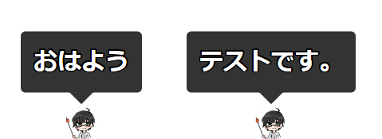

### BASIC
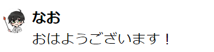

### cheer
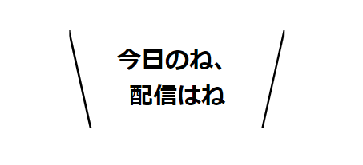

### cool-pop

### flipboard
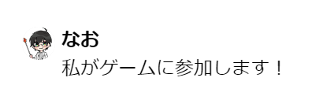

### jugon
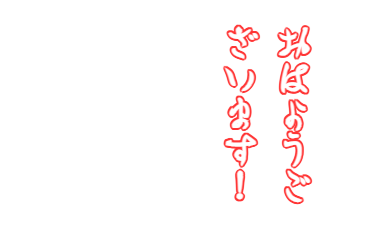

### ktx-quick-starter
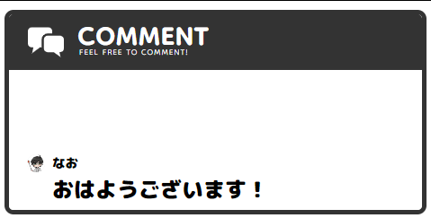

### line / line-right
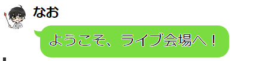

### neon
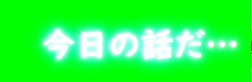

### newsticker
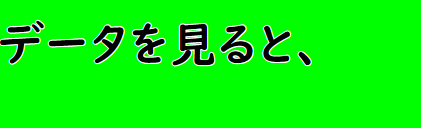

### persona / persona-right
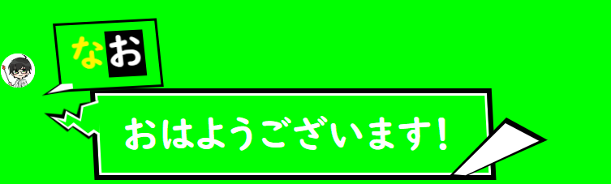

### newsticker
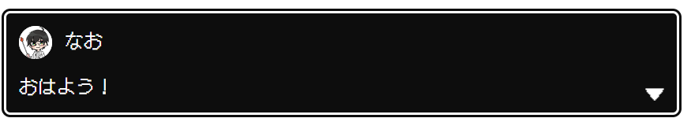

### slim
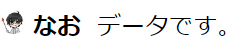

### vertical
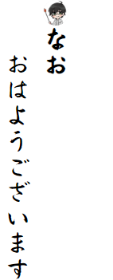

### yurucamp / yurucamp-right
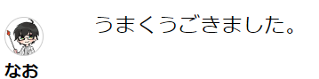

