# レイアウトについて

標準で用意しているレイアウトは36種類あります。
お好みのレイアウトを配信ソフトに取り込むことで簡単に字幕が出せます。

* 「レイアウトデザインの選択」画面のプルダウンから選びます。プルダウンはカテゴリごとに分かれているので、このページも同じ順番で並べています。
* 選んだあと、右横のボタンを押すと字幕画面が開きます。

!!! Tip "まず試すなら"
    * 迷ったら「**多言語**」を選んでください。いちばんよく使われている、汎用的なレイアウトです。
    * たくさん話す配信なら「**リスト**」、画面のすみに小さく置きたいなら「**ショート**」が向いています。

!!! Info "設定が反映されないレイアウトがあります"
    レイアウトによっては、フォントや色の設定項目が使われないことがあります。どの設定が効くかは [標準設定項目](startup_basic.md) の「反映される設定項目について」をご覧ください。

## 多言語

言語を縦や横に並べて表示します。言語は最大５つ並べられます。

|レイアウト|説明|
|:--|:--|
|多言語|よく使われる多言語表示です|
|多言語(横)|言語を横方向に並べます|

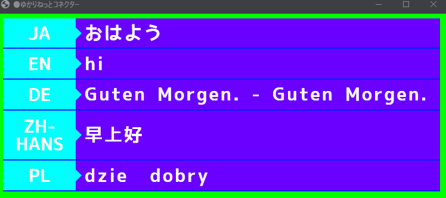

* 設定により、色や言語表示、枠を消すことができます。

## リスト

文章が流れて出ていく方式です。たくさん話す方はこちらのほうが視認性を確保できます。

|レイアウト|説明|
|:--|:--|
|リスト|上にスクロールしながら表示します|
|リスト（下スクロール）|下にスクロールしながら表示します|
|海外ドラマ|海外ドラマのような雰囲気で出します|
|海外ドラマ(リスト)|上にスクロールするタイプの海外ドラマ風表示です|
|スマート|余計な飾りを省いてシンプルに出していきます|
|ショート|1行に1文字ずつ流し、行が埋まると左へスクロールします。高さをとらないので、画面のすみに置く使い方に向いています|
|ショート(動き控えめ)|「ショート」と同じ見せ方ですが、文字が出るときの演出を抑えてちらつきを減らしています。横幅を超えたときだけ左へスクロールするので、画面の動きが気になるゲーム配信に向いています|
|スマート v2|「ショート(動き控えめ)」と同じ見せ方のまま、話した言葉と翻訳をそれぞれ別の行に出します。翻訳が出ても元の言葉が消えず、翻訳が複数あっても同時に流れるので、多言語を並べて見せたいときに向いています|

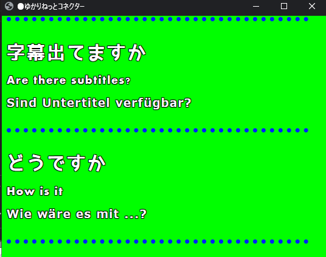

* 文字サイズ、区切り線の有無や色は設定で変更できます。
* 保持時間の設定をすると、過去の文章を消すことができます。

<!-- TODO: 「ショート」「ショート(動き控えめ)」のスクリーンショット未撮影。撮ったら images/startup_layout7.png / startup_layout8.png として置き、この節に追加する -->

## １行レイアウト

高さをとらない、1行だけのレイアウトです。画面の上端や下端に置く使い方に向いています。

|レイアウト|説明|
|:--|:--|
|コンベア|文字が右から左に流れていきます|
|コンベア縦ロール|文字が右から左に流れつつ、縦方向にも回転します|

## スクロール

|レイアウト|説明|
|:--|:--|
|スマートスクロール2|シンプルに表示し、画面幅を超えたらスクロールします|

## ゲーム

ゲームのようなウィンドウに文字が表示されます。

|レイアウト|説明|
|:--|:--|
|ゲームメッセージ風|RPGゲームっぽく出します|
|ゲーム風（カーソルあり）|RPG風の表示に、送りカーソルが付きます|
|ゲーム風（カーソルあり/Beepあり）|カーソルに加えて、文字送りの音が鳴ります|
|ゲーム風（横ならべ　左：母国語、右：翻訳１）|画面を左右に分割して並べます|
|ゲーム風（横ならべ　左：翻訳１、右：母国語）|上の左右を入れ替えたものです|

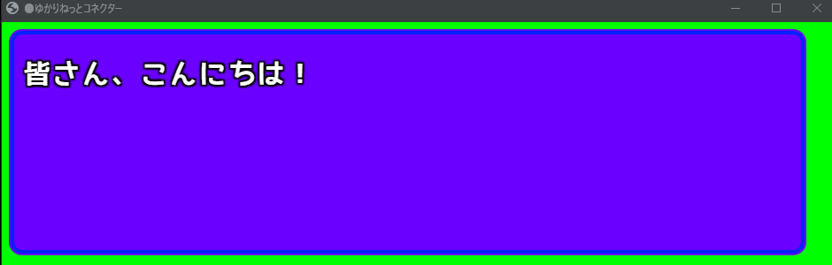

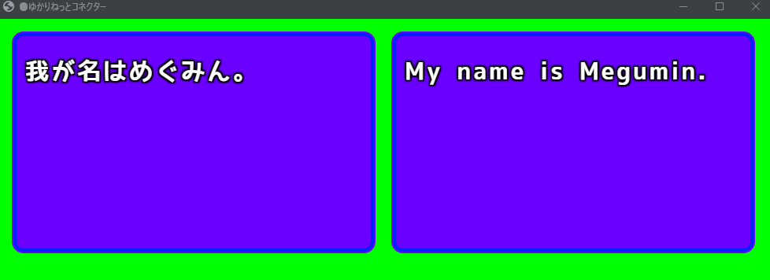

!!! Warning "横ならべは2言語までです"
    「横ならべ」のレイアウトは、**母国語＋1言語まで**しか表示できません。3言語以上出したい場合は「多言語」や「リスト」を使ってください。

## ゲーム(リスト)

|レイアウト|説明|
|:--|:--|
|リスト（横ならべ　左：母国語、右：翻訳１）|画面を左右に分割し、それぞれリスト表示します|
|リスト（横ならべ　左：翻訳１、右：母国語）|上の左右を入れ替えたものです|

* こちらも母国語＋1言語までの表示です。

## コラボレーション

コラボレーションなどの時に使います。顔、名前、文章がでます。話者が２名以上になると枠が増えます。

|レイアウト|説明|
|:--|:--|
|トークセッション|標準のトークセッション表示です|
|トークセッション（高さ広め）|1人あたりの枠を高くしたものです|
|トークセッション（枠は消えないVer）|発言がなくなっても枠を残します|
|トークセッション(母国語・翻訳１　別)|母国語と翻訳1を分けて表示します|
|トークセッション(横)　自分：左|自分を左、相手を右に置きます|
|トークセッション(横)　自分：左、枠自動消去|上に加えて、発言がないと枠が消えます|
|トークセッション(横)　自分：右|自分を右、相手を左に置きます|
|トークセッション(横)　自分：右、枠自動消去|上に加えて、発言がないと枠が消えます|

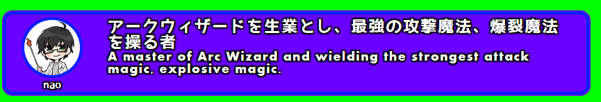

* 保持時間の設定で枠や文字の動作が変わります。
* 保持時間を最大化すると、消去動作をしなくなります。
* 話し手の顔として使う絵は「フォルダの指定」画面の「話し手のイメージデータ」で設定します。詳しくは [オプション設定](startup_option.md) をご覧ください。

## 遊び

演出重視のレイアウトです。

|レイアウト|説明|
|:--|:--|
|電光掲示板|駅の案内表示のように出します|
|自由落下(単語)|言葉が単語ごとに落下します|
|自由落下(ブロック)|言葉がかたまりで落下します|

## サンプル

自分でレイアウトを作りたい方向けの、シンプルな作例です。

|レイアウト|説明|
|:--|:--|
|ベーシック|最小限の作りのテンプレートです|
|RPG バウンス|1文字ずつ跳ねながら表示します|
|RPG スムース|1文字ずつスライドしながら表示します|

## 個別カスタマイズ

特定の困りごとに合わせて調整したレイアウトです。

|レイアウト|説明|
|:--|:--|
|リスト(多行時間延長あり)|上にスクロールしながら表示します。文字量が増えたら、消えるまでの時間が自動で延びます|
|外部連携レイアウト(リスト)|ほかのツールと組み合わせて使う前提のリスト表示です|
|おちつきテロップ(文字送り抑制版)|文字がなるべく画面に残るようにしながら表示します|

## わんコメ連携

* わんコメと連携させることで、わんコメが提供しているレイアウトをつかったエンタテインメント字幕を演出することが可能です。

* 以下、わんコメに標準搭載されているテンプレートのサンプルです。

* わんコメには、Pro版とそれ以外があります。Pro版のほうが応答が速く表示されます。

* 使うためには若干の設定が必要です。[設定方法](../plugin/plugin_OCTemplateGen.md) を参照してください。

<!-- TODO: 以下のわんコメテンプレートのスクリーンショットは2022年撮影。わんコメ側のテンプレートも更新されている可能性があるため確認・撮り直しが必要 -->

### audience
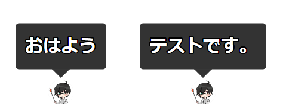

### BASIC
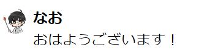

### cheer
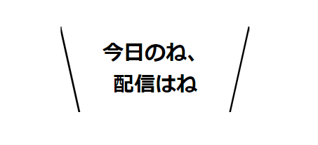

### cool-pop
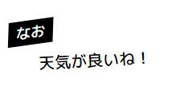

### flipboard
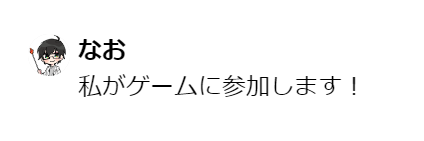

### jugon
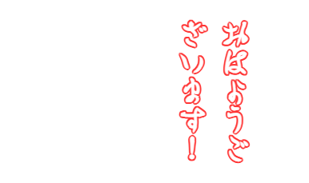

### ktx-quick-starter
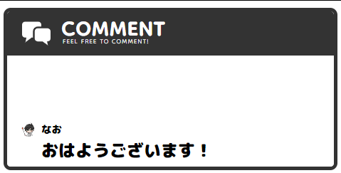

### line / line-right
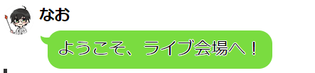

### neon
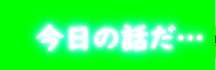

### newsticker
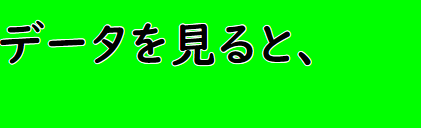

### persona / persona-right
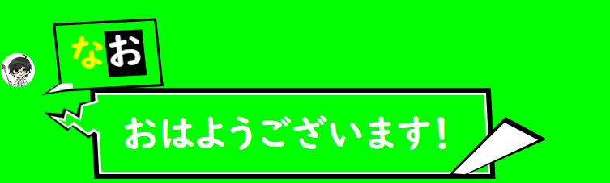

### rpg
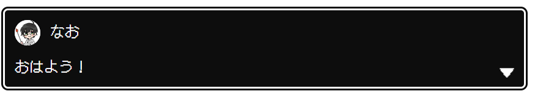

### slim
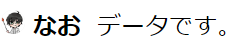

### vertical
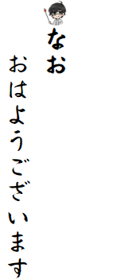

### yurucamp / yurucamp-right
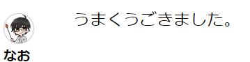

## 廃止されたレイアウト

* 「多言語（縁取りくっきり）」と「リスト（縁取り）」は、一覧から削除されました。選択できません。
* 縁取りをはっきり見せたい場合は、「色（表示色や背景色）」画面の縁取りサイズと、縁取り（内側）の設定で調整してください。
