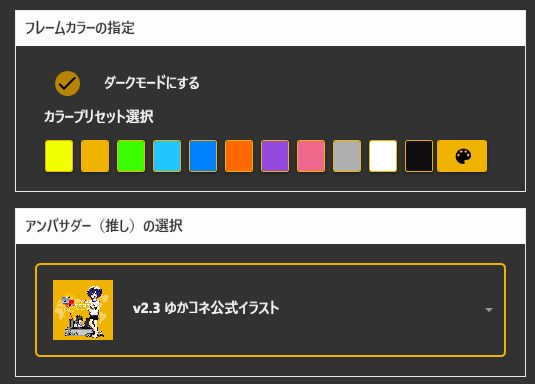
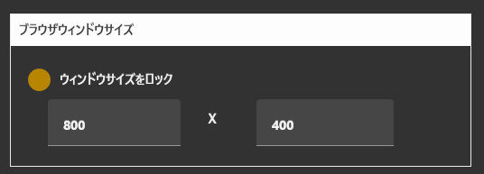
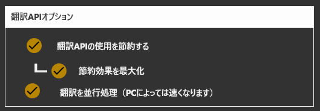
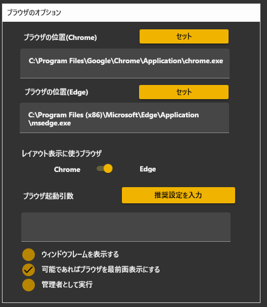
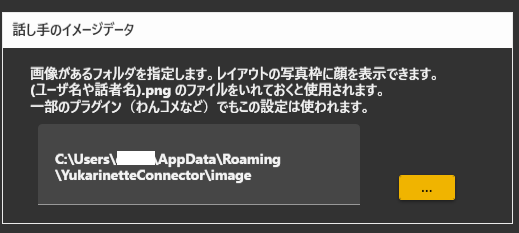
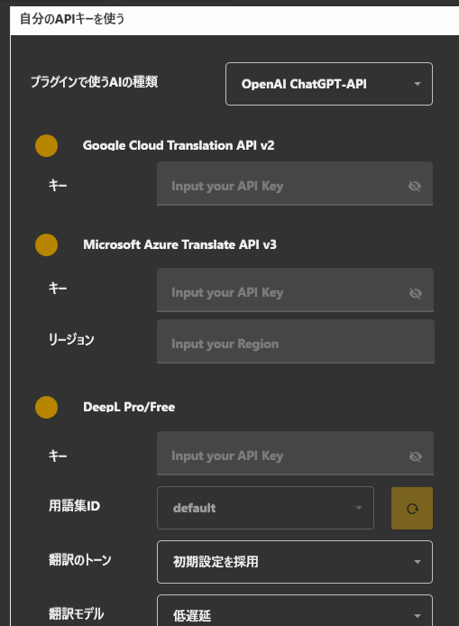
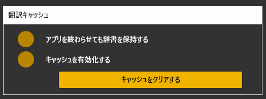

#オプション設定項目

## アンバサダーの設定

* ゆかりねっとコネクターのアンバサダーと公式担当が合計１０名います。
* こちらを設定することで推し設定することができます。

!!! Tip "推し設定について"
    この設定をしても、ゆかりねっとコネクターNEOのメイン動作は何も変わりません。
    見た目がちょっと変わって、Happyになれるという機能です。

## ブラウザウインドウサイズ

* 字幕を表示するウィンドウのサイズを強制的にロックします。
* OBSなどに取り込む際、数字でサイズを決めたい方に向いています。

## 翻訳APIオプション

翻訳に関する動作を変更できます。

|オプション|機能|
|:--------|:---|
|翻訳APIの使用を節約する|ON：翻訳途中の翻訳間隔を減らします。 OFF: 認識途中でも翻訳を実行します|
|節約効果を最大化 | ON:文章確定時のみ翻訳します OFF:翻訳途中の翻訳間隔をさらに減らします。|

## オプション

* ブラウザに関する動作を変更できます。
* ChromeとEdgeのどちらを使うかを設定できます。

### そのほか：

|オプション|機能|
|:--------|:---|
|ブラウザ引数| ブラウザの動作を切り替えます。 例えば --incognito  をいれると、シークレットモードで起動します。|
|前回のミュート状態を記録|音声認識のミュートボタンを再起動しても保持します|
|システムメッセージをOFF|「設定を変更しました」を表示しないようにします|

## 話し手のイメージデータ

* トークセッションなど、話し手の絵を使うシチュエーションで読み込まれる絵を置きます。
* ファイル名は、``（話者名）.png `` にします。
* ファイルサイズは、``100 x 100`` 程度の正方形にします。 

## 自分のAPIキーを使う

* 自分で契約したAPIキーを使うことができます。
* 使いたい翻訳エンジンが決まったら、当該エンジン提供メーカーと契約を行い、キーを入手してください。
* 入手したキーを設定し、翻訳設定でエンジンを使う選択をしてください。

## 翻訳キャッシュ

|オプション|機能|
|:--------|:---|
|キャッシュを有効化|以前の翻訳結果を記憶し、同じ文を翻訳するときに前回の結果を活用します|
|アプリを終わらせても辞書を保持|アプリ再起動しても前回の翻訳結果を活用します|
|キャッシュをクリア|記憶したデータをクリアします。|

## 不具合調査用ログ

*不具合が発生しているときに、解析を支援するためのデータを得られます。

|オプション|機能|
|:--------|:---|
|デバッグモードを有効|内部動作を解析するデータをログに出力するようになります|
|ログフォルダを開く|ログがある場所を開きます|

