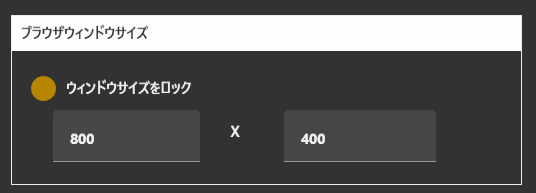
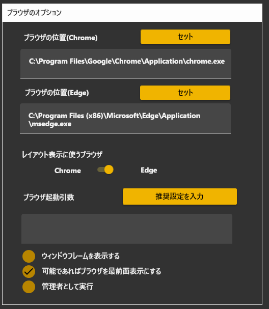
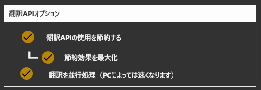
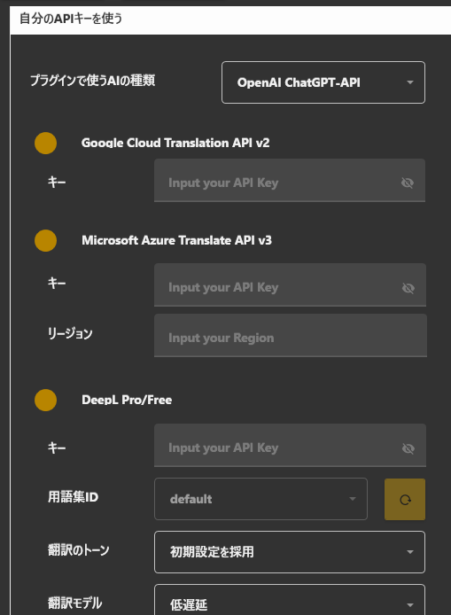
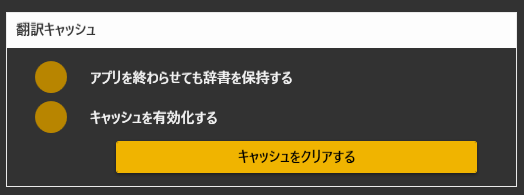
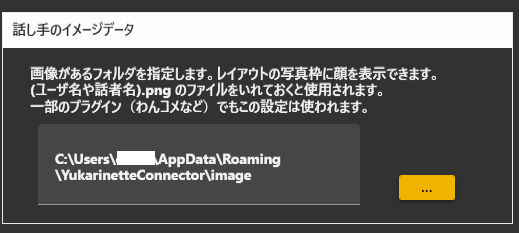
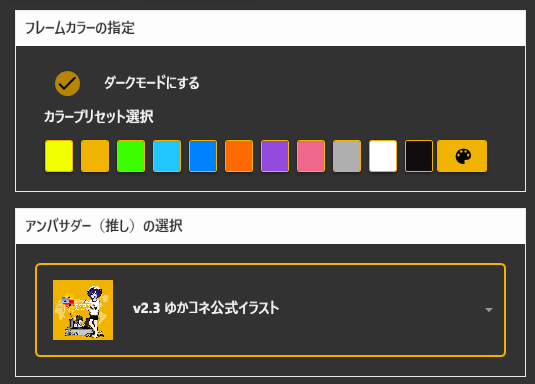
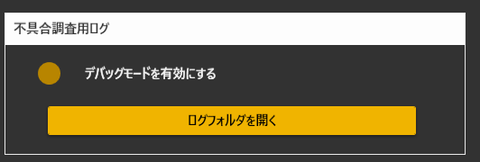

# オプション設定項目

オプション設定は、左メニューの**オプション設定**グループにある5つの画面に分かれています。このページも同じ順番で説明します。

|画面|主な内容|
|:--|:--|
|ブラウザのオプション|字幕表示に使うブラウザとウィンドウサイズ|
|翻訳（API、設定）|翻訳の節約設定・自分のAPIキー・翻訳キャッシュ|
|ネットワークの設定|通信の許可範囲と使うネットワーク|
|フォルダの指定|話し手の絵や外部ツールの場所|
|起動時設定|見た目のテーマ・スタートアップ登録・調査用ログ|

!!! Tip "項目が見つからないとき"
    左メニューの「全ての設定画面を表示」を選ぶと、すべての設定項目が1画面に並びます。どのページにあるかわからない項目を探すときに便利です。

## ブラウザのオプション

### ブラウザウインドウサイズ

* 字幕を表示するウィンドウのサイズを強制的にロックします。
* OBSなどに取り込む際、数字でサイズを決めたい方に向いています。

|項目|意味|既定|
|:--|:--|:--|
|幅|字幕ウィンドウの横幅|800|
|高さ|字幕ウィンドウの高さ|400|
|ウィンドウサイズをロック|指定したサイズに固定します|OFF|

### 表示に使うブラウザの設定

<!-- TODO: スクリーンショットは v2.3.59 時点のもの。項目が増えているため撮り直しが必要 -->

* 字幕を表示するために使うブラウザの動作を変更できます。
* ChromeとEdgeのどちらを使うかを設定できます。（既定はEdge）

|オプション|機能|既定|
|:--------|:---|:--|
|Chrome / Edge|字幕表示に使うブラウザを選びます|Edge|
|ブラウザの位置(Chrome) / (Edge)|ブラウザの実行ファイルの場所です。自動で見つからない場合に指定します|自動|
|ブラウザ引数|ブラウザの動作を切り替えます。 例えば --incognito をいれると、シークレットモードで起動します。 「推奨設定を入力」ボタンで、おすすめの内容を入れられます|—|
|ウィンドウフレームを表示する|字幕ウィンドウに枠とタイトルバーを出します|OFF|
|可能であればブラウザを最前面表示にする|字幕ウィンドウをほかのウィンドウの手前に出します|ON|
|管理者として実行|ブラウザなどを管理者権限で起動します|OFF|

!!! Warning "音声認識に使うブラウザとは別の設定です"
    * ここで選ぶのは**字幕の表示**に使うブラウザです。
    * **音声認識**にChromeとEdgeのどちらを使うかは、「音声入力の設定」画面で選びます。混同しやすいのでご注意ください。

## 翻訳（API、設定）

### 翻訳APIオプション

<!-- TODO: スクリーンショットは v2.3.59 時点のもの。ラベルの文言が変わっているため撮り直しが必要 -->

翻訳に関する動作を変更できます。翻訳エンジンの呼び出し回数を減らして、費用や制限を節約するための設定です。

|オプション|機能|既定|
|:--------|:---|:--|
|翻訳を節約（発話途中の翻訳間隔を伸ばす）|ON：翻訳途中の翻訳間隔を減らします。 OFF: 認識途中でも翻訳を実行します|ON|
|効果を最大化（発話途中で翻訳しない）|ON:文章確定時のみ翻訳します OFF:翻訳途中の翻訳間隔をさらに減らします。|ON|
|翻訳を並行処理（PCによっては速くなります）|複数言語の翻訳を同時に翻訳します。 PCや回線に余力がない場合はチェックを外した方が安定します。|ON|

### 自分のAPIキーを使う

<!-- TODO: スクリーンショットは v2.3.59 時点のもの。モデル選択とParapperのポート欄が増えているため撮り直しが必要 -->

* 自分で契約したAPIキーを使うことができます。
* 使いたい翻訳エンジンが決まったら、当該エンジン提供メーカーと契約を行い、キーを入手してください。
* 入手したキーを設定しチェックをONにすると、指定した翻訳エンジンを個人のAPIキーを用いて動かせるようになります。

エンジンごとに、キー以外の設定もここで行います。

|エンジン|設定できること|
|:--|:--|
|Google|APIキー|
|Microsoft|APIキー、Azureのリージョン（例: japaneast）|
|DeepL|APIキー、用語集ID（「再取得」ボタンで一覧を取り込めます）、翻訳のトーン（初期設定を採用／よりフォーマルに／よりカジュアルに）、翻訳モデル（低遅延／品質を優先）|
|OpenAI|APIキー、使用するモデルの選択|
|Google Gemini|APIキー、使用するモデルの選択|
|Anthropic Claude|APIキー、使用するモデルの選択|
|OpenRouter|APIキー、使用するモデルの選択|
|Grok|APIキー、使用するモデルの選択|
|NAVER Papago|APIキー、クライアントID|
|Tencent|SecretID、SecretKey、リージョン|
|Baidu|APPID、SecretKey|
|Alibaba|APPID、SecretKey|
|Google Apps Script|公開したスクリプトのURL（[GASの設定](startup_gas.md) を参照）|
|ローカル翻訳|接続先URL、通信の形式（POST(form) / POST(JSON) / OpenAI Format / plamo-2-translate）、モデル名|
|Parapper翻訳|ポート番号（後述）|

### プラグインで使うAIの種類

* プラグイン（AIアシスタントなど）が使うAIを選びます。
* 選択肢は OpenAI ChatGPT-API / Claude API / OpenAPI / Google Gemini / Browser内蔵LLM(無料) です。
* ここで選んだAIのAPIキーが、上の「自分のAPIキーを使う」で設定されている必要があります。

### Parapper翻訳

!!! Tech "使用条件"
    * ゆかコネNEO v2.3.128～

* Parapper は、お使いのPCの中で動くローカル翻訳です。APIキーの契約は不要で、翻訳の通信が外に出ません。
* 設定欄は「自分のAPIキーを使う」グループのいちばん下にあります。
* 接続先・通信の形式・モデル名は自動で決まるため、**設定するのはポート番号だけ**です。

|設定|意味|
|:--|:---|
|Port|Parapper が待ち受けているポート番号です。既定は ``18081`` （1～65535）|

* 数字でない値や範囲外の値を入れた場合は、いまの値をそのまま保持します。
* 設定したら、翻訳エンジンの一覧から ``Parapper翻訳`` を選ぶと使えるようになります。

!!! Info "Parapper 本体を起動しておいてください"
    * ゆかコネNEO側は、すでに動いている Parapper へ接続しにいくだけです。
    * Parapper が起動していない、またはポートが違う場合は翻訳されません。

### 翻訳キャッシュ

|オプション|機能|
|:--------|:---|
|キャッシュを有効化|以前の翻訳結果を記憶し、同じ文を翻訳するときに前回の結果を活用します|
|アプリを終わらせても辞書を保持|アプリ再起動しても前回の翻訳結果を活用します|
|キャッシュをクリア|記憶したデータをクリアします。|

## ネットワークの設定

* ゆかコネNEOの通信に関する設定です。
* 外部ツールとの連携がうまくいかないときや、ほかのパソコンから字幕を見たいときに触ります。

|オプション|機能|既定|
|:--------|:---|:--|
|同時通信量を節約する|同時に行う通信を減らします。回線が細い環境で安定させたいときに使います|OFF|
|すべてのIPアドレスを有効にする(管理者として起動が必要）|ほかのパソコンやスマホからの接続を受け付けます|OFF|
|使うネットワークの指定|パソコンに複数のネットワークがある場合、どれを使うか選びます|自動|

### API・Webサーバ設定

|オプション|機能|
|:--------|:---|
|Web許可ホスト|接続を許可するアドレスを、1行に1つずつ書きます（前方一致）|
|使える通信ポートを自動で選びます|ポートが使われていた場合に別のポートを自動で探します（既定ON）|

!!! Warning "「すべてのIPアドレスを有効にする」について"
    * ゆかコネNEOのAPIには**認証がありません**。接続元のアドレスだけで判断しています。
    * このチェックをONにすると、同じネットワークにいる人が誰でもAPIを呼び出せる状態になります。ネットカフェや共有Wi-Fiなど、信頼できないネットワークではONにしないでください。
    * ONにしても、**管理者としてゆかコネNEOを起動していない場合は有効になりません**（同じパソコンの中だけの通信に戻ります）。
    * 許可されるのは、同じパソコン・プライベートIPアドレス（``10.`` ``192.168.`` ``172.16``～``172.31`` で始まるもの）・Web許可ホストに書いたアドレスです。
    * 詳しくは [本体内蔵API](../tech/tech_api_neo.md) の「アクセス制御について」をご覧ください。

!!! Info "「使える通信ポートを自動で選びます」について"
    * OFFにすると、通信ポートが ``11900`` / ``11901`` に固定されます。外部ツールとの連携でポート番号を固定したいときに使います。
    * ONのままでも、実際に使われている番号はレジストリから取得できます。詳しくは [本体内蔵API](../tech/tech_api_neo.md) の「通信ポートについて」をご覧ください。

## フォルダの指定

* 外部のファイルやツールの場所を指定します。

### 話し手のイメージデータ

* トークセッションなど、話し手の絵を使うシチュエーションで読み込まれる絵を置きます。
* ファイル名は、``（話者名）.png `` にします。
* ファイルサイズは、``100 x 100`` 程度の正方形にします。 

### 外部の音声認識ツールの場所

* 音声認識に外部ツールを選んだ場合は、その場所をここで指定します。

|項目|意味|既定|
|:--|:--|:--|
|Whisperの実行ファイル|Whisperを起動するバッチファイルの場所|—|
|ゆーかねすぴれこ|ランチャーで作ったバッチファイルの場所|—|
|Parapper がある場所|Parapperをインストールしたフォルダ|``C:\Program Files\Parapper``|

!!! Info "Parapper の2つの設定について"
    * ここで指定するのは**音声認識**に使う Parapper の場所です。
    * **翻訳**に使う Parapper のポート番号は「翻訳（API、設定）」画面にあります。別の設定です。

### 自動バックアップ

* 設定を自動的にバックアップします。設定がおかしくなったときに戻せるようになります。

|項目|意味|既定|
|:--|:--|:--|
|バックアップ機能を有効にする|設定の自動バックアップを行います|ON|
|保存先|バックアップを置くフォルダ|既定の設定フォルダ内|

* 復元は「設定保存・復元」画面の「バックアップから復元」で行います。詳しくは [設定の保存・復元とプロファイル](startup_profile.md) をご覧ください。

## 起動時設定

### アンバサダーの設定

* ゆかコネのアンバサダーと公式担当が合計１０名います。
* こちらを設定することで推し設定することができます。

!!! Tip "推し設定について"
    この設定をしても、ゆかコネNEOのメイン動作は何も変わりません。
    見た目がちょっと変わって、Happyになれるという機能です。

### 画面の見た目

|オプション|機能|既定|
|:--------|:---|:--|
|ダークモードにする|ゆかコネNEOの画面を暗い配色にします|ON|
|フレームカラーの指定|画面のアクセントカラーを選びます。プリセット11色から選ぶか、自分で色を作れます|オレンジ（#F0B400）|
|UIの点滅効果を止める|画面のアニメーションや点滅を止めます。目が疲れる場合や、画面を録画する場合に使います|OFF|

### オプション

|オプション|機能|既定|
|:--------|:---|:--|
|前回のミュート状態を記憶する|音声認識のミュートボタンを再起動しても保持します|ON|
|システムメッセージをOFFにする|「設定を変更しました」を表示しないようにします|OFF|

### スタートアップ登録

|オプション|機能|
|:--------|:---|
|スタートアップ登録を実行|パソコンを起動したときにゆかコネNEOを自動で立ち上げます|
|スタートアップ登録を解除|自動起動をやめます|

* 登録すると、最小化＋常駐の状態で立ち上がります。
* 手動で登録したい場合は、起動オプション ``/startup`` を使います。詳しくは [起動オプション](../tech/tech_option_neo.md) をご覧ください。

### 不具合調査用ログ

* 不具合が発生しているときに、解析を支援するためのデータを得られます。

|オプション|機能|
|:--------|:---|
|デバッグモードを有効にする|内部動作を解析するデータをログに出力するようになります|
|ログフォルダを開く|ログがある場所を開きます|

* 毎回ONにするのが面倒な場合は、起動オプション ``/log`` が使えます。
* 画面の下には、直近に起きたエラーの内容も表示されます。
