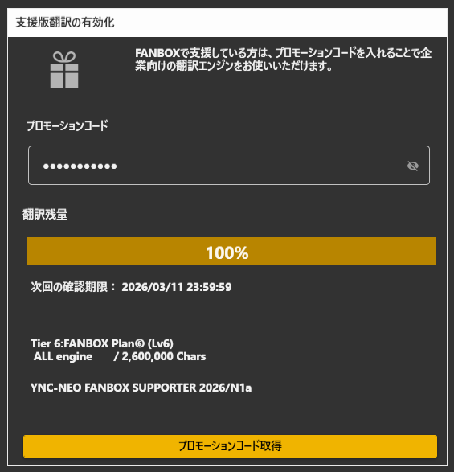
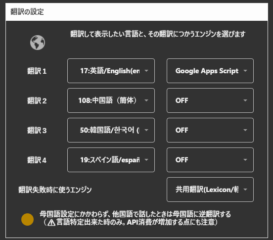

# 支援状態をソフトウェアに登録する方法
ソフトウェアに支援したことを登録すると、支援者向けの動作モードに切り替わります。

### 1.プロモーションコードを取得する

登録方法自体は、[こちら](support_howto.md)をご覧ください。

この赤字の部分がプロモーションコードになります。

### 2.ソフトウェアに入力する

* 青い枠のところに先ほどのコードを打ち込みます。（コピー&ペーストが確実です）
* 下の表示が「FANBOX Plan」などに変われば成功です。
* ゲージが0%になるまで、支援版の翻訳機能が使えます。

### 3.翻訳設定を変更する

* 翻訳設定の中から、商用翻訳システムを使うことができます。
* 向き不向きがあるので、翻訳対象などを見ながら試してみると良いです。

|翻訳API|特徴|
|:-----|:---|
|Google翻訳サービス|Google社の翻訳システム。対応言語が多く、トレンド用語に強い。|
|Microsoft翻訳サービス|Microsoft社の翻訳システム。翻訳処理が早い。|
|DeepL API 翻訳サービス|DeepL社の翻訳システム。翻訳精度が良いと人気。|
|Amazon翻訳サービス|Amazon社の翻訳システム。|
|IBM翻訳サービス|IBM社の翻訳システム。|
|NAVER Papago翻訳|NAVER社の翻訳システム。韓国語に強い|
