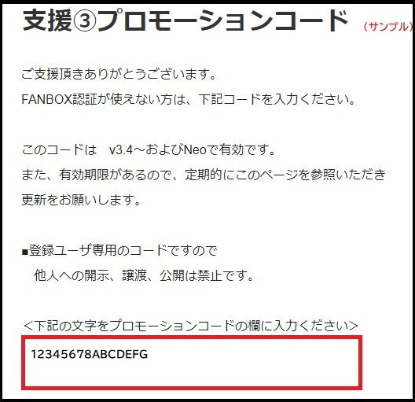

# 支援の方法
PIXIV FANBOXの支援プランのいずれかに入ることで支援が可能です。
!!! Tips "支援タイミングについて"
    支援は月単位になります。支援自体はいつでも歓迎なのですが、月末に支援すると翻訳文字数が…という方は、月初めにご支援いただくほうがよいかもしれません。

!!! Warning "支援コードの取り扱いについて"
    支援コードは支援した方へのみ提供するものです。機密情報にあたりますので、他者への開示、譲渡、公開を禁止します。もし行われた場合は、損害賠償を含めた法的手続きをとる場合があります。

## 支援方法
!!! Info "支援をするには"
    PIXIV FANBOXのアカウントが必要です。

### 1.支援登録をする
* [支援ページ](https://nao.fanbox.cc/)を開いて、支援プラン①～⑥のうち、お好みのものを選んでください。
* 支援①②ではMicrosoft 翻訳とGoogle翻訳が、支援③以上でほかのエンジンも利用可能となります。
* 支援がおわると、FANBOXの「支援中のクリエイター」にゆかコネが表示されます。

### 2.支援コード（プロモーションコード)を得る

支援登録が終わった後、下記のページにアクセスすると、支援コードが得られます。

* [支援１](https://nao.fanbox.cc/posts/2911086)
* [支援２](https://nao.fanbox.cc/posts/2911150)
* [支援３](https://nao.fanbox.cc/posts/2911157)
* [支援４](https://nao.fanbox.cc/posts/2911158)
* [支援５](https://nao.fanbox.cc/posts/2911160)
* [支援６](https://nao.fanbox.cc/posts/2911165)

### 3.支援コードを登録する

ソフトウェアに上記コードを[登録](support_enabled.md) してください。
