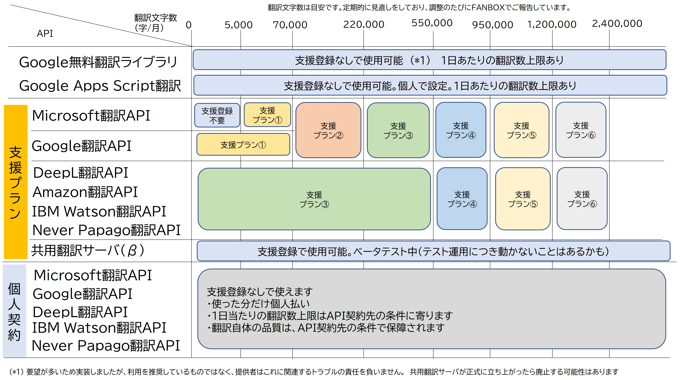

# 支援について

!!! Info "支援は必須ではありません"
    このプログラムは支援がなくても使えるフリーソフトウェアです。
    支援することによって開発が継続でき、より便利に使えるといったものです。

!!! caution "支援は自由意志に基づくものです"
    この支援は強制ではなく、支援者の自由意志・判断のもとに行われるものです。
    この点、トラブルになることがあるので、下記をよく読んでご判断ください。

## 概要
このプログラムが提供する有料API翻訳機能は、企業が提供するクラウドを用いた従量支払いのものを使用しております。

そのため、使用した分だけ企業に支払いをしなければならない「運用コスト」が毎月発生しています。

現状は、これらを開発者側で一括支払いする形で運用をしており、使用している方には、支援という形で維持・向上をお願いしております。

現在は月40万円ぐらい支払いをしています。赤字となれば、サービスをやめざるを得ないので、ぜひご協力いただければ幸いです。

## 支援頂くと
支援時にFANBOXで得たキーワードを入力すると、支援プランに応じた翻訳エンジンの利用が実施ができます。

!!! Warning "これは販売や課金ではありません"
    この仕組みは「課金」や「販売」ではない点に注意してください。動作することに関して保証をするものではありません。また翻訳文字数の繰り越しなどもございません。

!!! Tips "APIは個人契約が可能です"
    「開発側に負担をかけず、自立して運用したい」方は、個人で企業のＡＰＩを契約し、そのＡＰＩキーを打ち込むことで翻訳支払いを個人もち（使った分だけ自分で払う）に変えることが可能です。

以下の表は、ご支援いただいたお礼としてお使いいただけるようにしている翻訳一覧です。翻訳可能文字数は運用状態によって調整が入っている場合がありますので参考値となります。

## 支援に関する注意点

!!! Warning "この点は問い合わせが多いのでご確認ください"
    * この仕組みはいわゆる「ドネート、寄付」です。何らかの理由で意図しない支払いが発生している場合はPIXIV社と直接やり取りをしていただくことになります。
    * 直接お問い合わせいただいても、承ることはできません。支援をするかどうかも含め、支援者の自由意志によるものです。判断はご自身で慎重に実施してください。

!!! Warning "FANBOXの特性上、支援の返金ができません"
    * PIXIV FANBOX は個人送金の仕組みではなく、返金ができないシステムです。
    * 運用全体に対する支援であり、「翻訳システムへの課金」ではありません。
    * 運用全体に対する支援であるため、翻訳を使わなかった場合も同様に返金を承ることはできません。

!!! Info "無料状態で動くことを確かめてからご利用ください"
    * 本プログラムは「提供される現状の状態」を受け入れていただくことが前提の「フリーソフトウェアと」して供給しており、もともと支援がなくてもご利用が可能なものです。
    * 個人で翻訳提供企業と契約することでＡＰＩキーを得ることも可能です。
    * 最近ではDeepL Free APIキーなど、無料で取得が可能なものもありますので、そのような仕組みをご活用いただいて動作を確認の上、ご希望に叶う場合は支援したりご活用いただければ幸いです

!!! Tips "このサービスは予告なく終了する場合があります。"
    * やむを得ず継続できなくなった場合は予告なく終了することがあります。
        * 運用が赤字となり、サービス及び開発が困難となった場合
        * 開発者が病気もしくは死亡し、運用が困難となった場合
        * その他、運用が不可能となった場合

## ソフトウェアに関する注意点

!!! Info "不具合修正について"
    * 製作者側はバグ報告やリクエストに対して、合理的で可能な範囲で更新や修正を行うことはありますが、販売製品として契約をしているわけではなく、修正義務はありません。
    * Discordコミュニティへレポートいただくことで極力修正する努力はしています。
    * すべてが修正されるとは限らず、ケースによっては一定数の利用人数がないと採用されないケースもあります。

!!! Tips "下記の状況により、設計通りの動作をしない場合があります。"

    * インストールされているソフトの組み合わせ
    * ソフトウェア負荷率が高いケースでの動作
    * Windows側の省エネコントロールによってソフトウェアが外側から止められた場合
    * インターネット通信状態が遅い、あるいは遅延が多い
    * 特殊な通信環境の場合（プロキシなど）
    * セキュリティソフトやアンチチートソフトウェアの組み合わせ
    * ゲーム特有のデバイスやソフトウェアの影響によるもの
    
