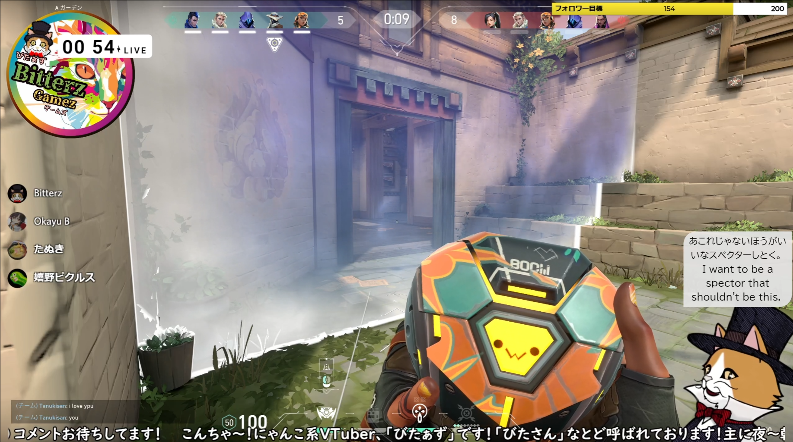

ユーザさんから寄せられた活用事例をご紹介します

## 活用事例

!!! Abstract "ぱきちさん　 [:fontawesome-brands-twitch:{ .twitch }](https://www.twitch.tv/pakichi)"
    <iframe src="https://player.twitch.tv/?video=1580143203&parent=nmori.github.io" frameborder="0" allowfullscreen="true" scrolling="no" height="378" width="620"></iframe>

    ** 一言コメント **   
    配信歴５年目のかっぱの「ぱきち」です。
    ゆかコネ歴は４年目かな？になりました！お世話になってます(∀｀*ゞ)ｴﾍﾍ
    今や私の配信には無くてはならない存在！
    ゆかコネのお陰でお友達がいっぱい出来ました！

    最近「わんコメ」も併用しているので、配信画面はもうわちゃわちゃしてますし、コメント欄は英語かスペイン語かポルトガル語で埋まっています。
    みんなにもっと「ゆかコネ」を使って貰いたいし、もっと世界に向けて配信して欲しいっス！
    草葉の陰から応援しております|дﾟ)ﾁﾗｯ

    ワンポイント一言
    「世界中の人たちとお友達になれる魔法のツール！」

!!! Abstract "びたぁずさん　 [:fontawesome-brands-twitch:{ .twitch }](https://www.twitch.tv/bitterzzzzzz)"
    

    ** 一言コメント **   
    twitchで配信始めて約1年、にゃんこ系Vtuberのびたぁず（Bitterz）と申します。

    もともと【びたぁず】は特にキャラ設定をせずにゲーム配信をしていたのですが、
    どうにか集客を増やす方法はないか？と模索していくうちに、
    字幕を付けて外国人の視聴者にも目を付けたことをきっかけに、ゆかりネットコネクターに出会いました。

    実は、上に紹介上がっておられる「ぱきち」さんの配信や,ゆかコネ導入紹介HPを見つけたことを
    きっかけにゆかりネットコネクターの導入をしております。たまに配信にお邪魔したりしています。

    現在は【ゆかコネneo】を運用しています。

    【わんコメ】に関してはまださわり程度しか導入できておりませんので、今後いろいろ試したり改善していきたいと考えております。

    夫婦で配信しているサブチャンネル【びたぁずはうす】も運営しており、こちらではゆかコネneoでどうにか二人分の字幕を何とかうまく分けて出力しようとテスト中ですが、
    いつかきれいに二人分を出力できたらいいなとトライしております！！

    外国の方とも友達ができ、徐々にフレンドの枠を広げているところです！！
    ぜひゆかコネneoの紹介枠につかっていただければと思います！

!!! Abstract "しゃくら / Shakuraさん　 [:fontawesome-brands-youtube:{ .youtube }](　https://www.youtube.com/channel/UCQaKE1t1qE_enMj79T418-A)"
    <iframe width="560" height="315" src="https://www.youtube.com/embed/04X2WUdv6dk?start=4908" title="YouTube video player" frameborder="0" allow="accelerometer; autoplay; clipboard-write; encrypted-media; gyroscope; picture-in-picture" allowfullscreen></iframe>

    ** 一言コメント **   
    　リアルタイム音声認識によるボイスロイド実況＋2か国語字幕＋わんコメ（WordParty）の合わせ技です🥳 ✨ 

!!! Abstract "甘え隊さん　 [:material-web:{ .niconico }](https://www.nicovideo.jp/user/121614426)"
    <iframe width="560" height="315" src="https://www.youtube.com/embed/4UdlKYVAkcQ?start=2258" title="YouTube video player" frameborder="0" allow="accelerometer; autoplay; clipboard-write; encrypted-media; gyroscope; picture-in-picture" allowfullscreen></iframe>

    ** 一言コメント **   
    いざという時でも喋れちゃうEdgeの音声認識や
    テキストでの綺麗な字幕出力・翻訳機能などとても助かっております！ 
