<!-- version-banner -->
!!! info ""
    ゆかコネNEO **v3.0** のドキュメントです。v2.3 をお使いの方は [v2.3 版のこのページ](../../v2.3/cs/cs_import_obs.md) を、違いを知りたい方は [v2.3 から v3.0 への移行](../../mig/mig_neo_v3.0.md) をご覧ください。

## 攻略チートシートについて

* このチートシートはテーマを絞ってガイドする「攻略本」的なものです。

## 配信ソフトに字幕を取り込む

このチートシートでは、配信ソフトに字幕を取り込む手順について解説しています。主にレイアウトを取り込む場合の設定です。

!!! info "v3.0 では貼るアドレスの置き場所が変わりました"
    配信ソフトに渡すアドレス（「to OBS」のドラッグ元）は、
    左メニュー → **レイアウトに関する設定** → **「OBSからの参照設定」** にあります。
    v2.3 ではレイアウトデザインの中にありましたが、v3.0 で独立した画面になりました。

    左メニューのいちばん上の **コックピット** にも、同じアドレスとコピーボタンがあります。

### 1. OBS Studio の場合

#### 1.1 使うテンプレートを選ぶ

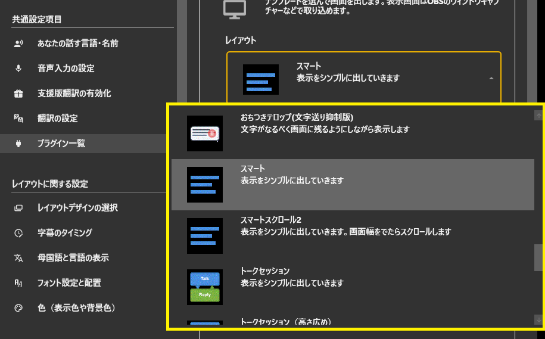

#### 1.2 テンプレートをOBSにドラッグ

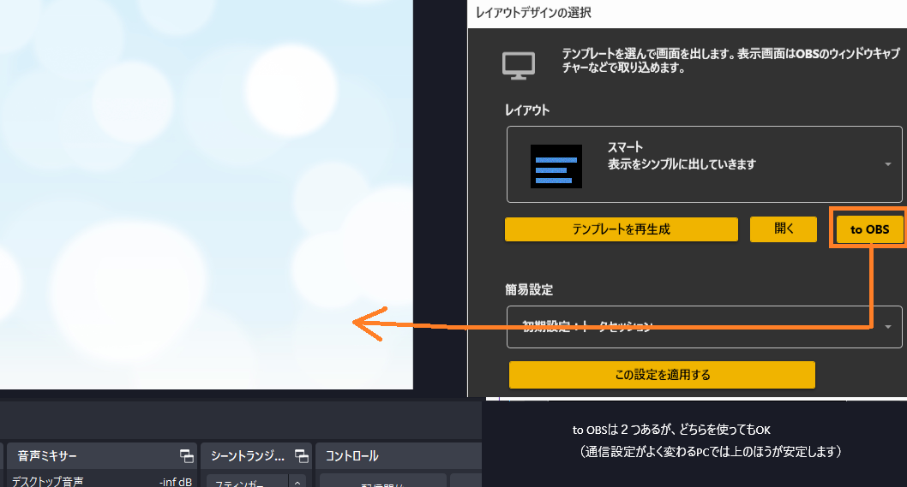

#### 1.3 追加を許可します

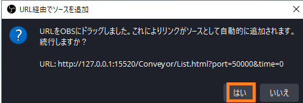

#### 1.4 一度字幕をだしてみましょう

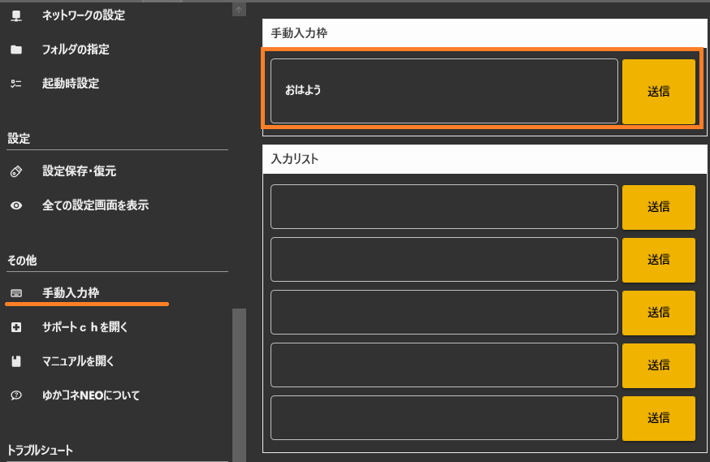

#### 1.5 画面いっぱいに出るはずです

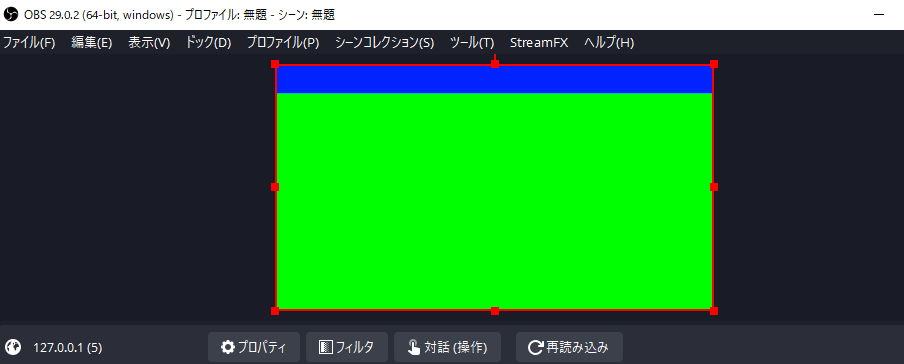

#### 1.6 凡そのサイズを決めます

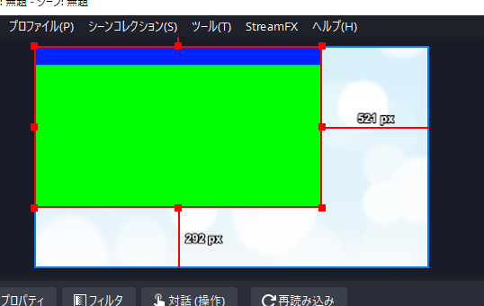

#### 1.7 プロパティを開きます

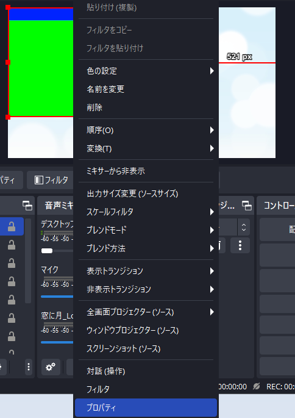

#### 1.8 サイズを変更します

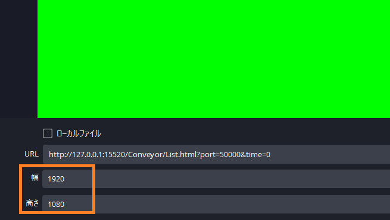

#### 1.9 フィルタを開きます

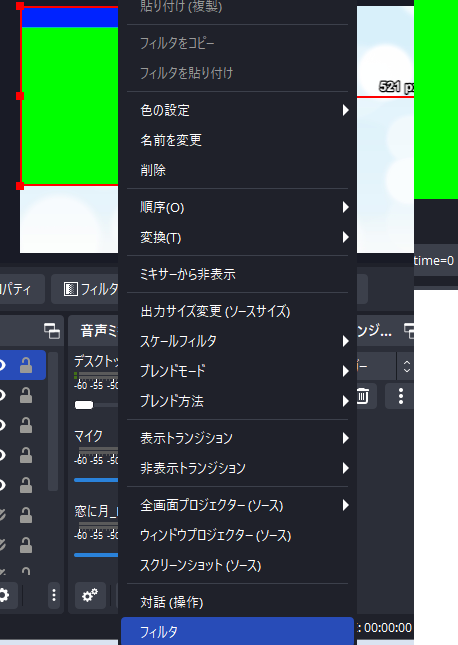

#### 1.10 カラーキーを追加します

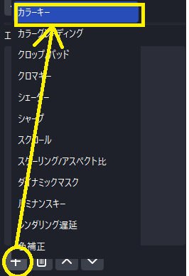

#### 1.11 名前はお好きにきめてください

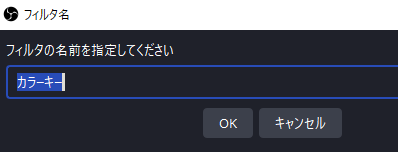

#### 1.12 綺麗に背景が消えるぐらいに調整し、終了です

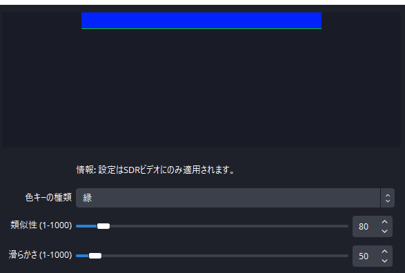

お疲れさまでした。

### 2. Streamlabs Desktop の場合

#### 2.1 使うテンプレートを選ぶ

#### 2.2 ソースの追加を押します

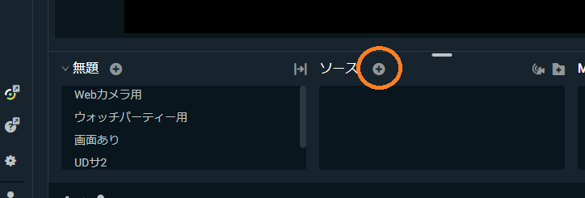

#### 2.3 ブラウザソースを追加します

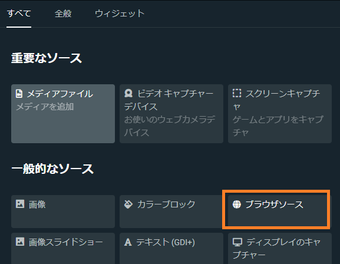

#### 2.4 名前は自分のわかりやすいものに

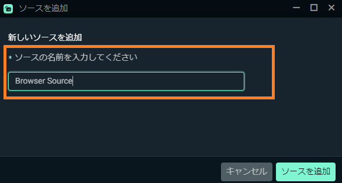

#### 2.5 表示用のアドレスをコピー&ペーストします

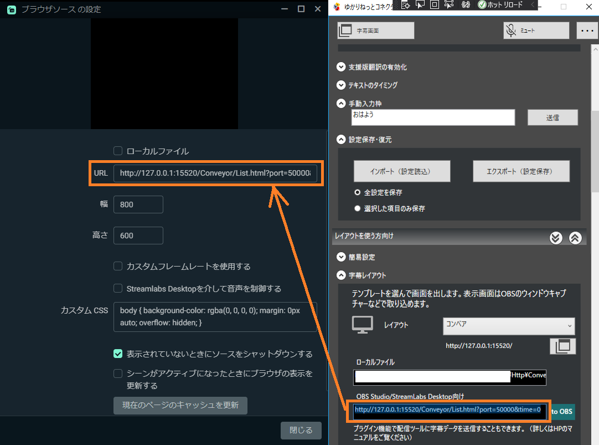

#### 2.6 サイズを変更します

* 後から変更できます。分からなければ手順を飛ばしてOKです。

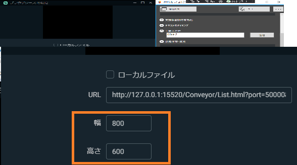

#### 2.7 一度字幕をだしてみましょう

#### 2.8 画面に出るはずです

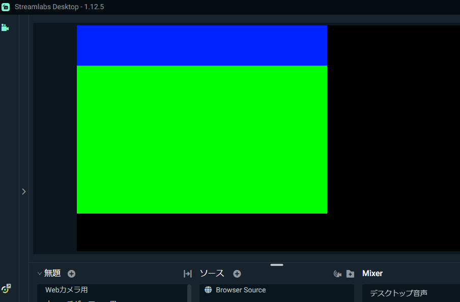

#### 2.9 フィルタ画面を出します

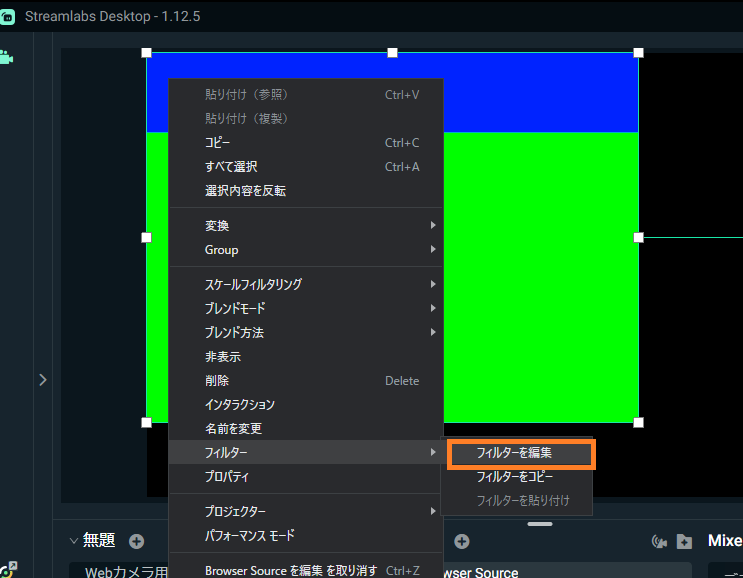

#### 2.10 フィルタを追加します

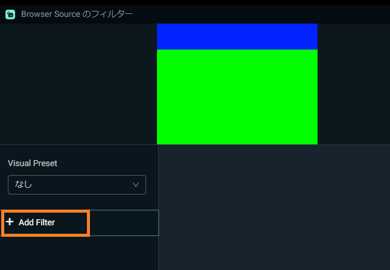

#### 2.11 カラーキーを追加します

* 名前は自分が分かりやすいものでOKです

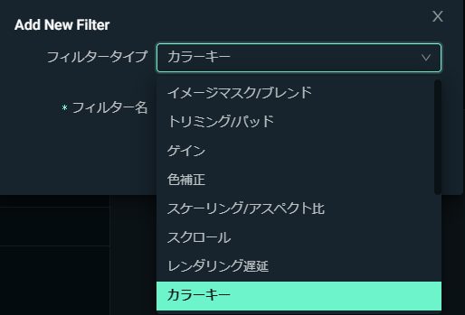

#### 2.12 綺麗に背景が消えるぐらいに調整し、終了です

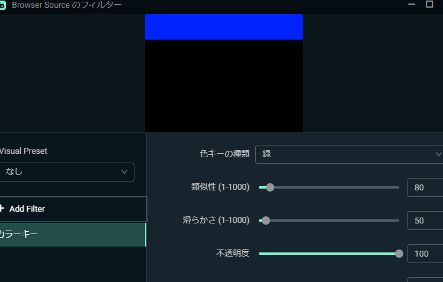

お疲れさまでした。
