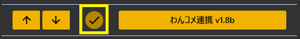
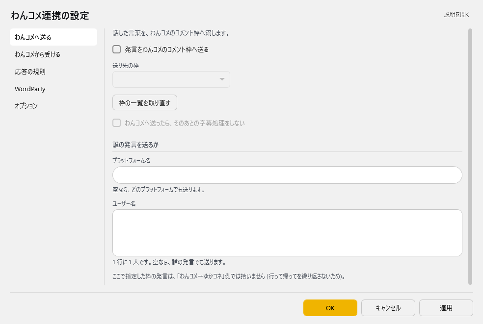
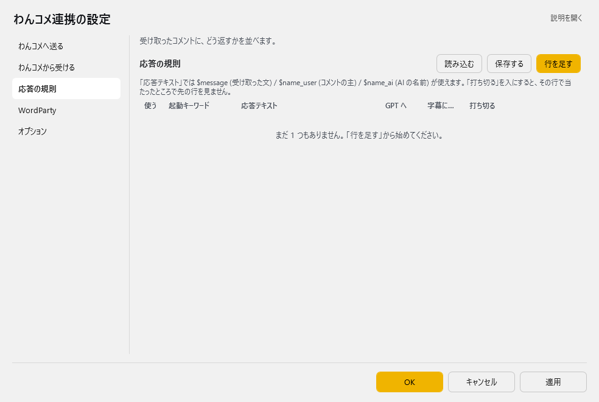
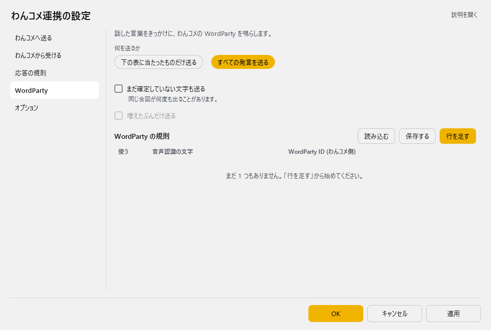
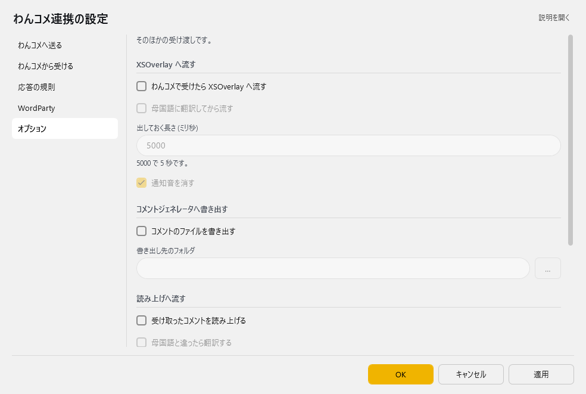
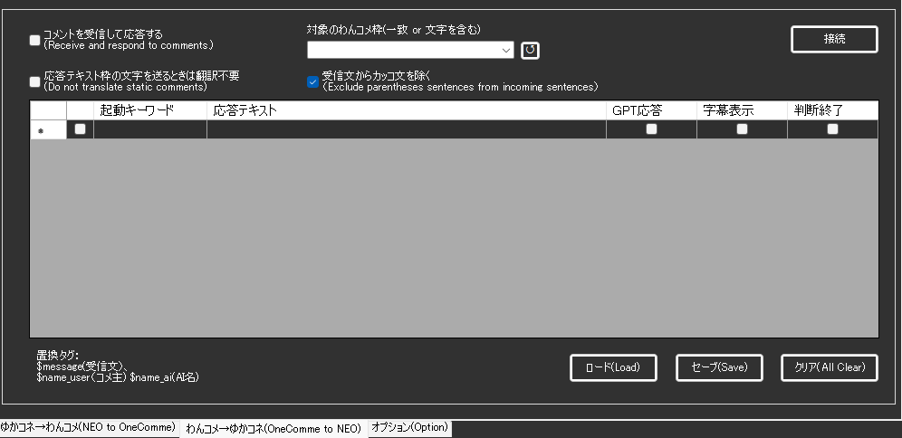

<!-- version-banner -->
!!! info ""
    ゆかコネNEO **v3.0** のドキュメントです。v2.3 をお使いの方は [v2.3 版のこのページ](../../v2.3/plugin/Plugin_OCComm.md) を、違いを知りたい方は [v2.3 から v3.0 への移行](../../mig/mig_neo_v3.0.md) をご覧ください。

!!! Info "前提条件"
    * [わんコメ](https://onecomme.com/) v5.0以上を使用していること

## このプラグインで出来ること

* わんコメに字幕データを送信できます
* Protocol V4対応による高度な通信制御
* WebSocket通信の自動復旧機能

!!! Tips "謝辞"
    * この機能の実現のために、[わんコメ](https://onecomme.com/)作者[アスティ](https://twitter.com/AstieDog)さんの許諾と技術支援をうけています。

!!! Tips "使いどころ"

    * 他のプラグインと併用すると便利に使えます。たとえば、Discordプラグインと連動させれば、Discordから受信したチャットをわんコメに統合表示できます。
    * コメントの内容次第で、GPTプラグインに応答させることができます。

## 有効化



* プラグインを使うチェックをONにしてください。

## 設定

プラグイン一覧で、このプラグインの名前の右にある **「設定」** を押すと開きます。
画面は **5 ページ**に分かれていて、左の一覧で切り替えます（わんコメへ送る／わんコメから受ける／応答の規則／WordParty／オプション）。

!!! info "閉じるときの 3 択"
    設定は**下書き**として持たれ、「OK」か「適用」を押すまで動いているプラグインには効きません。
    変更したまま閉じようとすると「変更が保存されていません」と聞かれ、**［はい］保存して閉じる／［いいえ］破棄して閉じる／［キャンセル］閉じるのをやめる** から選べます。

### わんコメへ送る

話した言葉を、わんコメのコメント枠へ流します。



| 項目 | 説明 |
|:--|:--|
| ☑ 発言をわんコメのコメント枠へ送る | 既定：OFF |
| 送り先の枠 | — |
| 「枠の一覧を取り直す」ボタン | — |
| ☑ わんコメへ送ったら、そのあとの字幕処理をしない | 既定：OFF |

**誰の発言を送るか**

| 項目 | 説明 |
|:--|:--|
| プラットフォーム名 | 空なら、どのプラットフォームでも送ります。 |
| ユーザー名 | 1 行に 1 人です。空なら、誰の発言でも送ります。 |

> ここで指定した枠の発言は、「わんコメ→ゆかコネ」側では拾いません (行って帰ってを繰り返さないため)。

### わんコメから受ける

わんコメのコメントを受け取って、返事をします。

| 項目 | 説明 |
|:--|:--|
| ☑ コメントを受信して応答する | 既定：OFF |
| 受け取る枠 | 枠の名前そのものか、名前に含まれる文字を書きます。 |
| ☑ 受け取った文からカッコの中を落とす | 既定：ON |
| ☑ 応答テキストを送るときは翻訳しない | 既定：OFF |
| 「わんコメにつなぐ」ボタン | — |

### 応答の規則

受け取ったコメントに、どう返すかを並べます。



**応答の規則**（表）

列：使う／起動キーワード／応答テキスト／GPT へ／字幕に出す／打ち切る

「応答テキスト」では $message (受け取った文) / $name_user (コメントの主) / $name_ai (AI の名前) が使えます。「打ち切る」を入にすると、その行で当たったところで先の行を見ません。

表の右上の **「行を足す」** で行を増やします。行の右端のボタンは ▲▼＝1 つ上へ／下へ、＋＝この下に足す、×＝この行を消す です。**「保存する」** はいまの中身を CSV へ書き出します（控え用）。**「読み込む」** は CSV から読み込んで、いまの中身と入れ替えます。

### WordParty

話した言葉をきっかけに、わんコメの WordParty を鳴らします。



| 項目 | 説明 |
|:--|:--|
| 何を送るか | 選択肢：下の表に当たったものだけ送る／すべての発言を送る。既定：下の表に当たったものだけ送る |
| ☑ まだ確定していない文字も送る | 同じ合図が何度も出ることがあります。（既定：OFF） |
| ☑ 増えたぶんだけ送る | 既定：OFF |

**WordParty の規則**（表）

列：使う／音声認識の文字／WordParty ID (わんコメ側)

表の右上の **「行を足す」** で行を増やします。行の右端のボタンは ▲▼＝1 つ上へ／下へ、＋＝この下に足す、×＝この行を消す です。**「保存する」** はいまの中身を CSV へ書き出します（控え用）。**「読み込む」** は CSV から読み込んで、いまの中身と入れ替えます。

### オプション

そのほかの受け渡しです。



**XSOverlay へ流す**

| 項目 | 説明 |
|:--|:--|
| ☑ わんコメで受けたら XSOverlay へ流す | 既定：OFF |
| ☑ 母国語に翻訳してから流す | 既定：OFF |
| 出しておく長さ (ミリ秒) | 5000 で 5 秒です。（既定：「5000」） |
| ☑ 通知音を消す | 既定：ON |

**コメントジェネレータへ書き出す**

| 項目 | 説明 |
|:--|:--|
| ☑ コメントのファイルを書き出す | 既定：OFF |
| 書き出し先のフォルダ | 右の「…」で選べます |

**読み上げへ流す**

| 項目 | 説明 |
|:--|:--|
| ☑ 受け取ったコメントを読み上げる | 既定：OFF |
| ☑ 母国語と違ったら翻訳する | 既定：OFF |
| ☑ 読み上げ方を自分で決める | 既定：OFF |
| 読み上げ方 | {comment} = コメント / {name} = 名前 / {displayName} = ニックネームか名前 |

**そのほか**

| 項目 | 説明 |
|:--|:--|
| ☑ 話した人の名前の入力を助ける | 既定：OFF |

> この設定を入にしているときに、わんコメ側でも読み上げる設定にしていると、二重に読み上げられます。

### 補足

!!! Info "わんコメ枠について
    わんコメ側での設定を先に行う必要があります。URLを入力していない枠を設定し、書き出しと接続をONとすることで通信準備が完了します。

## プラットフォームの指定



* リストは上から順に評価され、該当した場合に応答テキストを処理します。
* 一度条件が成り立つと、それより下の条件は評価しません。
* GPT送付にチェックを打つとGPTプラグインでAI応答させます。チェックが入っていない場合は字幕として表示されます。
* 起動キーワードには正規表現がつかえます。
* コメントを入れた人の名前は $name 、コメント文自体は $message で置き換えが出来ます。

## 高度な機能

### Protocol V4対応

#### 新機能
* **interval設定**: メタデータでのインターバル制御
* **meta情報送信**: 詳細なメタデータ付与機能
* **互換性保持**: 既存v3プロトコルとの完全互換

#### 技術仕様
```json
{
  "data": "送信データ",
  "meta": {
    "interval": 0
  }
}
```

### WebSocket通信管理

#### 自動復旧システム
* **接続状態監視**: リアルタイムでの接続状況確認
* **自動再接続**: 切断時の透明な再接続処理
* **タイムアウト調整**: 通信環境に応じた最適化

#### エラーハンドリング
* **通信エラー捕捉**: 全通信エラーの適切な処理
* **ログ記録**: 詳細なデバッグ情報の保存
* **回復処理**: 障害からの自動回復機能

### メッセージキューイング

#### 送信制御
* **リトライ機能**: 送信失敗時の自動再試行
* **優先度管理**: メッセージの重要度による制御
* **バックプレッシャー**: 過負荷状態での適切な制御

#### パフォーマンス最適化
* **非同期処理**: UIブロッキングを回避した処理
* **メモリ効率**: 効率的なリソース管理
* **スレッド安全**: 安全な並行処理

### トラブルシューティング

#### 接続問題
* **ポート確認**: わんコメの設定ポート確認
* **ファイアウォール**: 通信許可の設定確認
* **プロトコル**: V4対応状況の確認

#### 通信安定性
* **再接続間隔**: 適切な再接続タイミング設定
* **メッセージ重複**: 重複送信の防止確認
* **ネットワーク**: 安定したネットワーク環境確保

## 制約・仕様

* わんコメのバージョンが古い場合はうごきません。
* Protocol V4機能を使用するには、わんコメ v5.0以上が必要です。
* WebSocket接続が不安定な環境では、自動復旧機能により一時的な遅延が発生する場合があります。
