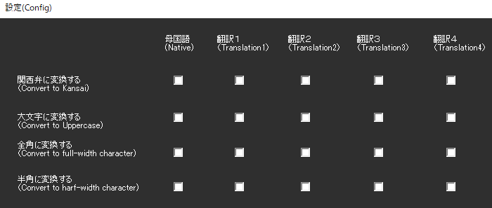

<!-- version-banner -->
!!! info ""
    ゆかコネNEO **v3.0** のドキュメントです。v2.3 をお使いの方は [v2.3 版のこのページ](../../v2.3/plugin/plugin_ConvertString.md) を、違いを知りたい方は [v2.3 から v3.0 への移行](../../mig/mig_neo_v3.0.md) をご覧ください。

!!! Info "前提条件"
    * なし

## このプラグインで出来ること

* 認識後の文字を強制的に置き換えることができます

##　有効化


* プラグインを使うチェックをONにしてください。

<!-- wpf-settings-note -->
!!! info "v3.0 で設定画面が新しくなりました"
    見た目がほかのプラグインと揃い、**表示言語に合わせて日本語・英語などで出る**ようになりました。
    各項目には「何を入れる欄なのか」「空のままだとどうなるのか」の説明が付いています。
    全角/半角・大文字/小文字・関西弁が **4 ページ**に分かれました（v2.3 は 4×5 の格子でした）。

    設定は**下書き**として持たれます。閉じるときに「適用」「破棄」「続ける」の 3 択が出るので、
    試して気に入らなければ破棄できます。
    新しい画面が開けなかったときは、従来の画面が代わりに開きます。
    → [プラグインの有効化](enabled.md)

## 設定



### 変換設定マトリックス（5言語 × 4変換種別）

設定画面は5列×4行のマトリックス形式で、各言語に対して独立した変換設定が可能です。

#### 言語列（横方向）
* **母国語 (Native)**: 音声認識した原文
* **翻訳1 (Translation 1)**: 第1翻訳結果
* **翻訳2 (Translation 2)**: 第2翻訳結果
* **翻訳3 (Translation 3)**: 第3翻訳結果
* **翻訳4 (Translation 4)**: 第4翻訳結果

#### 変換種別（縦方向）

|変換種別|説明|変換例|
|:--|:---|:---|
|関西弁に変換|標準語を関西弁風に変換|ありがとう→おおきに、そうですね→そやな|
|大文字に変換|アルファベットを大文字化|hello→HELLO|
|全角に変換|半角文字を全角に変換|ABC123→ＡＢＣ１２３|
|半角に変換|全角文字を半角に変換|ＡＢＣ１２３→ABC123|

### 関西弁変換の詳細

#### 辞書機能
* **基本辞書**: Yan様作成 [newosaka v2.1](http://www.yansite.jp/softparts/newosaka-2.1.tar.gz) ベース
* **カスタム辞書**: 独自の関西弁変換ルールを追加可能
* **CSVフォーマット**: 「標準語,関西弁」の形式

### カスタム関西弁辞書の作り方

#### CSVファイル形式
- **ファイル名**: 任意（例：my_kansai.csv）
- **文字コード**: UTF-8
- **形式**: 「標準語,関西弁」の1行1ペア

#### 基本的な変換例
```csv
ありがとう,おおきに
そうですね,そやな
できません,でけへん
すごいです,めっちゃすごいやん
いらっしゃいませ,まいど
```

#### 正規表現を使った高度な変換
特定の文字で始まる行は正規表現として処理されます：

```csv
/です$/,やで
/ありがとう.*$/,おおきに
^こんにちは,まいど
~だよね,やんな
```

- `/` : 正規表現パターン
- `^` : 行頭マッチ
- `$` : 行末マッチ  
- `.*` : 任意の文字
- `~` : 特殊パターン

#### 作成方法
1. **メモ帳で作る場合**:
   - メモ帳を開いて上記形式で入力
   - 保存時に「文字コード: UTF-8」を選択

2. **Excelで作る場合**:
   - A列に「標準語」、B列に「関西弁」を入力
   - 「名前を付けて保存」→「CSV UTF-8(コンマ区切り)(*.csv)」を選択

### 使い方
1. 設定画面で「関西弁に変換」をチェック
2. カスタム辞書がある場合は辞書ファイルを指定
3. 音声認識時に自動で変換が適用される

!!! Tips "変換の順序"
    * まず基本辞書（newosaka）で変換
    * 次にカスタム辞書で変換
    * より具体的なルールが後で適用されます

### 便利な機能

#### 自動変換タイミング
* **音声認識と同時**: 音声認識が終わったらすぐに文字を変換
* **翻訳と同時**: 翻訳が終わったらその言語も変換
* **複数変換対応**: 同時に複数の変換（例：関西弁＋全角）も可能

#### 配信に便利
* **見た目の統一**: 全角・半角を揃えて見やすい字幕に
* **キャラクター性**: 関西弁変換で個性的な配信に
* **多言語対応**: 翻訳された各言語にも個別に変換設定可能

## 使うとき

1. 音声認識と同時に置換されます。

## その他
!!! Info "大阪弁ルールには下記のソフトウェア辞書を使用しています"    
    * [newosaka v2.1](http://www.yansite.jp/softparts/newosaka-2.1.tar.gz)　辞書原作者：[Yan様](mailto:yan@yansite.net) ― [HP](http://www.yansite.jp/softparts/)
