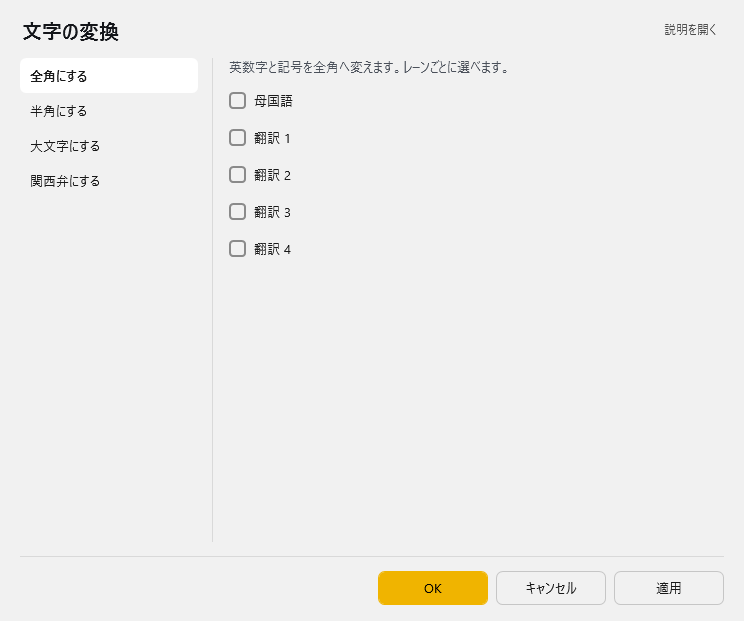
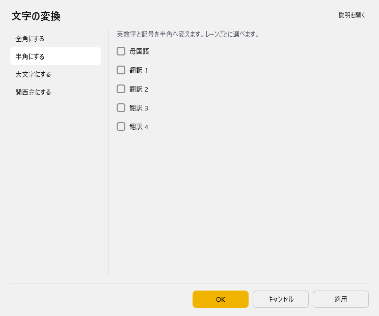
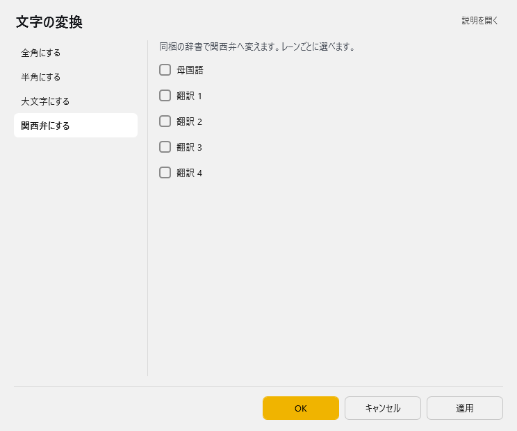

<!-- version-banner -->
!!! info ""
    ゆかコネNEO **v3.0** のドキュメントです。v2.3 をお使いの方は [v2.3 版のこのページ](../../v2.3/plugin/plugin_ConvertString.md) を、違いを知りたい方は [v2.3 から v3.0 への移行](../../mig/mig_neo_v3.0.md) をご覧ください。

!!! Info "前提条件"
    * なし

## このプラグインで出来ること

* 認識後の文字を強制的に置き換えることができます

##　有効化

* プラグインを使うチェックをONにしてください。

## 設定

プラグイン一覧で、このプラグインの名前の右にある **「設定」** を押すと開きます。
画面は **4 ページ**に分かれていて、左の一覧で切り替えます（全角にする／半角にする／大文字にする／関西弁にする）。

!!! info "閉じるときの 3 択"
    設定は**下書き**として持たれ、「OK」か「適用」を押すまで動いているプラグインには効きません。
    変更したまま閉じようとすると「変更が保存されていません」と聞かれ、**［はい］保存して閉じる／［いいえ］破棄して閉じる／［キャンセル］閉じるのをやめる** から選べます。

### 全角にする

英数字と記号を全角へ変えます。レーンごとに選べます。

| 項目 | 説明 |
|:--|:--|
| ☑ 母国語 | 既定：OFF |
| ☑ 翻訳 1 | 既定：OFF |
| ☑ 翻訳 2 | 既定：OFF |
| ☑ 翻訳 3 | 既定：OFF |
| ☑ 翻訳 4 | 既定：OFF |

### 半角にする

英数字と記号を半角へ変えます。レーンごとに選べます。

| 項目 | 説明 |
|:--|:--|
| ☑ 母国語 | 既定：OFF |
| ☑ 翻訳 1 | 既定：OFF |
| ☑ 翻訳 2 | 既定：OFF |
| ☑ 翻訳 3 | 既定：OFF |
| ☑ 翻訳 4 | 既定：OFF |

### 大文字にする

英字を大文字へ変えます。レーンごとに選べます。

| 項目 | 説明 |
|:--|:--|
| ☑ 母国語 | 既定：OFF |
| ☑ 翻訳 1 | 既定：OFF |
| ☑ 翻訳 2 | 既定：OFF |
| ☑ 翻訳 3 | 既定：OFF |
| ☑ 翻訳 4 | 既定：OFF |

### 関西弁にする

同梱の辞書で関西弁へ変えます。レーンごとに選べます。

| 項目 | 説明 |
|:--|:--|
| ☑ 母国語 | 既定：OFF |
| ☑ 翻訳 1 | 既定：OFF |
| ☑ 翻訳 2 | 既定：OFF |
| ☑ 翻訳 3 | 既定：OFF |
| ☑ 翻訳 4 | 既定：OFF |

### 補足

* 各ページで、どの字幕（母国語・翻訳 1〜4）に変換をかけるかを選びます。1 つの字幕に複数の変換（例：関西弁＋全角）を同時にかけることもできます。
* 変換は、音声認識が確定したとき・翻訳が届いたときに、それぞれの字幕へかかります。
* 関西弁の変換は、Yan 様作成の [newosaka v2.1](http://www.yansite.jp/softparts/newosaka-2.1.tar.gz) をもとにした同梱の辞書を使います。

## 使うとき

1. 音声認識と同時に置換されます。

## その他
!!! Info "大阪弁ルールには下記のソフトウェア辞書を使用しています"    
    * [newosaka v2.1](http://www.yansite.jp/softparts/newosaka-2.1.tar.gz)　辞書原作者：[Yan様](mailto:yan@yansite.net) ― [HP](http://www.yansite.jp/softparts/)
