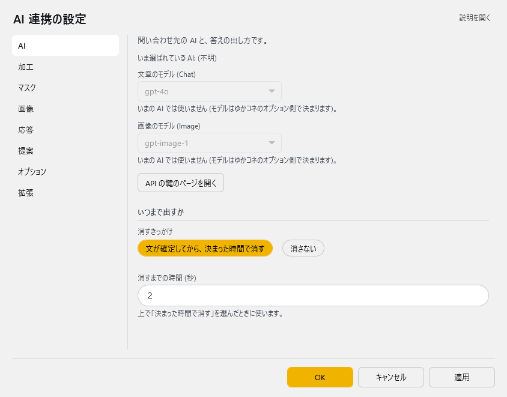
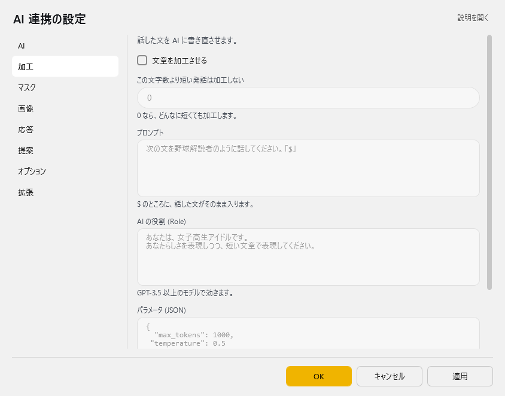
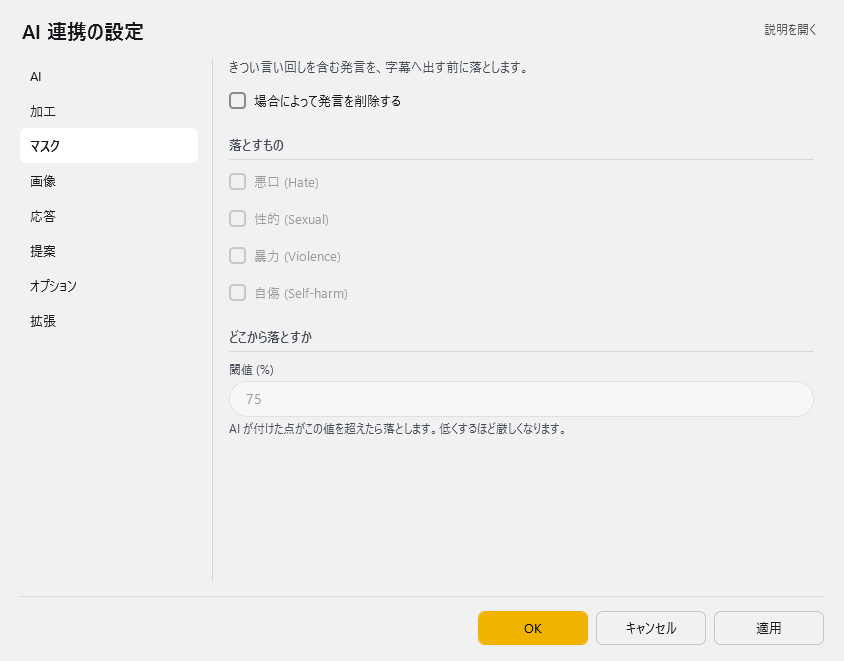
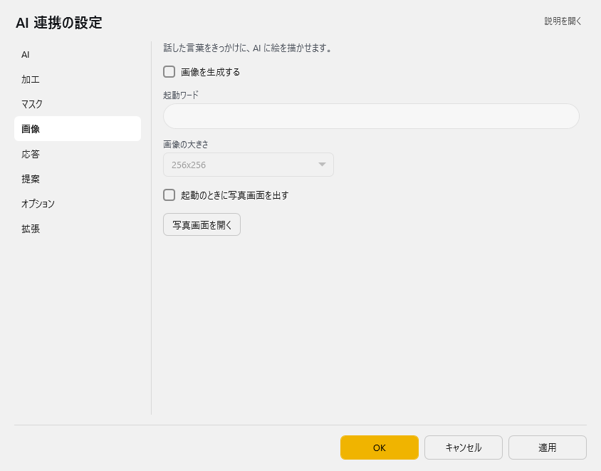
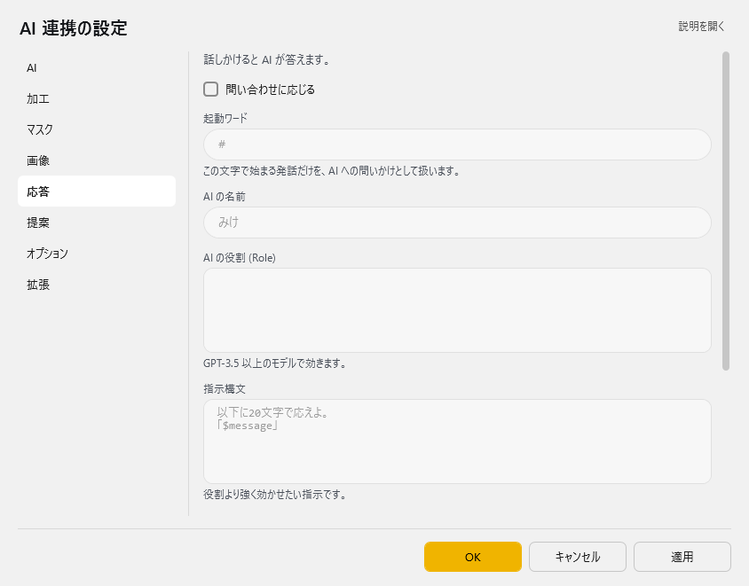
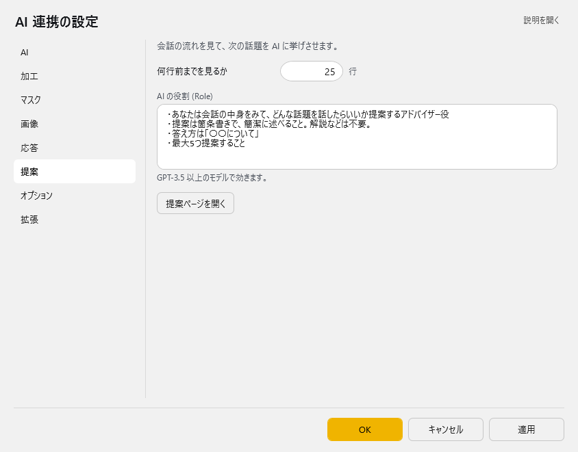
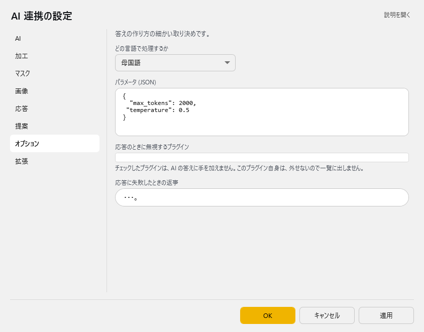
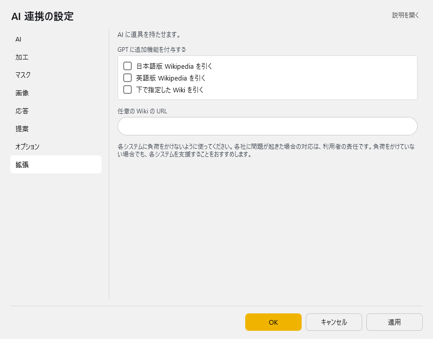

<!-- version-banner -->
!!! info ""
    ゆかコネNEO **v3.0** のドキュメントです。v2.3 をお使いの方は [v2.3 版のこのページ](../../v2.3/plugin/plugin_GPT3.md) を、違いを知りたい方は [v2.3 から v3.0 への移行](../../mig/mig_neo_v3.0.md) をご覧ください。

!!! Info "前提条件"
    * なし

## このプラグインで出来ること

* 複数のAIモデル（GPT-3/GPT-4、Claude、Gemini、Grokなど）を使用した高度な文章処理
* AI を使用した画像生成（DALL-E）
* AIアシスタント機能による対話型応答
* 文章の自動整形と改善
* 不適切なコンテンツのフィルタリング

!!! Warning "ライセンスについて"

    * この機能を使うためには、使用するAIサービスのAPIキーを取得する必要があります
    * OpenAI（GPT）、Anthropic（Claude）、Google（Gemini）、xAI（Grok）など各社の利用規約に従ってください
    * 支援版をご利用の方は、一部機能をAPIキーなしで利用可能です

!!! Info "謝辞"
    * 後程出てくる「VRM_AI」の開発者は[とりにく様](https://note.com/tori29umai/n/n81f3dd2343f3)です。

!!! Warning "うまく動かないときのレポートについて"
    * 本件について、とりにく様に直接問い合わせをしないでください。

##　有効化


* プラグインを使うチェックをONにしてください。

## 動作の仕組み

このプラグインは複数のAIプロバイダーに対応し、以下の機能を提供します：

### 対応AIサービス

* **ChatGPT（OpenAI）**: GPT-4、GPT-3.5など人気のAIモデル
* **Claude（Anthropic）**: 日本語処理が得意なAI
* **Gemini（Google）**: Googleの高性能AI
* **Grok（xAI）**: イーロン・マスク社のAI
* **その他**: 様々なAIサービスに対応

### できること

* **音声認識の文章を改善**: 話し言葉を読みやすい文章にAIが修正
* **不適切な言葉をフィルタ**: よくない言葉を自動で見つけて削除
* **AI画像生成**: 文章から画像をAIが作成（ChatGPTのみ）
* **AIとの対話**: 質問すると人工知能が答えてくれる機能
* **画像の説明**: 画像を見せるとAIが内容を説明

!!! Info "言語サポートについて"
    * 日本語、英語を中心に多言語対応
    * モデルによって対応言語の精度が異なります
    * Claude は日本語処理に特に優れています

## 設定

プラグイン一覧で、このプラグインの名前の右にある **「設定」** を押すと開きます。
画面は **8 ページ**に分かれていて、左の一覧で切り替えます（AI／加工／マスク／画像／応答／提案／オプション／拡張）。

!!! info "閉じるときの 3 択"
    設定は**下書き**として持たれ、「OK」か「適用」を押すまで動いているプラグインには効きません。
    変更したまま閉じようとすると「変更が保存されていません」と聞かれ、**［はい］保存して閉じる／［いいえ］破棄して閉じる／［キャンセル］閉じるのをやめる** から選べます。

### AI

問い合わせ先の AI と、答えの出し方です。



> いま選ばれている AI: …

| 項目 | 説明 |
|:--|:--|
| 文章のモデル (Chat) | 既定：「gpt-4o」 |
| 画像のモデル (Image) | 既定：「gpt-image-1」 |
| 「API の鍵のページを開く」ボタン | — |

**いつまで出すか**

| 項目 | 説明 |
|:--|:--|
| 消すきっかけ | 選択肢：文が確定してから、決まった時間で消す／消さない。既定：消さない |
| 消すまでの時間 (秒) | 上で「決まった時間で消す」を選んだときに使います。（既定：「10」） |

### 加工

話した文を AI に書き直させます。



| 項目 | 説明 |
|:--|:--|
| ☑ 文章を加工させる | 既定：OFF |
| この文字数より短い発話は加工しない | 0 なら、どんなに短くても加工します。（既定：「0」） |
| プロンプト | $ のところに、話した文がそのまま入ります。 |
| AI の役割 (Role) | GPT-3.5 以上のモデルで効きます。 |
| パラメータ (JSON) | — |
| ☑ 過去の加工結果を読み込ませる | 既定：OFF |

> 加工をさせるときは、字幕の表示設定を「確定のみ」にすると、書き直しの途中が見えなくなって体感がよくなります。

### マスク

きつい言い回しを含む発言を、字幕へ出す前に落とします。



| 項目 | 説明 |
|:--|:--|
| ☑ 場合によって発言を削除する | 既定：OFF |

**落とすもの**

| 項目 | 説明 |
|:--|:--|
| ☑ 悪口 (Hate) | 既定：OFF |
| ☑ 性的 (Sexual) | 既定：OFF |
| ☑ 暴力 (Violence) | 既定：OFF |
| ☑ 自傷 (Self-harm) | 既定：OFF |

**どこから落とすか**

| 項目 | 説明 |
|:--|:--|
| 閾値 (%) | AI が付けた点がこの値を超えたら落とします。低くするほど厳しくなります。（既定：「75」） |

### 画像

話した言葉をきっかけに、AI に絵を描かせます。



| 項目 | 説明 |
|:--|:--|
| ☑ 画像を生成する | 既定：OFF |
| 起動ワード | — |
| 画像の大きさ | 既定：「256x256」 |
| ☑ 起動のときに写真画面を出す | 既定：OFF |
| 「写真画面を開く」ボタン | — |

### 応答

話しかけると AI が答えます。



| 項目 | 説明 |
|:--|:--|
| ☑ 問い合わせに応じる | 既定：OFF |
| 起動ワード | この文字で始まる発話だけを、AI への問いかけとして扱います。（既定：「#」） |
| AI の名前 | 既定：「みけ」 |
| AI の役割 (Role) | GPT-3.5 以上のモデルで効きます。 |
| 指示構文 | 役割より強く効かせたい指示です。（既定：「以下に20文字で応えよ。\r\n「$message」\r\n」） |
| ☑ 過去の問い合わせを覚えておく | 既定：OFF |

**答えを外へ出す**

| 項目 | 説明 |
|:--|:--|
| ☑ 答えを VRM_AI へ出す | 既定：OFF |
| 通信先 | 既定：「127.0.0.1:5000」 |
| ☑ 表情を OSC で送る | ばもきゃプラグインを有効にしておく必要があります。（既定：OFF） |

### 提案

会話の流れを見て、次の話題を AI に挙げさせます。



| 項目 | 説明 |
|:--|:--|
| 何行前までを見るか | 1～500行。既定：25 |
| AI の役割 (Role) | GPT-3.5 以上のモデルで効きます。 |
| 「提案ページを開く」ボタン | — |

### オプション

答えの作り方の細かい取り決めです。



| 項目 | 説明 |
|:--|:--|
| どの言語で処理するか | 選択肢：母国語／翻訳 1／翻訳 2／翻訳 3／翻訳 4。既定：母国語 |
| パラメータ (JSON) | — |
| 応答に失敗したときの返事 | 既定：「・・・。」 |

### 拡張

AI に道具を持たせます。



| 項目 | 説明 |
|:--|:--|
| 任意の Wiki の URL | — |

> 各システムに負荷をかけないように使ってください。各社に問題が起きた場合の対応は、利用者の責任です。負荷をかけていない場合でも、各システムを支援することをおすすめします。

### 補足

#### AI の鍵（API キー）について

!!! Info "API キーの入れ場所"
    * API キーは、このプラグインではなく **ゆかコネ本体のオプション設定（翻訳（API、設定））** に入れます。
      「AI」ページの **「API の鍵のページを開く」** から開けます。
    * 使う AI（ChatGPT / Claude / Gemini など）とモデルも、本体のオプション設定で決まります。
    * 支援版をご利用の方は、API キーがなくても支援の範囲内で使えます。

!!! tip "API キーの取り方"
    1. 使いたい AI サービスの公式サイトにアクセス（[OpenAI](https://platform.openai.com/) ／ [Anthropic](https://console.anthropic.com/) ／ [Google AI Studio](https://aistudio.google.com/)）
    2. アカウントを作ってログイン
    3. 「API キー」や「新しいキーを作成」を探して作る
    4. 表示されたキー（英数字の長い文字列）をコピーして、ゆかコネのオプション設定に貼り付ける

* API キーは外に漏らさないでください。不要になったら削除し、定期的に作り直すと安全です。
* 使いすぎが心配なときは、AI サービス側で月の上限を設定してください（OpenAI の場合：Billing → Set monthly limit）。

#### Gemini で 404 が返るとき

Gemini は「モデルが見つからない」ときに 404 を返します。キーが正しくても発生するので、次の順に確認してください。

1. **モデルが古い**：一番多い原因です。Google はモデルを比較的短い周期で終了します（例：Gemini 2.0 系は 2026年6月1日に終了）。オプション設定の Gemini の `MODEL` を、一覧の新しいものに選び直してください。ゆかコネ側でも、廃止されたモデルが設定に残っている場合は起動時に自動で現行のものへ読み替えます。
2. **キーで使えるモデルを確認する**：ブラウザで次の URL を開くと、そのキーで実際に使えるモデルの一覧が返ります（`YOUR_KEY` は自分の API キーに置き換え）。

    ```
    https://generativelanguage.googleapis.com/v1beta/models?key=YOUR_KEY
    ```

    ここに出てこないモデルを選んでいると 404 になります。

3. **Google Cloud Console で払い出したキーの場合**：キーは特定のプロジェクトに紐づきます。支払い方法が設定されていない、または提供対象外の地域からの利用だと、新しいモデルが一覧に出てこず 404 になることがあります。手軽に済ませたい場合は [Google AI Studio](https://aistudio.google.com/) で払い出したキーをお使いください。
4. **Vertex AI とは別物です**：Vertex AI 用の設定・認証情報はゆかコネでは使えません。Gemini API（AI Studio / Generative Language API）のキーが必要です。

404 のときは、ゆかコネのログに Google が返した理由（`models/... is not found for API version v1beta` など）がそのまま記録されます。

#### 料金を抑えたいとき

* 「加工」ページの **この文字数より短い発話は加工しない** を 10 文字以上にすると、短い相づちで AI を呼ばなくなります
* プロンプトの不要な指示を削ると、使う量が減ります
* Gemini には無料で使える範囲があります（上限はモデルごとに異なり、随時変わります）

#### 拡張（Wikipedia）

* 「拡張」ページで、AI に日本語版／英語版 Wikipedia や、指定した Wiki を引かせることができます（OpenAI の Function Calling を使います）。

## 使い方

1. 音声認識させると自動的に処理されます。

## AIアシスタントをつくるには

* [AIアシスタントをつくる手順](../cs/cs_aiassistant.md)を参考に設定してみてください

## 高度な設定

### カスタムAPIエンドポイント

OpenAI互換のAPIを提供するサービスを利用する場合：

1. AIプロバイダーで「カスタム」を選択
2. APIエンドポイントにURLを入力（例: https://api.example.com/v1）
3. APIキーを設定
4. モデル名を手動で入力

### プロンプトエンジニアリング

効果的なプロンプトの例：

```
# 文章整形用
あなたは優秀な編集者です。以下の音声認識結果を自然な日本語に修正してください：
- 句読点を適切に追加
- 誤字脱字を修正
- 話し言葉を書き言葉に変換
$

# AIアシスタント用
あなたは親切で知識豊富なアシスタントです。
- 簡潔で分かりやすい回答を心がける
- 技術的な内容も初心者に理解できるように説明
- 必要に応じて例を提示
```

### パフォーマンス最適化

|設定項目|推奨値|説明|
|:--|:--|:--|
|Temperature|0.3-0.7|低い値で一貫性重視、高い値で創造性重視|
|Max Tokens|100-500|応答の最大長（コスト削減）|
|Top P|0.9|生成の多様性制御|
|実行下限文字数|10|短い発話を無視してコスト削減|

## トラブルシューティング

### APIキーエラー
* APIキーが正しく入力されているか確認
* APIの利用制限や請求設定を確認
* プロバイダーのダッシュボードで使用状況を確認

### レスポンスが遅い
* より軽量なモデルを選択（例: GPT-3.5-turbo、Claude Haiku）
* Max Tokensを減らす
* ネットワーク接続を確認

### 日本語が文字化けする
* 文字エンコーディングをUTF-8に設定
* プロンプトに「日本語で回答してください」を追加

## 技術仕様と高度な機能

### セキュリティ機能
* **コンテンツモデレーション**: 4つのカテゴリで内容フィルタリング
  * Hate（ヘイト）: 0-100%の閾値設定
  * Sexual（性的コンテンツ）: 0-100%の閾値設定
  * Violence（暴力）: 0-100%の閾値設定
  * Self-harm（自傷行為）: 0-100%の閾値設定
* **自動削除**: フラグ付きコンテンツの自動除外
* **プロキシ対応**: 企業環境でのネットワーク設定対応

### パフォーマンス最適化
* **レスポンスキャッシュ**: API呼び出し削減と高速化
* **非同期処理**: ノンブロッキング動作によるリアルタイム性能
* **接続プール管理**: HTTP クライアントの効率的な管理
* **エラーハンドリング**: 包括的なエラー管理とフォールバック応答

### 統合機能
* **クロスプラグイン制御**: 他のプラグインの選択的無効化
* **データ共有**: プラグイン間でのユーザ情報共有
* **言語ターゲティング**: 特定翻訳レイヤーの処理指定
* **VRM_AI連携**: 外部ツールとのリアルタイム連携
* **OSC/VMC出力**: 表情データの外部システム送信

### 開発者向け機能
* **詳細ログ出力**: デバッグ情報の包括的記録
* **JSON設定管理**: 構造化された設定ファイル
* **多言語UI**: 7言語対応のユーザインターフェース
* **API互換性**: OpenAI API 仕様への準拠
