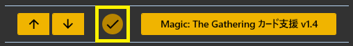
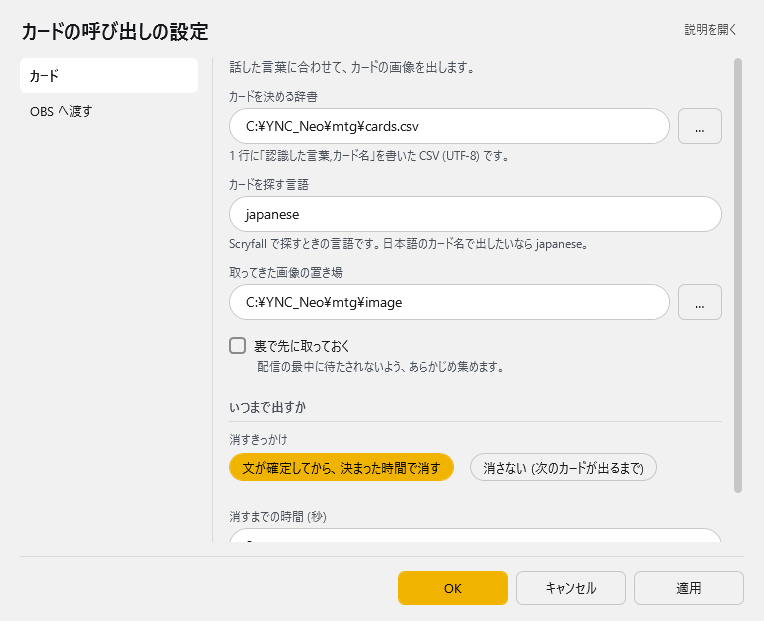
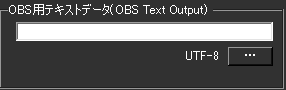
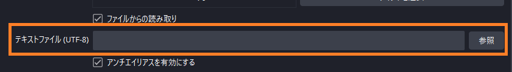

<!-- version-banner -->
!!! info ""
    ゆかコネNEO **v3.0** のドキュメントです。v2.3 をお使いの方は [v2.3 版のこのページ](../../v2.3/plugin/plugin_MTGCard.md) を、違いを知りたい方は [v2.3 から v3.0 への移行](../../mig/mig_neo_v3.0.md) をご覧ください。

!!! Info "前提条件"
    * 基本的には [MTGA自動実況ツール](https://github.com/poslogithub/binary-dist/tree/main/mtga-commentary-automation)の併用を想定しています。


## このプラグインで出来ること

* [MTG ARENA](https://mtg-jp.com/mtgarena/)のゲーム自動実況に応じて、カードを表示できます。
* カード辞書による音声認識連動表示
* 自動画像キャッシュシステム
* OBS統合による配信支援
* 複数画像フォーマット対応（JPG, PNG, GIF, BMP）
* バックグラウンドデータ取得
* プロキシ環境対応

!!! Info "謝辞"
    * MTGA自動実況ツールの開発者は[ぽｓ様](https://twitter.com/poslog)です。
    * ぽｓ様のご提案・ご協力により本システムは実現しております。

!!! Warning "うまく動かないときのレポートについて"
    * 本件に関し、MTG ARENAサイドへのお問い合わせはご容赦ください。

##　有効化



* プラグインを使うチェックをONにしてください。

## 準備順序
1. [MTGA自動実況ツール](https://github.com/poslogithub/binary-dist/tree/main/mtga-commentary-automation)を入れる
2. カード特定辞書が生成されるため、説明に従って``CardDictionary.csv``を指定する

## 設定

プラグイン一覧で、このプラグインの名前の右にある **「設定」** を押すと開きます。
画面は **2 ページ**に分かれていて、左の一覧で切り替えます（カード／OBS へ渡す）。

!!! info "閉じるときの 3 択"
    設定は**下書き**として持たれ、「OK」か「適用」を押すまで動いているプラグインには効きません。
    変更したまま閉じようとすると「変更が保存されていません」と聞かれ、**［はい］保存して閉じる／［いいえ］破棄して閉じる／［キャンセル］閉じるのをやめる** から選べます。

### カード

話した言葉に合わせて、カードの画像を出します。



| 項目 | 説明 |
|:--|:--|
| カードを決める辞書 | 1 行に「認識した言葉,カード名」を書いた CSV (UTF-8) です。（右の「…」で選べます） |
| カードを探す言語 | Scryfall で探すときの言語です。日本語のカード名で出したいなら japanese。（既定：「japanese」） |
| 取ってきた画像の置き場 | 右の「…」で選べます |
| ☑ 裏で先に取っておく | 配信の最中に待たされないよう、あらかじめ集めます。（既定：OFF） |

**いつまで出すか**

| 項目 | 説明 |
|:--|:--|
| 消すきっかけ | 選択肢：文が確定してから、決まった時間で消す／消さない (次のカードが出るまで)。既定：消さない (次のカードが出るまで) |
| 消すまでの時間 (秒) | 上で「決まった時間で消す」を選んだときに使います。（既定：「2」） |

### OBS へ渡す

出したカードの名前を、テキストファイルへ書き出します。

| 項目 | 説明 |
|:--|:--|
| 書き出し先のフォルダ | OBS のテキストソースに、このフォルダのファイルを読ませます。（右の「…」で選べます） |

## 高度な機能

### カード辞書システム

#### 辞書ファイル形式
* **ファイル形式**: CSV（UTF-8エンコーディング）
* **フォーマット**: "認識テキスト, カード名"
* **例**:
```csv
"ライトニングボルト","Lightning Bolt"
"稲妻","Lightning Bolt"  
"青い呪文","Counterspell"
```

### 表示制御オプション

#### クリアモード
| モード | 説明 | 設定値 |
|:------|:-----|:-------|
| 常時表示 | カード画像を常に表示 | "Never clear" |
| 時間制限表示 | 指定秒数後に自動消去 | デフォルト: 2秒 |

#### ウィンドウ管理
* **リサイズ可能**: カード表示ウィンドウのサイズ変更対応
* **位置記憶**: ウィンドウ位置の自動保存・復元
* **最前面表示**: 他のウィンドウに隠れない表示オプション

### 画像キャッシュシステム

#### キャッシュ機能
* **自動ダウンロード**: MTG APIからの画像自動取得
* **ローカル保存**: キャッシュフォルダでの永続化
* **カスタム画像**: ユーザー独自画像での上書き対応
* **フォーマット対応**: JPG, PNG, GIF, BMP

#### ファイル命名規則
* **パス正規化**: 不正文字（"/"、"."）を"_"に変換
* **重複回避**: 同名ファイルの自動管理
* **容量最適化**: 使用済みキャッシュの効率的管理

### ネットワーク機能

#### API統合
* **データソース**: api.magicthegathering.io との連携
* **タイムアウト**: 1分間のHTTP接続タイムアウト
* **自動デコンプレッション**: GZIP/Deflate対応
* **エラーハンドリング**: 接続失敗時の適切な処理

#### プロキシ対応
* **自動検出**: Windowsプロキシ設定の自動適用
* **認証対応**: プロキシ認証情報の自動使用
* **企業環境**: 企業ネットワーク環境での動作保証

### 技術仕様

| 項目 | 仕様 |
|:-----|:-----|
| SDK バージョン | .NET Framework 4.8 |
| 外部依存関係 | Newtonsoft.Json, System.Net.Http |
| 対応言語 | 7言語（日本語、英語、スペイン語、ロシア語、中国語、韓国語、フランス語）|
| キャッシュ形式 | ファイルシステムベース |
| ネットワーク | HTTPS、プロキシ対応 |
| メモリ管理 | 自動リソース管理とガベージコレクション |


!!! Info "カードについて"
    * 検索した結果ローカルに保存されていないカードについては、MTGカードデータベースより取得されます
    * カード画像を好みのものに差し替えたい場合はキャッシュフォルダの同カード名の画像ファイルを上書きしてください



* OBS用テキストデータは、OBSに直接データを取り込みたい方向けです。

* OBSのテキストソース側で生成されるファイルをしていすると字幕として表示されます


|ファイル名|内容|
|:----|:----|
|Flavor.txt|カードのフレイバー（解説）|
|Explan.txt|カードの説明|
|name.txt|カード名|
|type.txt|カードタイプ|

