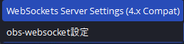
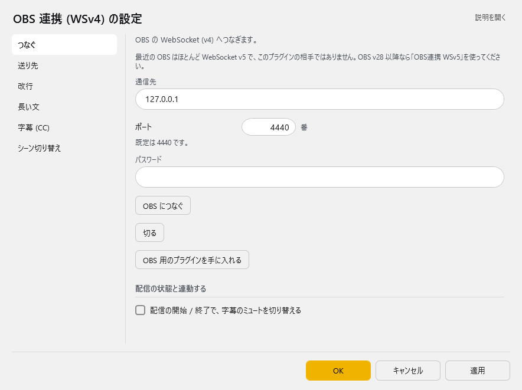
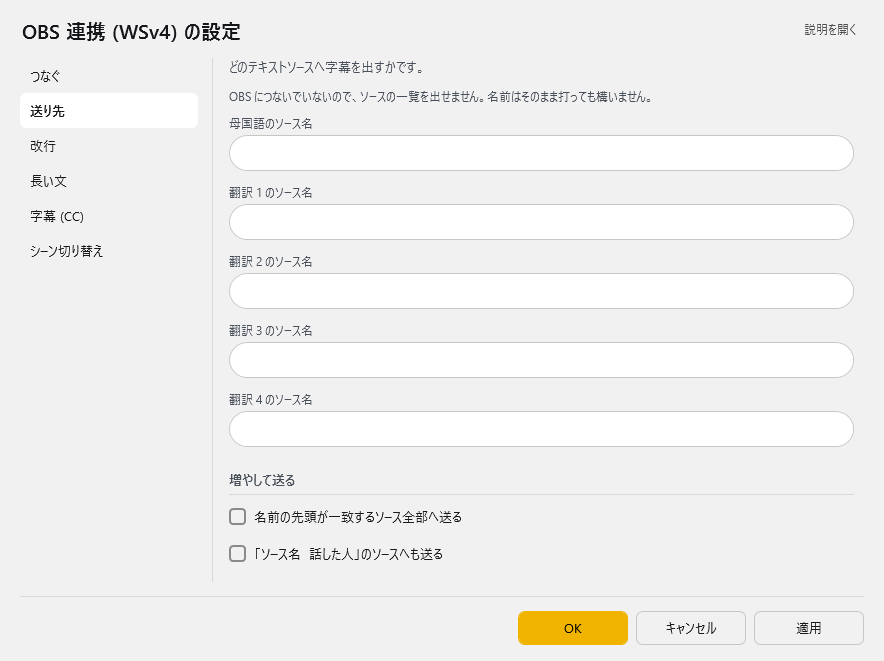
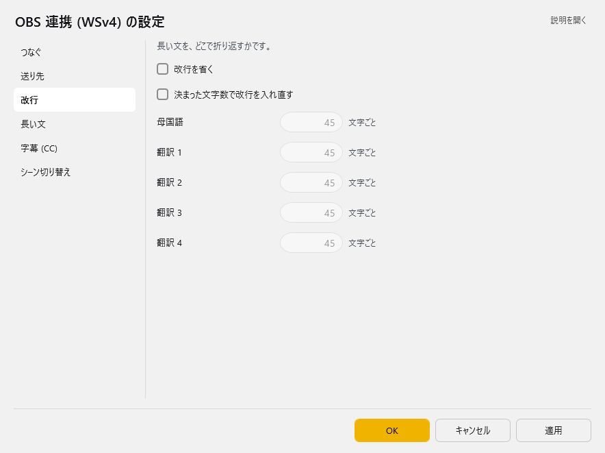
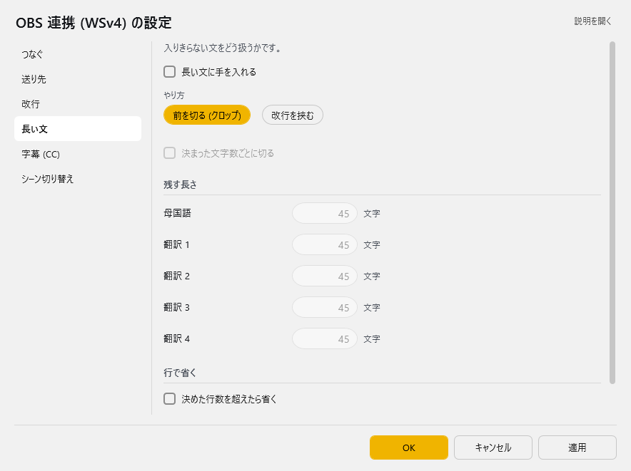
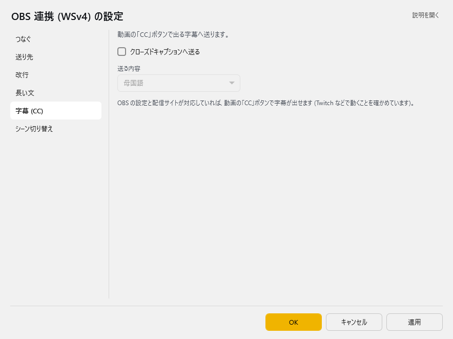
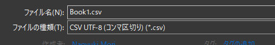
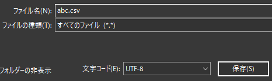

<!-- version-banner -->
!!! info ""
    ゆかコネNEO **v3.0** のドキュメントです。v2.3 をお使いの方は [v2.3 版のこのページ](../../v2.3/plugin/plugin_OBS.md) を、違いを知りたい方は [v2.3 から v3.0 への移行](../../mig/mig_neo_v3.0.md) をご覧ください。

!!! Info "このプラグインを使う前に"
    * OBS Studio と OBS WebSocket 4.9.1が必要です
    * OBS WebSocket 5（最新版）では動作しません。必ず4.9.1を使ってください

## このプラグインで出来ること

* OBS Studioに直接字幕を表示できます（テキストソース自動更新）
* 原文＋4言語の翻訳字幕を同時表示
* 長い文章を自動で改行・分割
* 話者ごとに異なる場所に字幕表示
* 配信中の字幕ON/OFF切り替え
* 自動でOBSのシーンを切り替え

##　有効化


* プラグインを使うチェックをONにしてください。

!!! Warning "OBS WebSocket 5の環境ではこのプラグインは使えません"
    * OBS WebSocket 5 (OBS v28～)の環境で通信を開始するとフリーズします
    * OBSの通信仕様が大きく変わったためです。バージョンを確認して使ってください。
    * このプラグインの対象となるOBSの設定画面はこちら側です

    

## 設定

プラグイン一覧で、このプラグインの名前の右にある **「設定」** を押すと開きます。
画面は **6 ページ**に分かれていて、左の一覧で切り替えます（つなぐ／送り先／改行／長い文／字幕 (CC)／シーン切り替え）。

!!! info "閉じるときの 3 択"
    設定は**下書き**として持たれ、「OK」か「適用」を押すまで動いているプラグインには効きません。
    変更したまま閉じようとすると「変更が保存されていません」と聞かれ、**［はい］保存して閉じる／［いいえ］破棄して閉じる／［キャンセル］閉じるのをやめる** から選べます。

### つなぐ

OBS の WebSocket (v4) へつなぎます。



> 最近の OBS はほとんど WebSocket v5 で、このプラグインの相手ではありません。OBS v28 以降なら「OBS連携 WSv5」を使ってください。

| 項目 | 説明 |
|:--|:--|
| 通信先 | 既定：「127.0.0.1」 |
| ポート | 既定は 4440 です。（1～65535番。既定：4440） |
| パスワード | 入力は伏せ字で表示されます |
| 「OBS につなぐ」ボタン | — |
| 「切る」ボタン | — |
| 「OBS 用のプラグインを手に入れる」ボタン | — |

**配信の状態と連動する**

| 項目 | 説明 |
|:--|:--|
| ☑ 配信の開始 / 終了で、字幕のミュートを切り替える | 既定：OFF |

### 送り先

どのテキストソースへ字幕を出すかです。



| 項目 | 説明 |
|:--|:--|
| 母国語のソース名 | — |
| 翻訳 1 のソース名 | — |
| 翻訳 2 のソース名 | — |
| 翻訳 3 のソース名 | — |
| 翻訳 4 のソース名 | — |

**増やして送る**

| 項目 | 説明 |
|:--|:--|
| ☑ 名前の先頭が一致するソース全部へ送る | 既定：OFF |
| ☑ 「ソース名 _ 話した人」のソースへも送る | 既定：OFF |

### 改行

長い文を、どこで折り返すかです。



| 項目 | 説明 |
|:--|:--|
| ☑ 改行を省く | 既定：OFF |
| ☑ 決まった文字数で改行を入れ直す | 既定：OFF |
| 母国語 | 1～1000文字ごと。既定：45 |
| 翻訳 1 | 1～1000文字ごと。既定：45 |
| 翻訳 2 | 1～1000文字ごと。既定：45 |
| 翻訳 3 | 1～1000文字ごと。既定：45 |
| 翻訳 4 | 1～1000文字ごと。既定：45 |

### 長い文

入りきらない文をどう扱うかです。



| 項目 | 説明 |
|:--|:--|
| ☑ 長い文に手を入れる | 既定：OFF |
| やり方 | 選択肢：前を切る (クロップ)／改行を挟む。既定：改行を挟む |
| ☑ 決まった文字数ごとに切る | 既定：OFF |

**残す長さ**

| 項目 | 説明 |
|:--|:--|
| 母国語 | 1～1000文字。既定：45 |
| 翻訳 1 | 1～1000文字。既定：45 |
| 翻訳 2 | 1～1000文字。既定：45 |
| 翻訳 3 | 1～1000文字。既定：45 |
| 翻訳 4 | 1～1000文字。既定：45 |

**行で省く**

| 項目 | 説明 |
|:--|:--|
| ☑ 決めた行数を超えたら省く | 既定：OFF |
| 残す行数 | 1～100行。既定：3 |

### 字幕 (CC)

動画の「CC」ボタンで出る字幕へ送ります。



| 項目 | 説明 |
|:--|:--|
| ☑ クローズドキャプションへ送る | 既定：OFF |
| 送る内容 | 選択肢：母国語／翻訳 1／翻訳 2／翻訳 3／翻訳 4。既定：母国語 |

> OBS の設定と配信サイトが対応していれば、動画の「CC」ボタンで字幕が出せます (Twitch などで動くことを確かめています)。

### シーン切り替え

話した言葉をきっかけに、OBS のシーンを切り替えます。

| 項目 | 説明 |
|:--|:--|
| 切り替えの表の置き場 | 空なら … を使います。置き場を変えたときは、いったん閉じて開き直してください(下の表は開いたときの置き場を見ています)。（右の「…」で選べます） |

**シーン切り替えの表**（表）

列：きっかけの言葉／切り替えるシーン名

表の右上の **「行を足す」** で行を増やします。行の右端のボタンは ▲▼＝1 つ上へ／下へ、＋＝この下に足す、×＝この行を消す です。**「保存する」** はいまの中身を CSV へ書き出します（控え用）。**「読み込む」** は CSV から読み込んで、いまの中身と入れ替えます。

### 補足

#### OBS 側でポート番号を確かめる

1. OBS Studio を開く
2. `ツール` → `WebSocket サーバー設定`
3. 表示されたポート番号を確認する
4. ゆかコネの「つなぐ」ページの **ポート** に入れる

!!! Top "OBS側の設定"
    * ポート番号やパスワードなどは、OBS 側の設定とゆかコネの設定を一致させてください。
    * 値は自分で決めて、両方に同じものを入れる形で構いません。

!!! Tip "名前の先頭が一致するソース全部へ送る"
    * シーンをいくつかに分けていて、複数のソースに字幕を送りたいときに使います。

    === "設定例"
        * `日本語1` `日本語2` というソースがあり、すべてに送る場合
            * 「送り先」ページの母国語のソース名に `日本語` と入れる
            * **名前の先頭が一致するソース全部へ送る** を ON にする

!!! Note "送り先は存在するソース名を設定してください"
    * 設定したソース名が OBS に見つからないと、何度か問い合わせ直すため通信の負荷がかかります。
    * PC の負荷が高いときは「名前の先頭が一致する…」を使わず、OBS 側の「コピー（参照）」を使ってみてください。

!!! Tip "字幕のミュートについて"
    * 配信が終わったあとに字幕が見えていると都合が悪い場合に使います（例：配信＋Discord 画面共有）。
    * 意図せず認識結果が他の人に見えるのを防ぎます。

!!! Tip "クローズドキャプションについて"
    * 配信サイトが対応している場合に機能します。
    * 対応が確認できているのは `YouTube` と `Twitch` です。
    * YouTube の場合は、配信設定の字幕のところで「608/708」を有効にします。
    * Twitch は特に設定なしで反映されます。
    * 字幕が出るタイミングや残る時間は、配信サイト側に任されます。

!!! Info "シーン切り替えの表について"
    「シーン切り替え」ページの **切り替えの表の置き場** を空のままにすると、設定フォルダの中の
    `Plugin_OBS_scene.csv` を使います。置き場を変えたときは、いったん閉じて開き直してください。

## よくある問題と解決方法

### 接続エラー

| 症状 | 原因 | 解決方法 | チェック項目 |
|:---|:---|:---|:---|
| **「接続できません」エラー** | ポート番号違い | OBS設定画面でポート確認 | ✓ WebSocket有効化<br>✓ ポート番号一致<br>✓ OBS起動中 |
| **「認証エラー」表示** | パスワード不一致 | パスワード再確認・再設定 | ✓ パスワード大文字小文字<br>✓ OBS側設定確認 |
| **「タイムアウト」エラー** | OBSが応答しない | OBSを再起動 | ✓ OBSの負荷状態<br>✓ プラグイン競合 |

### 字幕表示の問題

| 症状 | 原因 | 解決方法 | 確認方法 |
|:---|:---|:---|:---|
| **字幕が表示されない** | ソース名間違い | ソース名の完全一致確認 | OBSソース名をコピペで設定 |
| **一部の字幕のみ表示** | テキストソース未作成 | OBSで必要なテキストソース作成 | ソースリストで存在確認 |
| **文字化けする** | フォント問題 | OBSテキストソースのフォント変更 | 日本語対応フォント選択 |
| **字幕が重複表示** | 複数接続 | ゆかコネプラグイン重複確認 | 他のOBS連携プラグイン無効化 |

### パフォーマンスの問題

| 症状 | 原因 | 解決方法 |
|:---|:---|:---|
| **OBSがフリーズ** | WebSocket過負荷 | 「話者名追加」機能をOFF |
| **字幕更新が遅い** | ネットワーク遅延 | ローカル接続確認（127.0.0.1） |
| **CPU使用率が高い** | 頻繁な更新処理 | 更新間隔を調整・不要ソース削減 |

### 設定確認チェックリスト

#### OBS側の確認
- [ ] WebSocketサーバーが有効になっている
- [ ] ポート番号が正しい（通常4444）
- [ ] パスワード設定が一致している（設定している場合）
- [ ] テキストソースが存在している
- [ ] ソース名が正確（大文字小文字・全角半角含む）

#### ゆかコネ側の確認  
- [ ] プラグインが有効になっている
- [ ] 通信先IPアドレスが正しい
- [ ] ポート番号がOBSと一致している
- [ ] ソース名がOBSと完全一致している
- [ ] 他のOBS連携プラグインと競合していない

### OBSシーン切り替え設定の作り方

!!! Info "編集方法"
    * Excel もしくは メモ帳で実施します。

=== "Case1:Excelの場合"

    ||A|B|
    |:-|:-|:-|
    |1|これで今日の配信はおしまい|終了シーン|
    
    1. Excelでデータを作ります。

    2. CSVファイルとして保存します。

    
    
=== "Case2:メモ帳の場合"

    1. 下記のようなファイルを作ります。

    ``` js
    これで今日の配信はおしまい,終了シーン
    ```
    2. CSV（UTF8エンコード)で保存します。

    

## 高度な機能

### 多言語字幕システム

#### 5チャンネル構成
| チャンネル | デフォルト名 | 用途 |
|:-----------|:-------------|:-----|
| 母国語 | "日本語" | 原文表示 |
| 翻訳1 | "英語" | 第1翻訳言語 |
| 翻訳2 | (設定可能) | 第2翻訳言語 |
| 翻訳3 | (設定可能) | 第3翻訳言語 |
| 翻訳4 | (設定可能) | 第4翻訳言語 |

#### 複数ソース対応
* **前方一致送信**: ソース名の先頭一致で複数ソースに同時送信
* **話者名追加**: `ソース名+話者名` での動的ソース生成
* **参照コピー最適化**: OBS側の参照コピー機能との連携推奨

### テキスト処理システム

#### スマート分割機能
* **自然言語境界**: 単語境界での適切な分割
* **文字数制限**: 1-300文字の可変制限設定
* **行数制御**: 1-300行の表示行数制限
* **クロッピング方式**: 
  - 先頭削除（"…"付与）
  - 末尾表示（指定行数維持）

#### 改行処理オプション
* **改行除去**: 全改行の一括削除
* **改行再挿入**: 指定文字数での自動改行
* **スマート整形**: 自然な区切りでの改行

### 自動シーン切り替え

#### CSV辞書システム
* **キーワード検出**: 発言内容による自動シーン変更
* **形式**: "検出キーワード, 切り替えシーン名"
* **例**: "配信終了, 終了画面"

#### 実行タイミング
* **即座切り替え**: キーワード検出と同時に実行
* **優先順位**: CSVファイルの上から順に判定

### クローズドキャプション

#### CEA-608対応
* **YouTube**: 配信設定で "608/607" を有効化
* **Twitch**: 自動対応（設定不要）
* **配信サイト制御**: タイミング・表示時間は各サイトに依存

### ストリーミング連動

#### 字幕ミュート機能
* **配信開始**: 字幕ミュート自動解除
* **配信終了**: 字幕ミュート自動適用
* **用途**: Discord画面共有等での意図しない表示防止

### 技術実装詳細

#### WebSocket v4統合
* **プロトコル**: OBS WebSocket v4.9.1対応
* **接続管理**: 自動再接続機能
* **ソース検出**: GDI+/FreeType2テキストソース対応

#### パフォーマンス最適化
* **存在確認**: ソース名の効率的な検証
* **通信負荷軽減**: 存在しないソースの問い合わせ最小化
* **マルチスレッド**: 非同期テキスト処理

### 実用例

#### 多言語配信
```
母国語: "こんにちは皆さん"
翻訳1: "Hello everyone" 
翻訳2: "Hola a todos"
翻訳3: "Bonjour tout le monde"
```

#### シーン切り替え設定
```csv
"ゲーム開始", "ゲーム画面"
"休憩します", "休憩画面"  
"配信終了", "エンディング"
```

#### 話者別ソース
- 設定: ソース名 "配信者", 話者名追加 ON
- 結果: "配信者田中", "配信者佐藤" 等に自動分散

### トラブルシューティング

#### 接続できない
* **ポート番号**: OBS設定との一致確認（4440/4444）
* **パスワード**: OBS WebSocket設定の確認
* **バージョン**: WebSocket v4対応の確認

#### テキストが表示されない
* **ソース名**: 正確なOBSソース名の設定
* **テキスト形式**: GDI+またはFreeType2テキストソース使用
* **文字数制限**: 制限値の適切な設定

## 使うとき
* プラグイン画面で「OBSに接続」をおします。
* 音声認識と同時に字幕が転送されます。
