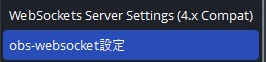
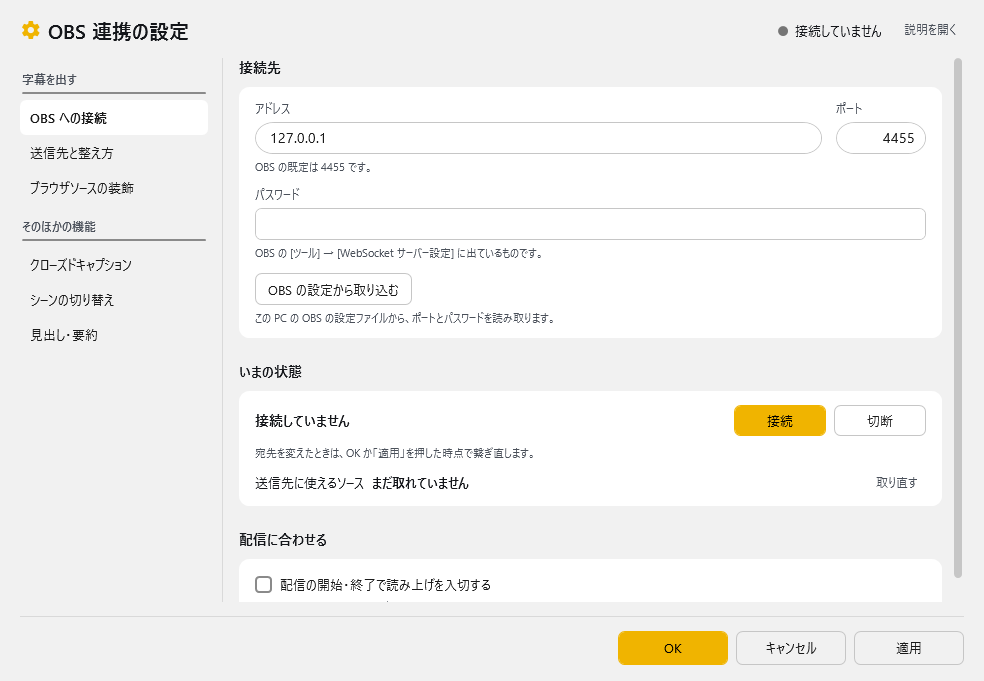
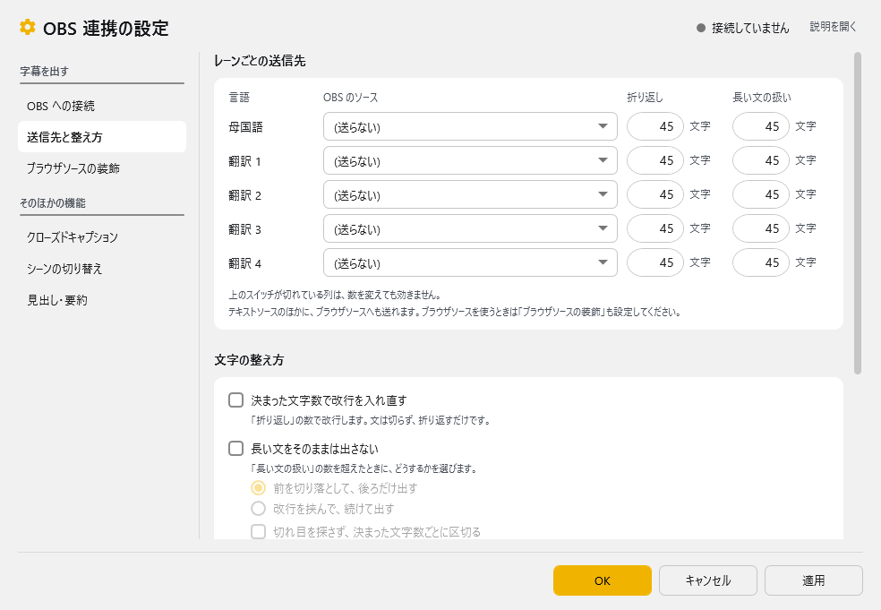
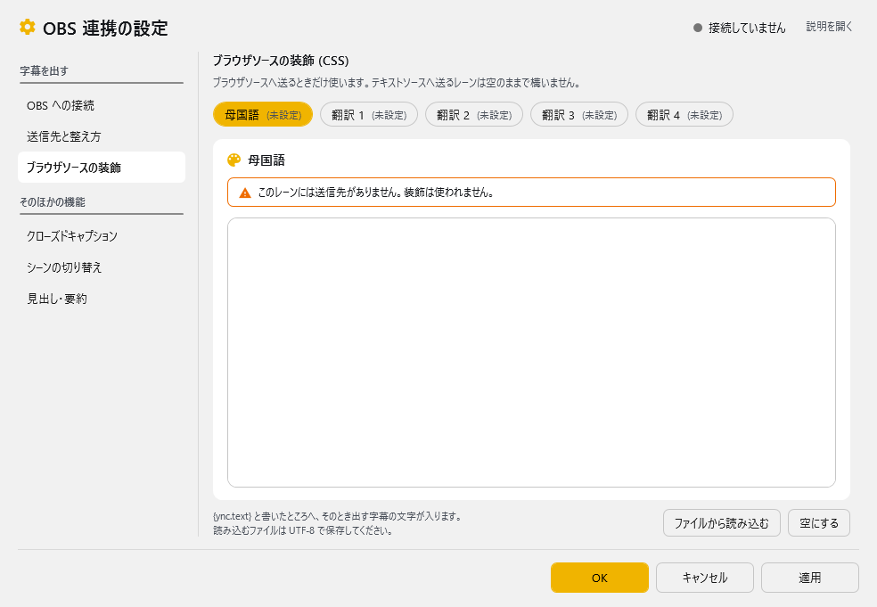
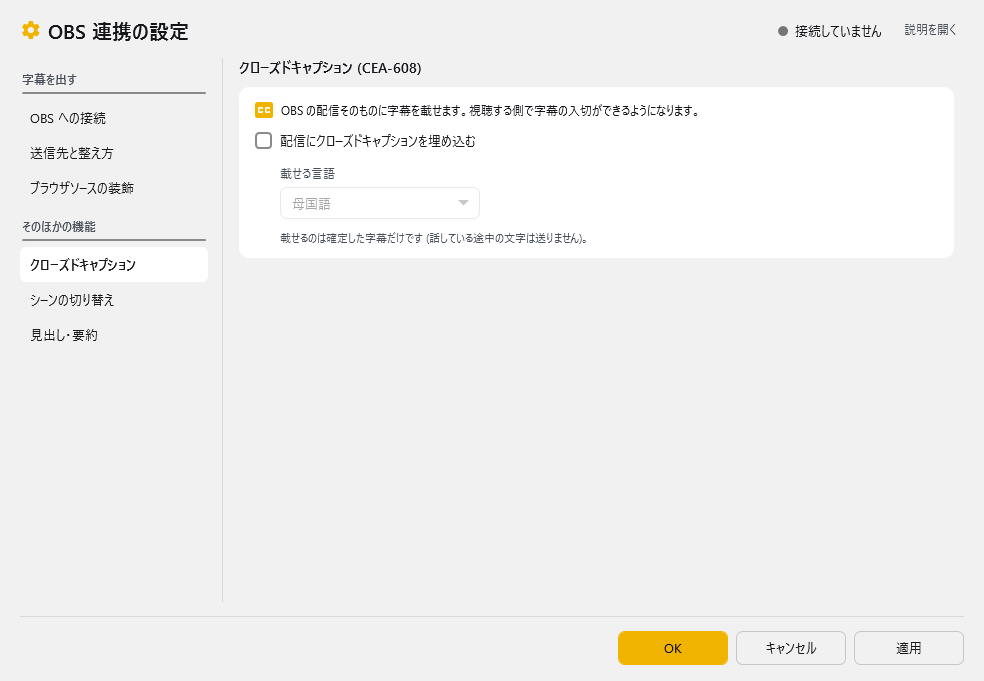
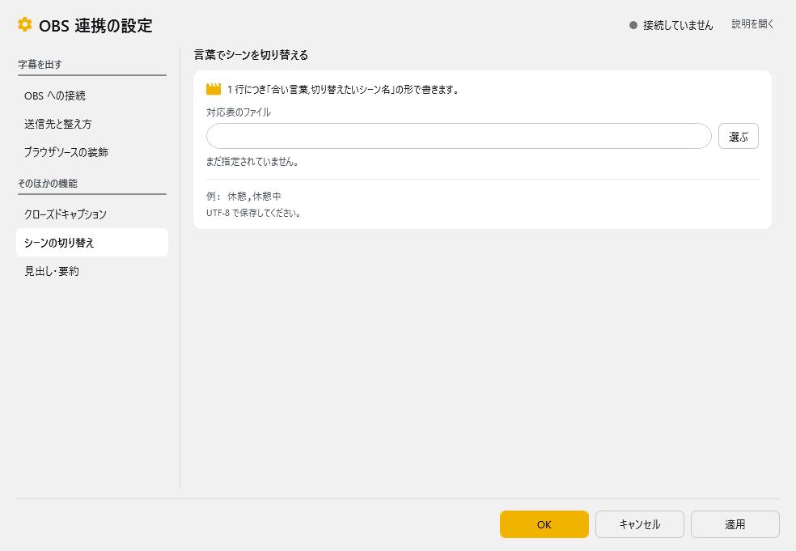
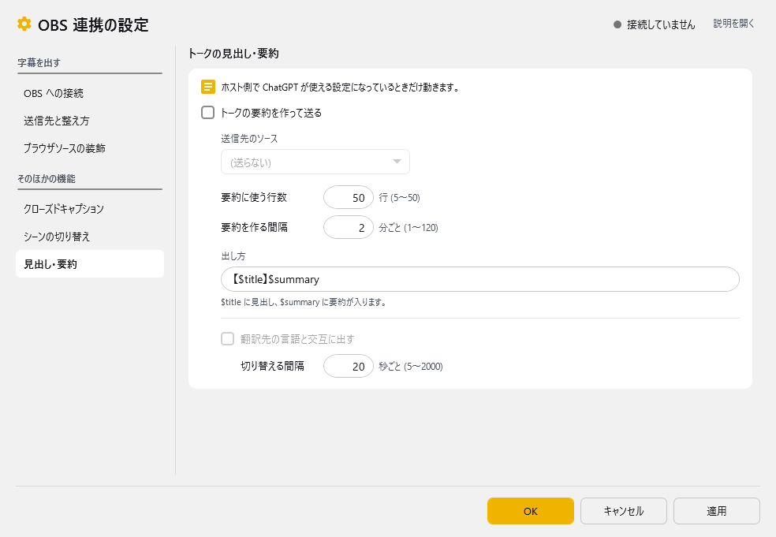
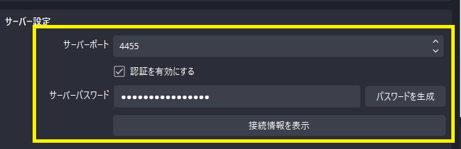

<!-- version-banner -->
!!! info ""
    ゆかコネNEO **v3.0** のドキュメントです。v2.3 をお使いの方は [v2.3 版のこのページ](../../v2.3/plugin/plugin_OBS5.md) を、違いを知りたい方は [v2.3 から v3.0 への移行](../../mig/mig_neo_v3.0.md) をご覧ください。

!!! Info "前提条件"
    * [OBS Studio v28](https://github.com/obsproject/obs-studio/releases/download/)以降を使用していること
    
!!! Tip "OBS WebSocketについて"
    * OBS Studio v28からは、デフォルトでWebSocket機能が備わっています。

## このプラグインで出来ること

* OBS Studioの字幕レイアウトを直接書き換えることで字幕をきれいに表示できます
* **AI要約生成機能**（GPT-4.1-mini統合）
* ブラウザソース用CSS動的スタイリング
* 5チャンネル多言語字幕対応
* 配信自動開始・停止検出
* 要約の多言語ローテーション表示
* 外部APIによる拡張制御

##　有効化


* プラグインを使うチェックをONにしてください。

!!! Warning "OBS WebSocket 4の環境ではこのプラグインは使えません"
    * OBSの通信仕様が大きく変わったためです。バージョンを確認して使ってください。
    * このプラグインの対象となるOBSの設定画面はこちら側です

    

<!-- wpf-settings-note -->
## 設定

プラグイン一覧で、このプラグインの名前の右にある **「設定」** を押すと開きます。
左の一覧で 6 ページを切り替えます。**上の 2 ページ（OBS への接続／送信先と整え方）を埋めれば字幕は出ます。**

| まとまり | ページ | 中身 |
|:--|:--|:--|
| 字幕を出す | **OBS への接続** | OBS Studio の WebSocket へ繋ぎます。まずここを設定してください |
| | **送信先と整え方** | どの言語の字幕を、OBS のどのソースへ、どう整えて出すか |
| | ブラウザソースの装飾 | ブラウザソースへ送るときの見た目（CSS）。テキストソースには要りません |
| そのほかの機能 | クローズドキャプション | 配信そのものに字幕を埋め込みます（CEA-608） |
| | シーンの切り替え | 話した言葉に合わせて OBS のシーンを切り替えます |
| | 見出し・要約 | トークの内容をまとめて、ソースへ流します |

画面の右上には、どのページを見ていても**いまの接続の状態**（接続しています／接続していません など）が出ます。

!!! info "閉じるときの 3 択"
    設定は**下書き**として持たれ、「OK」か「適用」を押すまで OBS へは出ません。編集の途中の値が配信に映ることはありません。
    変更したまま閉じようとすると「変更が保存されていません」と聞かれ、**［はい］保存して閉じる／［いいえ］破棄して閉じる／［キャンセル］閉じるのをやめる** から選べます。
    「破棄」は画面で触った項目だけを戻すので、外部コマンドで変えた設定を巻き込みません。

### OBS への接続

OBS Studio の WebSocket へ繋ぎます。まずここを設定してください。



**接続先**

| 項目 | 説明 |
|:--|:--|
| アドレス | OBS が動いているパソコンのアドレス。同じパソコンなら `127.0.0.1` のままです |
| ポート | OBS の既定は **4455** です |
| パスワード | OBS の［ツール］→［WebSocket サーバー設定］に出ているものです。**入力は伏せ字で表示されます** |
| 「OBS の設定から取り込む」ボタン | この PC の OBS の設定ファイルから、ポートとパスワードを読み取ります（OBS v28 以降） |

**いまの状態**

| 項目 | 説明 |
|:--|:--|
| 「接続」「切断」ボタン | その場で繋ぐ／切ります。宛先を変えたときは、OK か「適用」を押した時点で繋ぎ直します |
| 送信先に使えるソース | OBS から取れたソースの数。**「取り直す」** で OBS に問い合わせ直します |

**配信に合わせる**

| 項目 | 説明 |
|:--|:--|
| ☑ 配信の開始・終了で読み上げを入切する | 配信を始めたら読み上げを入れ、止めたら切ります |

!!! warning "「OBS の設定から取り込む」でうまくいかないとき"
    * 「OBS 側の WebSocket サーバーが有効になっていません」と出たら、先に OBS の［ツール］→［WebSocket サーバー設定］で有効にしてください。
    * 「OBS の設定ファイルが見つかりませんでした」と出たら、OBS が v28 より古いか、別のパソコンで動いています。ポートとパスワードを手で入れてください。
    * 「パスワードが違うようです」と出たら、OBS 側の表示と見比べてください。

### 送信先と整え方

どの言語の字幕を、OBS のどのソースへ、どう整えて出すかを決めます。



**レーンごとの送信先**（1 言語 1 行の表）

| 列 | 説明 |
|:--|:--|
| 言語 | 母国語／翻訳 1〜4 |
| OBS のソース | 送り先のソース。OBS に繋がっていると一覧から選べます。**（送らない）** にするとその言語は送りません |
| 折り返し | 「決まった文字数で改行を入れ直す」を ON にしたときの 1 行の文字数（文字） |
| 長い文の扱い | 「長い文をそのままは出さない」を ON にしたときの上限の文字数（文字） |

* テキストソースのほかに、**ブラウザソースへも送れます**。ブラウザソースを使うときは「ブラウザソースの装飾」も設定してください。
* **上のスイッチが切れている列は、数を変えても効きません**（その列は薄く表示されます）。
* 同じソースを 2 つ以上の言語に指定すると、その場で注意が出ます。

**文字の整え方**

| 項目 | 説明 |
|:--|:--|
| ☑ 決まった文字数で改行を入れ直す | 「折り返し」の数で改行します。文は切らず、折り返すだけです |
| ☑ 長い文をそのままは出さない | 「長い文の扱い」の数を超えたときに、どうするかを選びます（**前を切り落として、後ろだけ出す**／**改行を挟んで、続けて出す**） |
| ☑ 切れ目を探さず、決まった文字数ごとに区切る | 句読点などの切れ目を探さずに区切ります |
| ☑ 決まった行数を超えたら、古い行から省く | 指定した行数（行まで）を超えたら、古い行から省きます |
| ☑ 改行をすべて取り除いて送る | 1 行しか表示できないテキストソースへ送るときに使います |

**送り方**

| 項目 | 説明 |
|:--|:--|
| ☑ 翻訳もそれぞれのレーンへ送る | 切ると、母国語のレーンにだけ送ります |
| ☑ 話した人の名前も付ける | 字幕の前に話した人の名前を付けます |

!!! tip "v2.3 との違い"
    v2.3 は 8 つの枠が 1 枚に積まれ、同じ設定が 5 組ずつ縦に並んでいました（送信先が 5 つ、折り返しの文字数が 5 つ、クロップ長が 5 つ…）。
    どれがどの言語のものかは上から数えないと分からず、数字を直しても、それを効かせるスイッチが別の枠にあるため「効かない」ことに気づけませんでした。
    v3.0 では 1 言語 1 行の表になり、効かせるスイッチも同じページに並びます。

### ブラウザソースの装飾

ブラウザソースへ送るときの見た目（CSS）を、言語（レーン）ごとに書きます。**テキストソースへ送るレーンは空のままで構いません。**



* 上のボタン（母国語／翻訳 1〜4）でレーンを選ぶと、そのレーンの CSS を大きく開きます。ボタンには（未設定）／設定あり が出ます。
* `{ync.text}` と書いたところへ、そのとき出す字幕の文字が入ります。
* **「ファイルから読み込む」** で CSS ファイルを読み込めます（UTF-8 で保存してください）。**「空にする」** で消せます。
* 送信先が無いレーンや、送信先がブラウザソースでないレーンでは、書き始める前に「装飾は使われません」と知らせます。

### クローズドキャプション

配信そのものに字幕を埋め込みます（CEA-608）。



| 項目 | 説明 |
|:--|:--|
| ☑ 配信にクローズドキャプションを埋め込む | OBS の配信そのものに字幕を載せます。視聴する側で字幕の入切ができるようになります |
| 載せる言語 | 母国語／翻訳 1〜4 から 1 つ選びます |

> 載せるのは確定した字幕だけです（話している途中の文字は送りません）。

!!! Tip "クローズドキャプションについて"
    * 配信サイトが対応している場合に機能します。対応が確認できているのは `YouTube` と `Twitch` です。
    * YouTube の場合は、配信設定の字幕のところで「608/708」を有効にします。
    * Twitch は特に設定なしで反映されます。
    * 字幕が出るタイミングや残る時間は、配信サイト側に任されます。

### シーンの切り替え

話した言葉に合わせて OBS のシーンを切り替えます。



| 項目 | 説明 |
|:--|:--|
| 対応表のファイル | **「選ぶ」** で指定します。1 行につき「合い言葉,切り替えたいシーン名」の形で書き、UTF-8 で保存してください（例：`休憩,休憩中`） |

指定したファイルが読めるかどうかが、その場に出ます（まだ指定されていません／読み込めます／見つかりません）。

#### 対応表の作り方

!!! Info "編集方法"
    * Excel もしくは メモ帳で作ります。

=== "Case1:Excelの場合"

    ||A|B|
    |:-|:-|:-|
    |1|これで今日の配信はおしまい|終了シーン|

    1. Excel でデータを作ります。
    2. 「CSV UTF-8（コンマ区切り）」で保存します。

=== "Case2:メモ帳の場合"

    1. 下記のようなファイルを作ります。

    ``` js
    これで今日の配信はおしまい,終了シーン
    ```
    2. UTF-8 で保存します。

### 見出し・要約

トークの内容をまとめて、ソースへ流します。**ゆかコネ本体で ChatGPT が使える設定になっているときだけ動きます。**



| 項目 | 説明 |
|:--|:--|
| ☑ トークの要約を作って送る | ON にすると、下の設定で要約を作って送ります |
| 送信先のソース | 要約を送る OBS のソース |
| 要約に使う行数 | 5〜50 行 |
| 要約を作る間隔 | 1〜120 分ごと |
| 出し方 | `$title` に見出し、`$summary` に要約が入ります（例：`【$title】$summary`） |
| ☑ 翻訳先の言語と交互に出す | 要約を翻訳先の言語と交互に切り替えて出します |
| 切り替える間隔 | 5〜2000 秒ごと |

### OBS 側の設定

!!! Top "OBS側の設定"
    

    * ポート番号やパスワードは、OBS 側の設定とゆかコネの設定を一致させてください。
    * いちばん簡単なのは、「OBS への接続」ページの **「OBS の設定から取り込む」** を押すことです。

!!! Info "従来の設定画面について"
    新しい画面を開けなかったときは、従来の設定画面が代わりに開きます。
    その場合は「新しい画面を開けなかったため、従来の設定画面を開きます」と知らせが出ます。

## 高度な機能

### AI要約生成システム

#### GPT-4.1-mini統合
* **自動要約**: 配信内容の定期的なAI要約生成
* **カスタムフォーマット**: "【$title】$summary" 形式
* **多言語対応**: 要約の自動翻訳機能
* **タイマー設定**: 1-120分間隔での定期実行

#### 要約設定
| 設定項目（画面の名前） | 説明 | 既定 |
|:---------|:-----|:----------|
| 要約を作る間隔 | 自動要約の実行間隔（1〜120 分） | 2 分 |
| 要約に使う行数 | 要約対象とする最新 N 行（5〜50 行） | 50 行 |
| 翻訳先の言語と交互に出す | 要約を翻訳先の言語と交互に表示 | OFF |
| 切り替える間隔 | 交互に出すときの切り替え間隔（5〜2000 秒） | 20 秒 |

### CSS スタイリング機能

#### ブラウザソース対応
* **動的CSS注入**: `{ync.text}` プレースホルダーによる動的スタイリング
* **ソース別設定**: 各字幕ソースに個別のCSSテンプレート
* **リアルタイム更新**: テキスト変更に合わせたスタイル適用

#### CSSテンプレート例
```css
/* 基本スタイリング */
.subtitle {
  color: white;
  background: rgba(0,0,0,0.7);
  font-size: 24px;
  padding: 10px;
}

/* 動的テキスト */
.content::before {
  content: "{ync.text}";
}
```

### 配信自動連動

#### ストリーミング検出
* **開始検出**: OBS配信開始の自動検知
* **終了検出**: 配信停止の自動検知  
* **読み上げの入切**: 「配信の開始・終了で読み上げを入切する」を ON にすると、配信を始めたら読み上げを入れ、止めたら切ります
* **要約自動化**: 配信終了時の最終要約生成

### 外部API制御

#### 拡張コマンド
| コマンド | パラメータ | 機能 |
|:---------|:----------|:-----|
| `SetScene` | sceneName | 指定シーンに切り替え |
| `StartReplayBuffer` | - | リプレイバッファー開始 |
| `StopReplayBuffer` | - | リプレイバッファー停止 |
| `SetSourceText` | sourceNo, text | 特定ソースにテキスト設定 |

#### API使用例
```javascript
// シーン切り替え
plugin.onCommand({
  "target": "Plugin_OBS5",
  "command": "SetScene", 
  "sceneName": "ゲーム画面"
});

// 特定ソースにテキスト設定
plugin.onCommand({
  "target": "Plugin_OBS5",
  "command": "SetSourceText",
  "sourceNo": "1",
  "text": "カスタムメッセージ"
});
```

### 技術実装詳細

#### WebSocket v5統合
* **プロトコル**: OBS WebSocket v5対応（ポート4455）
* **自動構成**: OBS接続の自動セットアップ
* **改良された接続管理**: より安定した接続・再接続処理

#### AI統合機能
* **GPTモデル**: GPT-4.1-mini使用
* **プロンプト最適化**: 配信内容要約用の特化プロンプト
* **メモリ管理**: 会話履歴の自動クリーンアップ（50項目制限）

#### パフォーマンス最適化
* **マルチタイマー**: 複数の独立したタイマーシステム
* **非同期処理**: UIブロッキングを避けた背景処理
* **自動復旧**: API失敗時の適切な回復処理

### 実用的な活用例

#### AI要約配信
1. **設定**: 5分間隔での自動要約
2. **実行**: GPT-4による内容要約
3. **表示**: 要約を専用ソースで表示
4. **多言語**: 翻訳版要約のローテーション

#### 高度なブラウザソース
```css
/* グラデーション字幕 */
.subtitle {
  background: linear-gradient(45deg, #ff6b6b, #4ecdc4);
  -webkit-background-clip: text;
  -webkit-text-fill-color: transparent;
}

/* アニメーション付きテキスト */
@keyframes slideIn {
  from { transform: translateX(-100%); }
  to { transform: translateX(0); }
}

.subtitle {
  animation: slideIn 0.5s ease-out;
}
```

#### 配信自動化
* **開始時**: 要約タイマー自動スタート
* **配信中**: 定期的な内容要約生成
* **終了時**: 最終要約の自動生成・表示

### トラブルシューティング

#### AI要約が生成されない
* **APIキー**: OpenAI APIキーの設定確認
* **要約間隔**: 適切な間隔設定（1-120分）
* **対象行数**: 十分な対話履歴の存在確認

#### CSS が適用されない
* **ブラウザソース**: ソースタイプの確認
* **プレースホルダー**: `{ync.text}` の正確な記述
* **CSS文法**: 有効なCSS記述の確認

#### 接続が不安定
* **ポート設定**: OBS WebSocket v5のポート（4455）確認
* **パスワード**: OBS設定との一致確認
* **自動構成**: 自動設定機能の利用検討

## 使うとき
* プラグイン画面で「OBSに接続」をおします。
* 音声認識と同時に字幕が転送されます。
