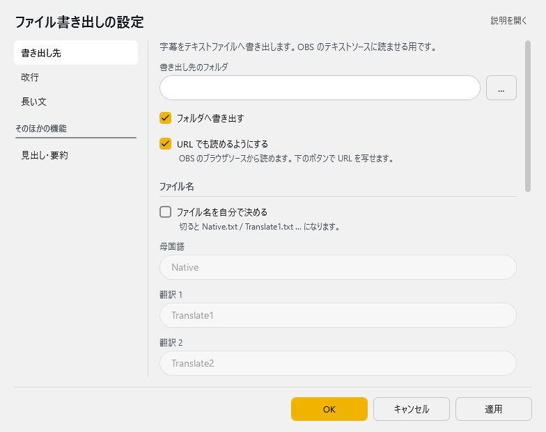
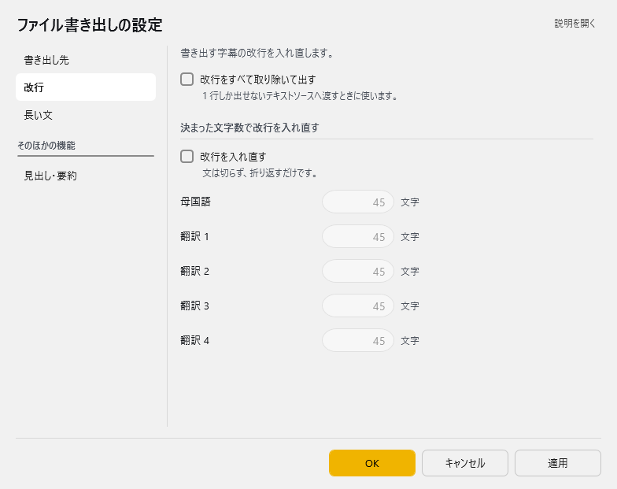
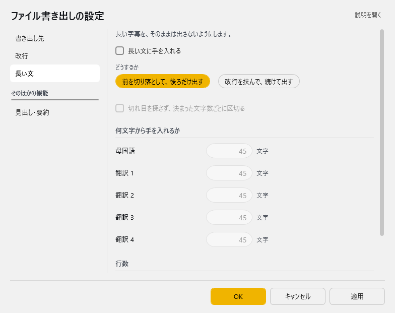
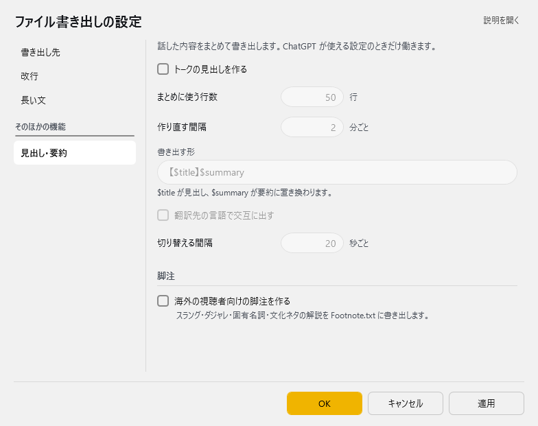

<!-- version-banner -->
!!! info ""
    ゆかコネNEO **v3.0** のドキュメントです。v2.3 をお使いの方は [v2.3 版のこのページ](../../v2.3/plugin/plugin_OBSFile.md) を、違いを知りたい方は [v2.3 から v3.0 への移行](../../mig/mig_neo_v3.0.md) をご覧ください。

!!! Info "前提条件"
    * なし

## このプラグインで出来ること

* テキスト読み込み対応の配信ソフトで字幕を表示できます
* 字幕をテキストファイルとして書き出します
* 書き出した内容を、ゆかコネNEOのWebサーバ経由でも取得できます

!!! Info "OBS Studioの場合"
    * この方法よりもOBS WebSocketを使う方が負荷を下げられます

##　有効化


* プラグインを使うチェックをONにしてください。

## 設定

プラグイン一覧で、このプラグインの名前の右にある **「設定」** を押すと開きます。
画面は **4 ページ**に分かれていて、左の一覧で切り替えます（書き出し先／改行／長い文／見出し・要約）。

!!! info "閉じるときの 3 択"
    設定は**下書き**として持たれ、「OK」か「適用」を押すまで動いているプラグインには効きません。
    変更したまま閉じようとすると「変更が保存されていません」と聞かれ、**［はい］保存して閉じる／［いいえ］破棄して閉じる／［キャンセル］閉じるのをやめる** から選べます。

### 書き出し先

字幕をテキストファイルへ書き出します。OBS のテキストソースに読ませる用です。



| 項目 | 説明 |
|:--|:--|
| 書き出し先のフォルダ | 右の「…」で選べます |
| ☑ フォルダへ書き出す | 既定：ON |
| ☑ URL でも読めるようにする | OBS のブラウザソースから読めます。下のボタンで URL を写せます。（既定：ON） |

**ファイル名**

| 項目 | 説明 |
|:--|:--|
| ☑ ファイル名を自分で決める | 切ると Native.txt / Translate1.txt … になります。（既定：OFF） |
| 母国語 | 既定：「Native」 |
| 翻訳 1 | 既定：「Translate1」 |
| 翻訳 2 | 既定：「Translate2」 |
| 翻訳 3 | 既定：「Translate3」 |
| 翻訳 4 | 既定：「Translate4」 |
| 見出し | 既定：「Summary」 |
| ☑ 話した人の名前をファイル名に足す | 「ベース名_発話者名.txt」で書き出します。（既定：OFF） |

**URL を写す**

| 項目 | 説明 |
|:--|:--|
| 「母国語の URL を写す」ボタン | — |
| 「翻訳 1 の URL を写す」ボタン | — |
| 「翻訳 2 の URL を写す」ボタン | — |
| 「翻訳 3 の URL を写す」ボタン | — |
| 「翻訳 4 の URL を写す」ボタン | — |
| 「見出しの URL を写す」ボタン | — |

### 改行

書き出す字幕の改行を入れ直します。



| 項目 | 説明 |
|:--|:--|
| ☑ 改行をすべて取り除いて出す | 1 行しか出せないテキストソースへ渡すときに使います。（既定：OFF） |

**決まった文字数で改行を入れ直す**

| 項目 | 説明 |
|:--|:--|
| ☑ 改行を入れ直す | 文は切らず、折り返すだけです。（既定：OFF） |
| 母国語 | 1～2000文字。既定：45 |
| 翻訳 1 | 1～2000文字。既定：45 |
| 翻訳 2 | 1～2000文字。既定：45 |
| 翻訳 3 | 1～2000文字。既定：45 |
| 翻訳 4 | 1～2000文字。既定：45 |

### 長い文

長い字幕を、そのままは出さないようにします。



| 項目 | 説明 |
|:--|:--|
| ☑ 長い文に手を入れる | 既定：OFF |
| どうするか | 選択肢：前を切り落として、後ろだけ出す／改行を挟んで、続けて出す。既定：改行を挟んで、続けて出す |
| ☑ 切れ目を探さず、決まった文字数ごとに区切る | 既定：OFF |

**何文字から手を入れるか**

| 項目 | 説明 |
|:--|:--|
| 母国語 | 1～2000文字。既定：45 |
| 翻訳 1 | 1～2000文字。既定：45 |
| 翻訳 2 | 1～2000文字。既定：45 |
| 翻訳 3 | 1～2000文字。既定：45 |
| 翻訳 4 | 1～2000文字。既定：45 |

**行数**

| 項目 | 説明 |
|:--|:--|
| ☑ 決まった行数を超えたら、古い行から省く | 既定：OFF |
| 残す行数 | 1～100行まで。既定：3 |

### 見出し・要約

話した内容をまとめて書き出します。ChatGPT が使える設定のときだけ働きます。



| 項目 | 説明 |
|:--|:--|
| ☑ トークの見出しを作る | 既定：OFF |
| まとめに使う行数 | 5～50行。既定：50 |
| 作り直す間隔 | 1～120分ごと。既定：2 |
| 書き出す形 | $title が見出し、$summary が要約に置き換わります。（既定：「【$title】$summary」） |
| ☑ 翻訳先の言語で交互に出す | 既定：OFF |
| 切り替える間隔 | 1～600秒ごと。既定：20 |

**脚注**

| 項目 | 説明 |
|:--|:--|
| ☑ 海外の視聴者向けの脚注を作る | スラング・ダジャレ・固有名詞・文化ネタの解説を Footnote.txt に書き出します。（既定：OFF） |

### 補足

!!! Info "見出し・要約の書き出す形"
    * `$title` に見出し、`$summary` に要約が入ります（例：`【$title】$summary`）。
    * 見出し・要約は、ゆかコネ本体で ChatGPT が使える設定になっているときだけ作られます。

## 使うとき

* 音声認識と同時にファイルが生成されます。

* 標準ファイル名と内容は以下の通りです。

|ファイル名|意味|
|:--|:---|
|Native.txt|母国語|
|Translate1.txt|翻訳語１|
|Translate2.txt|翻訳語２|
|Translate3.txt|翻訳語３|
|Translate4.txt|翻訳語４|
|Summary.txt|会話の要約（「要約を書き出す」がONのとき）|
|Footnote.txt|脚注（「脚注を書き出す」がONのとき）|

* これらのファイルを配信ソフトで読み込みます。


!!! Info "話者毎に分ける場合"
    * ゆかコネNEOが認識している名前毎にファイルが分かれます<br> 例）``Native_nao.txt``
    * このファイルを読み込むことで話者毎の表示が実現できます
    * 話者の名前には、ファイル禁則文字を使わないでください<br>例）``*``や``￥``など

## HTTP経由で読み込む

* 「HTTPで公開する」をONにすると、同じ内容をゆかコネNEOのWebサーバからも取得できます。
* ファイルを経由しないので、配信ソフトのブラウザソースから直接読み込めます。

```
<ベースURL>/Native.txt
<ベースURL>/Translate1.txt
```

* ベースとなるアドレスは、プラグインの設定画面に表示されています。
* 話者ごとに分ける設定にしている場合は ``<ベースURL>/Native_nao.txt`` のようになります。
* 「書き出し先を使わない」をONにすると、フォルダへのファイル出力を止めてHTTPだけで使えます。書き込みが頻繁に起きるのを避けたい場合に向いています。

!!! Info "ほかのパソコンから読み込む場合"
    既定では同じパソコンの中からしか接続できません。ほかの端末から読みたい場合は「ネットワークの設定」画面の設定が必要です。詳しくは [オプション設定](../startup/startup_option.md) をご覧ください。
