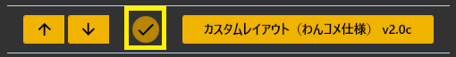
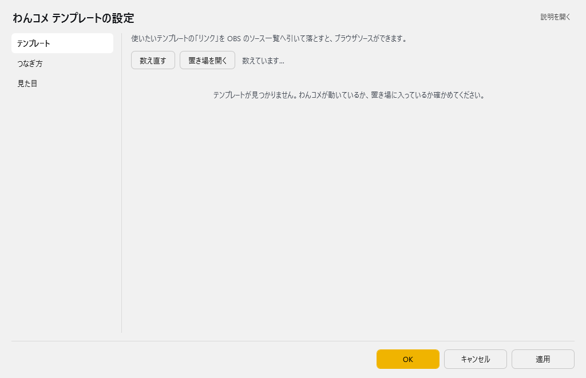
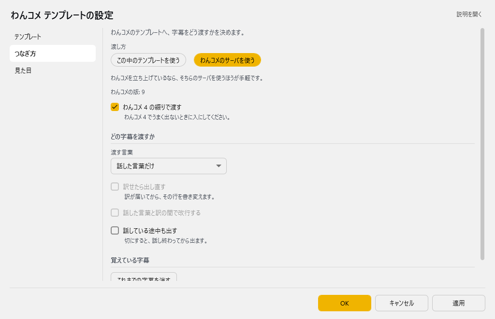
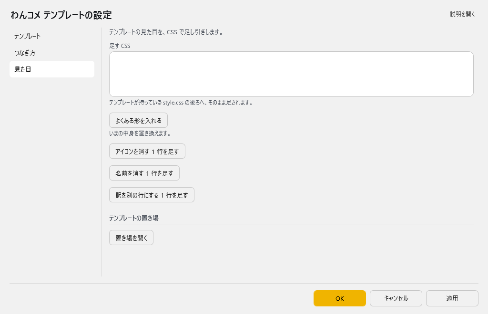
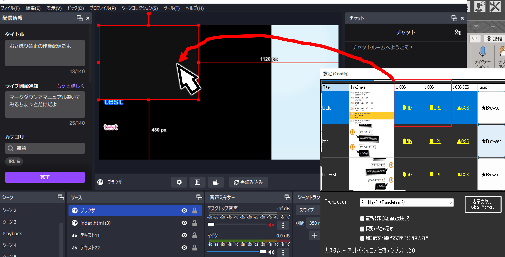
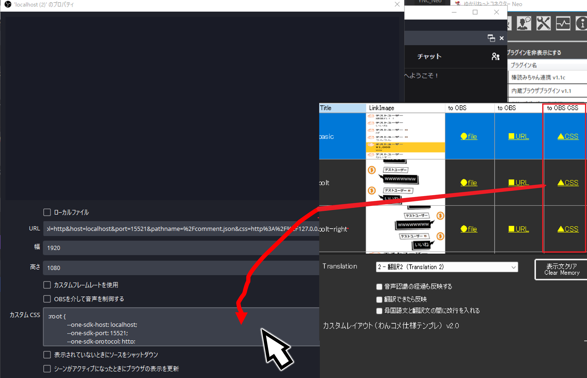
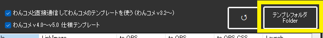
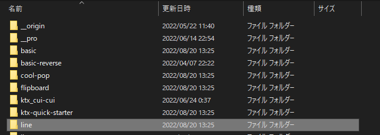

<!-- version-banner -->
!!! info ""
    ゆかコネNEO **v3.0** のドキュメントです。v2.3 をお使いの方は [v2.3 版のこのページ](../../v2.3/plugin/plugin_OCTemplateGen.md) を、違いを知りたい方は [v2.3 から v3.0 への移行](../../mig/mig_neo_v3.0.md) をご覧ください。

!!! Info "前提条件"
    * [わんコメ](https://onecomme.com/) v3.2以上を使用していること

## このプラグインで出来ること

* わんコメのテンプレートをつかって字幕を出します。

!!! Tips "謝辞"
    * この機能の実現のために、[わんコメ](https://onecomme.com/)作者[アスティ](https://twitter.com/AstieDog)さんの許諾と技術支援をうけています。

##　有効化

* プラグインを使うチェックをONにしてください。

## 設定

プラグイン一覧で、このプラグインの名前の右にある **「設定」** を押すと開きます。
画面は **3 ページ**に分かれていて、左の一覧で切り替えます（テンプレート／つなぎ方／見た目）。

!!! info "閉じるときの 3 択"
    設定は**下書き**として持たれ、「OK」か「適用」を押すまで動いているプラグインには効きません。
    変更したまま閉じようとすると「変更が保存されていません」と聞かれ、**［はい］保存して閉じる／［いいえ］破棄して閉じる／［キャンセル］閉じるのをやめる** から選べます。

### テンプレート

使いたいテンプレートの「リンク」を OBS のソース一覧へ引いて落とすと、ブラウザソースができます。

設定画面を開くと、最初にこのテンプレートの一覧が出ます。テンプレートごとに次のボタンが並んでいます。

| ボタン | 押したとき | OBS へ引いて落としたとき |
|:--|:--|:--|
| リンク | ブラウザソースの URL をコピーします | ブラウザソースができます |
| ファイル | index.html の場所をコピーします（エクスプローラーへも貼れます） | ローカルのファイルとして入ります |
| CSS | そのまま貼れる CSS をコピーします | — |
| ↗（右端のアイコン） | ブラウザで開いて確かめます | — |

* 押してコピーするのも、引いて落とすのも、中身は同じです。
* 何をコピーしたかは、一覧の上に出ます。「コピーできませんでした」と出たときは、クリップボードの履歴ツールなどがクリップボードを使っているかもしれません。少し待ってからもう一度押してください。
* 一覧は、「つなぎ方」ページの **渡し方** に合わせて切り替わります（OK を押す前でも切り替わります）。
* 一覧の上の **「数え直す」** で一覧を読み直し、**「置き場を開く」** でテンプレートのフォルダを開きます。

### つなぎ方

わんコメのテンプレートへ、字幕をどう渡すかを決めます。

| 項目 | 説明 |
|:--|:--|
| 渡し方 | わんコメを立ち上げているなら、そちらのサーバを使うほうが手軽です。（選択肢：この中のテンプレートを使う／わんコメのサーバを使う。既定：わんコメのサーバを使う） |
| ☑ わんコメ 4 の綴りで渡す | わんコメ 4 でうまく出ないときに入にしてください。（既定：ON） |

**どの字幕を渡すか**

| 項目 | 説明 |
|:--|:--|
| 渡す言葉 | 選択肢：話した言葉だけ／訳した言葉だけ／話した言葉 + 訳した言葉。既定：話した言葉だけ |
| ☑ 訳せたら出し直す | 訳が届いてから、その行を書き変えます。（既定：OFF） |
| ☑ 話した言葉と訳の間で改行する | 既定：OFF |
| ☑ 話している途中も出す | 切にすると、話し終わってから出ます。（既定：OFF） |

**覚えている字幕**

| 項目 | 説明 |
|:--|:--|
| 「これまでの字幕を消す」ボタン | テンプレートに出ている行をすべて消します。 |

### 見た目

テンプレートの見た目を、CSS で足し引きします。

| 項目 | 説明 |
|:--|:--|
| 足す CSS | テンプレートが持っている style.css の後ろへ、そのまま足されます。 |
| 「よくある形を入れる」ボタン | いまの中身を置き換えます。 |
| 「アイコンを消す 1 行を足す」ボタン | — |
| 「名前を消す 1 行を足す」ボタン | — |
| 「訳を別の行にする 1 行を足す」ボタン | — |

**テンプレートの置き場**

| 項目 | 説明 |
|:--|:--|
| 「置き場を開く」ボタン | — |

## 使い方

### 連携で動かす場合
* わんコメを立ち上げます。

!!! warning "使用途中でわんコメを終了させないでください"
    * わんコメは連動してうごいています。途中で終了すると表示が正常にできなくなります。

!!! Success "わんコメ　Pro版について"
    * Pro版をご利用の方は、この機能もPro版の「動作が速いテンプレート」が利用できます。

* プラグインの画面をだします。

!!! Tips "表に何も表示されない場合"
    * 「わんコメのテンプレートを直接使う」のチェックがONか確認します
    * リロードボタン（丸まった矢印のボタン）を押します

* 「to OBS」の ●file もしくは ■URLをOBSにドラック＆ドロップします。

* 「to OBS CSS」を CSS枠 にドラック＆ドロップします。

* その後、音声認識すると、わんコメのレイアウトをつかった字幕が表示されます。

### 単独で動かす場合
!!! Success "こちらのモードは、わんコメの起動は不要です"
    * こちらのモードであれば、単独で動くためわんコメの起動は不要です。

* まず、テンプレートフォルダを開きます

* ここにテンプレートを入れてください。

* プラグインのリスト一覧に表示されれば、あとは前述の方法で設定すれば使えます。

!!! Tips "動作に必要なファイル"
    * ``__origin`` と ``__pro`` は必須です。
    * 上記２つのファイルは、ご自身が使用中のわんコメフォルダからコピーしてください。
    * 上記２つのファイルは、他人からもらうことはできません。（わんコメをインストールし入手してください）
    * テンプレート自体はネット上で公開されているものがあるのでご活用ください

## その他

!!! Tips "音声認識の経過を表示する場合"
    * 「音声認識の経過も反映する」をONにします。

