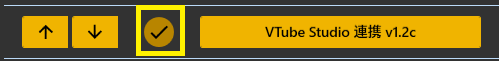
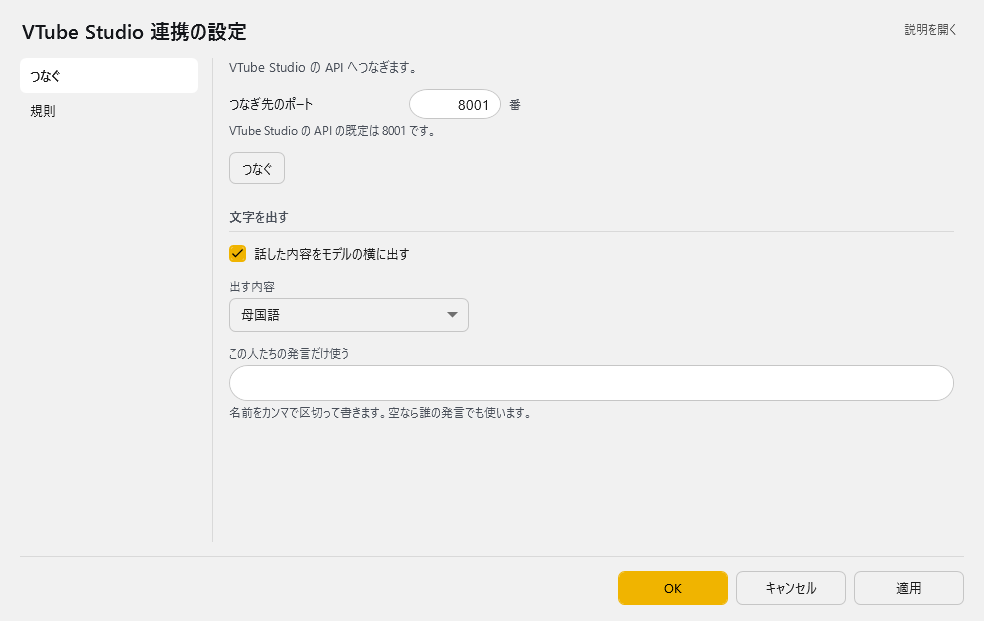
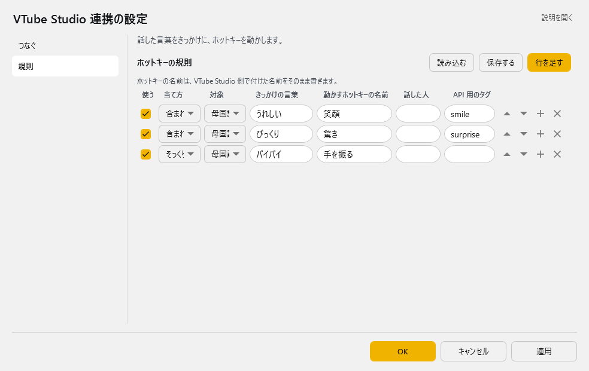

<!-- version-banner -->
!!! info ""
    ゆかコネNEO **v3.0** のドキュメントです。v2.3 をお使いの方は [v2.3 版のこのページ](../../v2.3/plugin/plugin_VtubeStudio.md) を、違いを知りたい方は [v2.3 から v3.0 への移行](../../mig/mig_neo_v3.0.md) をご覧ください。

!!! Info "前提条件"
    * [VTubeStudio](https://store.steampowered.com/app/1325860/VTube_Studio/?l=japanese)が動作することが必要です
    * VTubeStudioでAPIの有効化が必要です
    * このプラグインは ゆかコネNEOv2.0.17より同梱されています

## このプラグインで出来ること

* 音声認識結果に応じてVTubeStudioのキーバインドアクションを自動実行
* VTubeStudioに字幕表示（日本語・英語・中国語・韓国語・スペイン語・フランス語対応）
* キーワードや話者によるアクション制御
* リアルタイムでアバターの表情・モーションを変更
* 多言語翻訳結果の自動表示

##　有効化



* プラグインを使うチェックをONにしてください。

## 設定

プラグイン一覧で、このプラグインの名前の右にある **「設定」** を押すと開きます。
画面は **2 ページ**に分かれていて、左の一覧で切り替えます（つなぐ／規則）。

!!! info "閉じるときの 3 択"
    設定は**下書き**として持たれ、「OK」か「適用」を押すまで動いているプラグインには効きません。
    変更したまま閉じようとすると「変更が保存されていません」と聞かれ、**［はい］保存して閉じる／［いいえ］破棄して閉じる／［キャンセル］閉じるのをやめる** から選べます。

### つなぐ

VTube Studio の API へつなぎます。



| 項目 | 説明 |
|:--|:--|
| つなぎ先のポート | VTube Studio の API の既定は 8001 です。（1～65535番。既定：8001） |
| 「つなぐ」ボタン | — |

**文字を出す**

| 項目 | 説明 |
|:--|:--|
| ☑ 話した内容をモデルの横に出す | 既定：ON |
| 出す内容 | 選択肢：母国語／翻訳 1／翻訳 2／翻訳 3／翻訳 4。既定：母国語 |
| この人たちの発言だけ使う | 名前をカンマで区切って書きます。空なら誰の発言でも使います。 |

### 規則

話した言葉をきっかけに、ホットキーを動かします。



**ホットキーの規則**（表）

列：使う／当て方／対象／きっかけの言葉／動かすホットキーの名前／話した人／API 用のタグ

ホットキーの名前は、VTube Studio 側で付けた名前をそのまま書きます。

表の右上の **「行を足す」** で行を増やします。行の右端のボタンは ▲▼＝1 つ上へ／下へ、＋＝この下に足す、×＝この行を消す です。**「保存する」** はいまの中身を CSV へ書き出します（控え用）。**「読み込む」** は CSV から読み込んで、いまの中身と入れ替えます。

## ルール

* ルールは、条件に一致したときにそのデータを送付することができる「仕掛け」です
* 条件成立したときにアバターにアクションを起こさせることができます。

|設定|意味|
|:--|:---|
|有効(Enabled)|この条件を有効化します|
|モード(Mode)|条件の判断モードを指定します|
|対象|対象にする言語を決めます（母国語、翻訳１～４）|
|起動フレーズ|判断に使う起動キーワードです|
|Key Action|VTubeStudioに設定しているキーバインドの設定名を入れます |
|対象者|話者名に指定文字が含まれているときに反応します。空欄の場合は全員が対象です|
|APIタグ|APIから呼び出すときにつかうタグ名です|

## VTubeStudio側の設定手順

### API設定の有効化
1. **VTubeStudioを起動**
2. **設定を開く**: 右上の歯車アイコンをクリック
3. **一般設定 → API**を開く
4. **「APIを有効にする」をチェック**
5. **ポート設定を確認**: 通常8001番（ゆかコネ設定と一致させる）
6. **「外部からのAPI接続を許可する」をチェック**（必要に応じて）

### キーバインド設定（表情・モーション制御用）
1. **設定 → キーバインド**を開く
2. **「+」ボタンで新しいキーバインドを追加**
3. **名前を設定**（例：「笑顔」「驚き」「手を振る」）
4. **トリガー設定**: 「ホットキー」を選択
5. **アクション設定**: 表情やモーションを選択
6. **保存**

#### よく使うキーバインド例
| キーバインド名 | 用途 | アクション例 |
|:-------------|:-----|:-----------|
| 笑顔 | 嬉しい発言時 | Happy表情に変更 |
| 驚き | びっくり発言時 | Surprised表情 |
| 怒り | 怒った発言時 | Angry表情 |
| 手を振る | 挨拶時 | Wave手のモーション |
| お辞儀 | 感謝時 | Bowモーション |

## 使い方手順

### 初回接続設定
1. **VTubeStudioを起動してAPI設定を有効化**（上記参照）
2. **ゆかコネでプラグインを有効化**
3. **ポート番号を確認・設定**（デフォルト8001）
4. **「Open」ボタンを押して接続開始**
5. **VTubeStudio側で許可ダイアログが表示される**
6. **「許可」をクリックして認証完了**
7. **「Yukarinette Connector NEO」が接続済みアプリに表示されることを確認**

### 日常使用
1. **音声認識を開始**
2. **設定したキーワードを話す**
3. **VTubeStudioでキーバインドアクションが自動実行される**
4. **字幕表示を有効にしている場合は字幕も表示される**

## 字幕表示について

### 表示設定
* **表示時間**: ゆかコネ本体設定の「表示時間」に基づいて表示
* **ウィンドウサイズ**: 字幕レイアウト詳細の「ウィンドウの高さ」が適用
* **多言語対応**: 7言語（日本語、英語、中国語、韓国語、スペイン語、フランス語、ロシア語）

### 字幕の活用例
- **配信での多言語対応**
- **VTuberの発言内容を視聴者に分かりやすく表示**
- **翻訳結果を同時表示して国際的な配信**

## よくある問題と解決方法

### 接続エラー

| 症状 | 原因 | 解決方法 |
|:---|:---|:---|
| **「接続できません」エラー** | VTubeStudioのAPI無効 | VTubeStudio設定でAPI有効化 |
| **「認証失敗」エラー** | API許可していない | VTubeStudioで接続許可 |
| **「ポートエラー」** | ポート番号不一致 | 両側のポート設定を確認 |

### キーバインドが動作しない

| 症状 | 原因 | 解決方法 |
|:---|:---|:---|
| **アクションが実行されない** | キーバインド名が間違い | VTubeStudioでキーバインド名を確認 |
| **一部のアクションのみ実行** | モデルが対応していない | モデル固有の表情・モーション確認 |
| **反応が遅い** | ネットワーク遅延 | ローカル接続（127.0.0.1）確認 |

### 字幕表示の問題

| 症状 | 原因 | 解決方法 |
|:---|:---|:---|
| **字幕が表示されない** | 「文章を表示」OFF | 設定で「文章を表示」をON |
| **文字化けする** | 文字コード問題 | VTubeStudioを再起動 |
| **表示時間が短い** | 本体設定の表示時間 | ゆかコネ本体で表示時間延長 |

### 設定確認チェックリスト

#### VTubeStudio側
- [ ] VTubeStudioが起動している
- [ ] API機能が有効になっている  
- [ ] ポート番号が正しい（通常8001）
- [ ] 外部接続が許可されている
- [ ] キーバインドが正しく設定されている
- [ ] 使用する表情・モーションがモデルに対応している

#### ゆかコネ側
- [ ] プラグインが有効になっている
- [ ] ポート番号がVTubeStudioと一致している
- [ ] ルール設定でキーバインド名が正確
- [ ] 起動フレーズが適切に設定されている
- [ ] 対象言語が正しく選択されている

## 高度な活用方法

### 感情認識による自動表情変更
```
設定例:
起動フレーズ: 嬉しい|楽しい|ありがとう
Key Action: 笑顔
結果: 嬉しい発言時に自動で笑顔になる
```

### 配信シーン切り替え
```
設定例:
起動フレーズ: ゲーム開始|プレイ開始
Key Action: ゲーム画面
結果: ゲーム開始発言で画面レイアウト変更
```

### 多言語配信サポート
```
設定例:
表示内容: 翻訳1（英語）
結果: 日本語で話した内容が英語字幕で表示される
```

